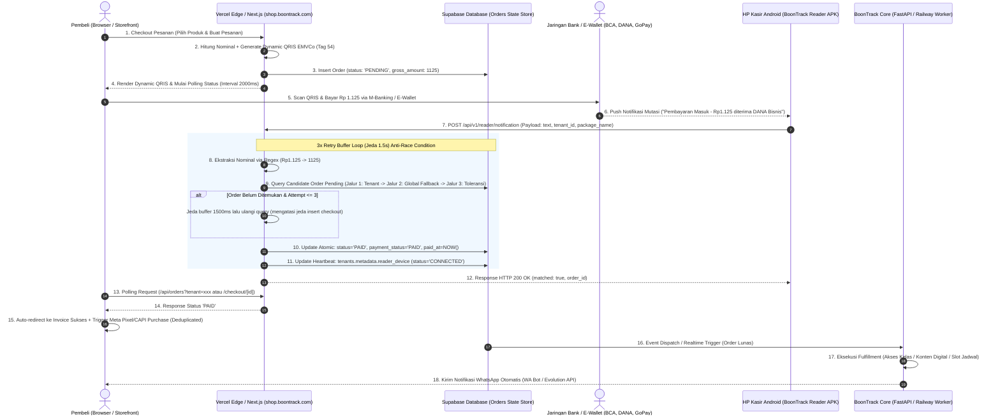

# 🏛️ BOONTRACK ENGINEERING CONSTITUTION & CORE ARCHITECTURE

> **Golden Rule**: *"Implementation can change. Architecture contracts do not change without an explicit Architecture Decision Record (ADR)."*  
> **Core Principle**: *"Natural conversation, deterministic commerce."*

---

## 0. Architecture Principles & Non-Negotiables
1. **Backend is the single source of truth.**
2. **LLM is probabilistic and untrusted.**
3. **Transaction state must be deterministic.**
4. **Tenant isolation is mandatory at every layer.**
5. **Frontend visibility is NOT a security boundary.**
6. **Provider integrations must be replaceable through adapters.**
7. **Business logic must not be coupled to a specific AI provider.**
8. **Configuration belongs in database/environment, not hardcoded in code.**
9. **Webhook handlers must be fast, idempotent, and asynchronous where appropriate.**
10. **New features must strengthen the BoonTrack Business Graph or remain isolated as optional capabilities.**
11. **Verticals define configuration and business rules; the Core Engine defines how configuration is interpreted and executed.**
12. **Zero Fake Fallbacks on External Infrastructure**: Dilarang keras membuat generator kode tiruan (mock/hash generator) untuk menutupi kegagalan koneksi pihak ketiga (seperti WhatsApp pairing code). Kegagalan infrastruktur wajib diekspos secara jujur dan transparan sebagai error HTTP eksplisit.

### 0.1 Tri-Rule Database-Driven Multi-Tenant Constitution (Phase B Guardrails)
- **Rule 1 (Zero Hardcoded Tenant Logic)**: Tidak boleh membuat percabangan kode berbasis slug fisik (misal: `if tenant == 'gym'` atau `if slug in ['om_budi', 'career']`). Seluruh logika runtime wajib membaca `capabilities`, `business_type`, atau `tenant_kind` dari database Supabase (`TenantRuntimeContext`).
- **Rule 2 (No New Tenant Folders)**: Direktori `app/tenants/*` berstatus **DEPRECATED (Freeze)**. Dilarang keras menambah file, modul, atau folder baru di dalamnya. Seluruh vertikal bisnis baru harus dioperasikan melalui Core capability engine berbasis data.
- **Rule 3 (Shared Core Capabilities)**: Fitur-fitur fundamental seperti Meta CAPI, Payment QRIS (Duitku/Xendit), AI Conversational Gateway, Storage R2, dan Auth adalah mesin global terpadu milik BoonTrack Core, bukan milik vertikal tertentu. Vertikal hanya mengonsumsi capabilities ini secara deklaratif.

---

## 1. Backend Engine (Dual-Runner Python)
- **Engine**: Menggunakan **aiohttp web runner via `main.py` + FastAPI** yang di-deploy di Railway.
- **Aturan Wajib**: Setiap penambahan route, blueprint, atau middleware **WAJIB** didaftarkan di `aiohttp_app` runner. Mendaftarkan route hanya di FastAPI akan menyebabkan error `404 Not Found`.
- **CORS**: Penanganan CORS reflection wajib diterapkan di tingkat runner.

---

## 2. Frontend & Modular Navigation (Next.js App Router)
- **Domain Platform**: `shop.boontrack.com`
- **Routing API**: Memanfaatkan proxy internal `/api/v1/...` dengan base URL terarah ke `https://api.boontrack.com`.
- **Adaptive Modular Registry (Progressive Disclosure)**:
  - Dilarang keras menggunakan pengecekan boolean kaku berbasis tier string lama.
  - Navigasi wajib membaca objek `capabilities` dari `TenantRuntimeContext`.
  - **Core Menu (Selalu Tampil)**: Beranda, Produk, Pesanan, Pembayaran.
  - **Conditional Core**:
    - `Pengiriman`: Hanya dirender jika `business_type === 'PHYSICAL'` dan `capabilities.shipping === true`.
    - `Booking`: Hanya dirender jika `business_type === 'FIELD_SERVICE'`.
    - Form vertikal lokal (seperti service toren/torsi) terisolasi mutlak di balik pengecekan tipe bisnis dan dilarang muncul di toko digital.

### 2.1 Canonical Domain, Edge Delivery & Funnel Routing Contract
Seluruh domain, routing funnel, edge infrastructure, dan event tracking terikat kontrak arsitektur baku:

| Domain / Route | Target Pengguna & Peran | Edge / Hosting Infra | Funnel & CTA Intent | Meta Event Trigger |
| :--- | :--- | :--- | :--- | :--- |
| `boontrack.com` | Landing Page Korporat & Solusi | Cloudflare Worker (`patient-smoke-84ed`) | Edukasi platform & navigasi produk | `PageView` |
| `boontrack.com/onboarding` | B2B, B2G, Custom IoT & Hardware | Cloudflare Worker (`patient-smoke-84ed`) | Form Audit & Booking Architect | `Lead` |
| `career.boontrack.com` | AI Career Growth & Talent Pool | Cloudflare Worker (`silent-water-8c2e`) | Landing page career & intake CV | `PageView` / `Lead` |
| `app.boontrack.com` | Pintu Masuk Portal Aplikasi | Vercel (Next.js) | Hub Utama (Onboarding redirect ke `boontrack.com/onboarding`) | - |
| `shop.boontrack.com/register` | Merchant Self-Serve (UKM / Retail) | Vercel (Next.js) | Registrasi Toko Baru Langsung | `InitiateCheckout` (Trial), `Purchase` (Lunas) |
| `shop.boontrack.com/affiliate/register` | Calon Mitra Afiliasi | Vercel (Next.js) | Registrasi Mandiri Program Afiliasi | `CompleteRegistration` |
| `affiliate.boontrack.com` | Mitra Affiliate Aktif | Vercel (Next.js) | Dashboard Klik, Konversi Referal & Komisi | - |
| `manager.boontrack.com` | Affiliate Manager (AM / Kang Sakti) | Vercel (Next.js) | Pengawasan Jaringan, Approval Mitra & Validasi Payout | - |
| `bossob.boontrack.com/admin` | Super Admin Internal | Vercel (Next.js) | Control Plane, Leads Pipeline & Tenant Registry | - |

> **Contract Rule**: Setiap domain baru yang ditambahkan ke ekosistem BoonTrack **WAJIB** didaftarkan di tabel ini beserta edge infra, funnel intent, dan Meta event trigger-nya sebelum dipublikasikan ke produksi.

### 2.2 Auth-Only Affiliate Dashboard Standard (Production Contract)
1. **Automated Session Authentication (Cookie / JWT Based)**:
   - Halaman portal afiliasi (`/affiliate/dashboard` dan `/affiliate`) WAJIB beroperasi secara murni *auth-only* berbasis sesi terotentikasi (JWT Bearer / HTTP-only Secure Cookie `authSession` / `affiliate_code`).
   - Data profil mitra, kode referral unik personal, metrik performa (klik, lead masuk, toko trial aktif, toko berbayar, komisi tercatat), serta link promosi WAJIB dimuat secara otomatis dari sesi aktif tanpa intervensi manual.
2. **Larangan Mutlak Manual Search di Level Produksi**:
   - DILARANG KERAS menampilkan kotak input pencarian manual ("KODE REFERRAL MITRA") atau tombol pencarian ("Cari Mitra") di level produksi.
   - Mitra tidak boleh dibebani untuk mencari data dirinya sendiri.
   - Jika sesi autentikasi belum terdeteksi / expired, antarmuka wajib mengarahkan mitra secara elegan ke alur login OTP WhatsApp resmi (`/affiliate/login`).

---

## 3. Entitlement Engine & Security Guard
- **Source of Truth**: Menggunakan skema relasional: `features` → `plans` → `plan_entitlements` → `tenant_entitlements` (bukan array string sederhana di tabel tenants).
- **Pemisahan Konsep**: 
  - *Feature* = kapabilitas teknis sistem internal (contoh: `AI_BOT`, `META_CAPI`).
  - *Add-on* = paket komersial yang dibeli user.
- **FastAPI Enforcement**: Setiap endpoint privat wajib memvalidasi entitlement via guard/dependency decorator. Kembalikan error `403 FEATURE_NOT_ENTITLED` jika hak akses tidak aktif.

### 3.1 Entitlement & Commercial Subscription Tiers (Contract ADR)
Ekosistem BoonTrack meresmikan standarisasi 3 Tier Komersial baku yang mengikat seluruh lapisan (Frontend UI, Onboarding Gateway, Billing Invoicing, dan PostgreSQL Database):

| Nama Komersial (UI) | Tier PostgreSQL Enum | Durasi & Skema Harga | Hak Akses Fitur Utama |
| :--- | :--- | :--- | :--- |
| **Solo / Starter** | `STARTER` | Rp 0 (Trial 7 Hari Penuh) / Rp 199.000/bln | Storefront mandiri, katalog tanpa batas, cek ongkir multi-ekspedisi, QRIS dinamis, Bot WhatsApp auto-reply dasar. |
| **Ads Performance** | `PRO_SCALE` | Rp 299.000 / bulan | Semua fitur STARTER + Meta & TikTok CAPI Server-Side, God Button konversi, 2 Seats CS Inbox, Advanced Analytics. |
| **Team Scale** | `ENTERPRISE` | Rp 499.000 / bulan | Semua fitur PRO_SCALE + Unlimited Multi-Seat CS, Official Meta Cloud API (WABA), Broadcast WA, Custom Domain + SSL. |

> **ADR Database Invariant**:
> Kolom `tenants.tier` dan `shop_subscriptions.plan_tier` di PostgreSQL Supabase serta enum SQLAlchemy/Pydantic di Core ENGINE WAJIB hanya menampung nilai resmi: `'STARTER'`, `'PRO_SCALE'`, dan `'ENTERPRISE'` (serta `'FREE'` untuk internal testing). Seluruh string legacy (seperti `GROWTH`, `growth_tracking`, `proscale`, `team_scale`, `solo`) wajib ditransformasikan melalui adapter/migrasi database ke 3 enum resmi di atas.

---

## 4. Fulfillment & Checkout Logic
- **Fulfillment Resolver**:
  - `DIGITAL`: Memotong otomatis seluruh field logistik (alamat, kecamatan, kurir, ongkir). Checkout hanya meminta Nama, WhatsApp, Email, lalu bypass langsung ke auto-delivery payload saat status pesanan menjadi `PAID`.
  - `PHYSICAL`: Mengaktifkan kalkulasi ongkir dan form logistik pengiriman lengkap.
- **Dynamic Links**: Link checkout WhatsApp wajib menggunakan resolver dinamis (`shop.boontrack.com/{tenant_slug}` atau custom domain), dilarang hardcode domain tertentu.

---

## 5. Monetization & Entitlement Lifecycle (Flexible Policy)
- **Status Lifecycle Engine**: Mendukung transisi status dinamis: `TRIAL`, `ACTIVE`, `EXPIRED`, `CANCELLED`. Durasi aktif dan kuota pemakaian dibaca dari database (`valid_until`, `usage_limit`), bukan di-hardcode.

### 5.1 Three Official Subscription Tiers (Canonical Standard)
Ekosistem BoonTrack (frontend registrasi, gateway onboarding, billing Xendit, dan database PostgreSQL) distandarisasi mutlak pada 3 tier resmi:
1. **Solo / Starter** (`tier = 'STARTER'`)
   - Harga: Rp 0 (Reverse Trial 7 Hari), normal Rp 199.000 / bulan.
   - Hak Akses: Storefront mandiri, katalog produk, kalkulasi ongkir, QRIS dinamis 0% MDR, bot auto-reply dasar.
2. **Ads Performance** (`tier = 'PRO_SCALE'`)
   - Harga: Rp 299.000 / bulan.
   - Hak Akses: Semua fitur Solo/Starter + Meta & TikTok CAPI Server-Side, God Button konversi, 2 Seats CS Inbox.
3. **Team Scale** (`tier = 'ENTERPRISE'`)
   - Harga: Rp 499.000 / bulan.
   - Hak Akses: Semua fitur Ads Performance + Full Skala Tim, CS Inbox Unlimited / Multi-seat, Integrasi WhatsApp WABA & AI Bot Omnichannel.

> **Database & Schema Invariant**: Kolom `tenants.tier` di database PostgreSQL Supabase dan SQLAlchemy Core WAJIB menggunakan nilai enum kanonikal: `'STARTER'`, `'PRO_SCALE'`, atau `'ENTERPRISE'`.

- **Cost-Guarding Enforcement**:
  - Membedakan fitur berbiaya marjinal rendah (Storefront, Katalog, Input Pesanan) dengan fitur berbiaya variabel pihak ketiga (AI Bot Token, Sesi WhatsApp).
  - Ketika akun berada di status tanpa entitlement bot (misal: mode dasar atau promo habis), backend worker wajib menonaktifkan panggilan ke AI/WhatsApp secara otomatis tanpa merusak data katalog dan riwayat pesanan.
- **Identity & Fraud Guard**: Pencegahan eksploitasi promo berulang berbasis identitas bernilai riil (verifikasi nomor WhatsApp unik dan rekening payout bank).

---

## 6. Media Storage
- **Penyimpanan Utama**: Cloudflare R2 (path `media/`).
- **Khusus QRIS**: Wajib format lossless PNG dengan solid background (bukan transparan) di folder `qris/`.
- **Fallback**: Supabase Storage.

---

## 7. Database & Auth
- **Database**: PostgreSQL Supabase (arsitektur multi-tenant berbasis `tenant_id`).
- **Edge Routing**: Cloudflare Edge Routing.

---

## 8. Unified Natural Engine & Conversational Architecture

### 8.1 Core Philosophy & Unified Natural Engine
- **Prinsip Utama**: *"Natural conversation, deterministic commerce."*
- **Karakteristik LLM**: Model Bahasa Besar (LLM) bersifat probabilistik dan secara mendasar **untrusted** untuk pencatatan buku besar (*ledger*), kalkulasi harga, alokasi stok, dan validasi status transaksi.
- **Sinergi Dua Alam**:
  - *Conversational Layer* bertanggung jawab untuk empati, negosiasi, klarifikasi bahasa gaul, dan percakapan natural dengan calon pembeli.
  - *Deterministic State Machine* bertanggung jawab mutlak atas validasi bisnis, perhitungan subtotal/diskon, pembuatan QRIS unik, penguncian inventaris, dan transisi status order.
- **Zero Hallucination Guarantee**: Sistem menjamin tidak ada halusinasi data transaksi; backend state machine selalu menjadi otoritas pemutus terakhir (*ultimate authority*).

---

### 8.2 Three-Pillar Hybrid Core
Sistem percakapan cerdas BoonTrack beroperasi di atas tiga pilar independen yang memiliki batasan wewenang tegas:

```text
┌─────────────────────────────────────────────────────────────────────────┐
│                       THREE-PILLAR HYBRID CORE                          │
├──────────────────────────┬───────────────────────┬──────────────────────┤
│  PILLAR 1: PERSONA LAYER │ PILLAR 2: CONV. LLM   │ PILLAR 3: STATE MACH.│
│  (Presentation Policy)   │ (Intelligence Layer)  │ (System Authority)   │
│  "HOW it speaks"         │ "HOW it understands"  │ "WHAT it can do"     │
├──────────────────────────┼───────────────────────┼──────────────────────┤
│ • Tone & Empathy Voice   │ • NLU & Slang Parser  │ • Catalog & Stock    │
│ • Greeting & Closings    │ • Intent Extraction   │ • Cart & Total Bill  │
│ • Objection Handling     │ • Entity Resolution   │ • Dynamic QRIS / Pay │
│ • Do/Don't Directives    │ • Natural Synthesis   │ • Order Lifecycle    │
│ [DILARANG TENTUKAN DATA] │ [UNTRUSTED PROPOSAL]  │ [SINGLE TRUTH AUTHORITY]
└──────────────────────────┴───────────────────────┴──────────────────────┘
```

1. **Pillar 1 — Seller Persona Layer (Presentation Policy - HOW it speaks)**
   - Mengatur tone bahasa (santai, formal, ramah, konsultatif), greeting, objection handling, closing style, dan batasan kepribadian brand toko.
   - **Authority Boundary**: Persona DILARANG KERAS menentukan kebenaran data transaksional (harga produk, ketersediaan stok, validitas pesanan, status pembayaran).
2. **Pillar 2 — Conversational LLM (Intelligence Layer - HOW it understands)**
   - Bertanggung jawab atas Natural Language Understanding (NLU), deteksi intent, ekstraksi entitas, normalisasi bahasa daerah/slang, dan perangkai respon natural.
   - **Authority Boundary**: Output LLM diperlakukan sebagai *untrusted proposal*. LLM DILARANG memutasi database pesanan/pembayaran, menghitung nominal final, atau membuat payload QRIS sendiri.
3. **Pillar 3 — Deterministic State Machine & Business Graph (The System Authority - WHAT it can do)**
   - Otoritas tunggal untuk alur percakapan terstruktur, katalog, stok, validasi checkout, payload QRIS dinamis, aturan bisnis, dan CAPI events. Backend state selalu meng-override interpretasi LLM.

---

### 8.3 Separation of Concerns: Configuration vs Runtime
Arsitektur memisahkan secara tegas antara **Fase Konfigurasi (Setup & Tuning)** dan **Fase Runtime (Interaksi Aktif Pelanggan)**:

1. **Fase Konfigurasi (BoonPilot - The Setup Architect)**:
   - BoonPilot bertindak sebagai konsultan bisnis pintar dan asisten konfigurasi bagi merchant.
   - Menghasilkan proposal terstruktur berbasis tipe `BusinessConfigurationProposal` (`types/boonpilot.ts`).
   - Siklus hidup proposal: `DRAFT` → `VALIDATED` → `PUBLISHED` (atau `REJECTED`).
   - Proposal yang telah di-validasi dan di-publish oleh merchant tersimpan di database Supabase sebagai konfigurasi resmi toko.
2. **Fase Runtime (Conversational Runtime Engine - The Real-Time Executor)**:
   - Engine runtime membaca konfigurasi toko yang berstatus `PUBLISHED` dari database Supabase sebagai parameter *read-only*.
   - Runtime engine mengeksekusi pipeline pemrosesan sinyal chat secara deterministik.
   - Kode internal BoonPilot TIDAK dijalankan di alur eksekusi pesan WhatsApp pembeli langsung.

---

### 8.4 Boundary & Role of BoonPilot
- **Definisi Peran**: BoonPilot adalah *Merchant-Facing Configuration Consultant & Knowledge Architect*, BUKAN eksekutor transaksi runtime pembeli.
- **Batas Wewenang BoonPilot**:
  - ✅ **DIPERBOLEHKAN**:
    - Mewawancarai merchant untuk menggali profil bisnis, keunggulan produk, dan gaya komunikasi.
    - Merekomendasikan template vertikal bisnis yang paling relevan.
    - Menyusun proposal konfigurasi toko (`BusinessConfigurationProposal`).
    - Menyediakan edukasi dan SOP penggunaan platform BoonTrack via `PlatformKnowledgeProvider` (`lib/boonpilotKnowledge.ts`).
  - ❌ **DILARANG KERAS**:
    - Memutasi status pesanan pelanggan (`orders` table).
    - Menghitung nilai total tagihan, diskon, atau ongkir di transaksi live.
    - Mengubah saldo atau status mutasi rekening merchant.
    - Melakukan bypass terhadap validasi skema database atau RLS Supabase.
    - Melayani chat langsung dengan pembeli akhir (*end-buyer chat runtime*).

---

### 8.5 6 Canonical Vertical Business Templates
Platform BoonTrack mendukung 6 pola bisnis vertikal utama dengan batasan kapabilitas dan aturan transaksi yang terisolasi:

1. `PHYSICAL` (Retail, Fashion, FMCG, Gadget, Kosmetik)
   - **Logistik**: Form pengiriman lengkap (alamat, kecamatan, kurir ekspedisi, ongkir otomatis via Biteship).
   - **Stok**: Pengurangan stok otomatis saat checkout/reservasi.
   - **Fulfillment**: Resi kurir fisik, packing, pengiriman reguler/kargo.
2. `DIGITAL` (E-book, Lisensi Software, Kelas Online, Asset Grafis)
   - **Logistik**: Bypass mutlak seluruh form alamat dan ongkir.
   - **Fulfillment**: Pengiriman otomatis instant (*download link*, *license key*, akses instan) begitu status pesanan menjadi `PAID`.
3. `FOOD` (F&B, Bakery, Katering, Makanan Beku)
   - **Logistik**: Prioritas kurir instan/same-day (Grab/Gojek/Lalamove) dengan radius kilometer terbatas.
   - **Fitur Khusus**: Integrasi QR Meja Toko untuk dine-in / take-away tanpa antre kasir.
4. `FIELD_SERVICE` (Servis AC, Cuci Toren, Sedot WC, Tukang/Teknisi Panggilan)
   - **Booking**: Wajib memilih tanggal, slot jam, dan area jangkauan (*service area*).
   - **Operasional**: Penugasan staf/teknisi, estimasi waktu pengerjaan di lokasi pelanggan.
   - **Pembayaran**: DP/Uang muka atau pelunasan setelah pengerjaan selesai di tempat.
5. `PROFESSIONAL_SERVICE` (Konsultan Hukum, Akuntan, Pajak, Agensi Desain, Dokter)
   - **Intake**: Kuesioner kualifikasi brief awal sebelum konfirmasi.
   - **Jadwal**: Sinkronisasi jadwal konsultasi (1-on-1 meeting slots).
   - **Invoice**: Penagihan bertahap (*milestone/retainer invoicing*).
6. `CREATOR_AGENCY` (Influencer, Content Creator, Talent Management, Video Production)
   - **Paket**: Rate card terstruktur, paket endorse, durasi penayangan konten.
   - **Workflow**: Pengumpulan brief kreatif, approval draft konten, pelunasan bertahap.

---

### 8.6 Conversational Signal Processing Pipeline
Setiap pesan masuk dari pelanggan diproses melalui pipa sekuensial 4 tahap:

```text
Inbound Message (WhatsApp / Web Widget)
                ↓
┌────────────────────────────────────────────────────────┐
│ 1. RAW SIGNAL EXTRACTOR                                │
│    • Normalisasi teks, slang, & typo                   │
│    • Ekstraksi entitas (nama produk, qty, alamat)      │
│    • Klasifikasi intent awal via Conversational LLM    │
└────────────────────────────────────────────────────────┘
                ↓
┌────────────────────────────────────────────────────────┐
│ 2. POLICY EVALUATION LAYER                             │
│    • Penerapan Persona Toko (tone, boundaries)         │
│    • Pengecekan aturan vertikal (PHYSICAL vs DIGITAL)  │
│    • Pemeriksaan Do's & Don'ts konfigurasi tenant      │
└────────────────────────────────────────────────────────┘
                ↓
┌────────────────────────────────────────────────────────┐
│ 3. DETERMINISTIC STATE MACHINE TRANSITION              │
│    • Validasi ketersediaan stok & jam operasional      │
│    • Guard transisi state (mencegah loncat alur ilegal)│
│    • Kalkulasi matematis tagihan & kode unik           │
└────────────────────────────────────────────────────────┘
                ↓
┌────────────────────────────────────────────────────────┐
│ 4. ACTION DISPATCH & RESPONSE SYNTHESIS                │
│    • Eksekusi mutasi DB (create order / reserve stock) │
│    • Generate QRIS dinamis 0% MDR                      │
│    • Trigger Meta CAPI Event (InitiateCheckout, Lead)  │
│    • Rangkai respon natural terarah ke call-to-action  │
└────────────────────────────────────────────────────────┘
```

---

### 8.7 Intent Interruption & Resume Contract
Engine percakapan memiliki kontrak mutlak untuk menangani interupsi pertanyaan di tengah-tengah alur transaksi tanpa kehilangan konteks sebelumnya:

```text
[STATE: COLLECT_ADDRESS] (Sedang meminta alamat pengiriman)
        ↓
(Customer: "Eh kak, yang warna hitam bahannya panas gak?")
        ↓
[INTERRUPTION CAPTURED: PRODUCT_SPEC_QUERY]
        ↓
1. Simpan pointer state aktif (Stack: [COLLECT_ADDRESS]).
2. Jawab pertanyaan produk secara presisi via Knowledge Base (Semantic Category: FACT).
3. Sambungkan dengan bridging kembali ke state utama.
        ↓
[RESUME_ACTION: COLLECT_ADDRESS]
(Bot: "Bahannya katun combed 30s premium kak, adem dan menyerap keringat. Boleh lanjut share kelurahan & kecamatannya kak agar ongkirnya bisa kami hitungkan?")
```

Kontrak ini menjamin pembeli tidak merasa diabaikan, namun alur transaksi tetap terkawal menuju konversi tanpa reset ke awal.

---

### 8.8 Knowledge Base Semantic Categories
Untuk menghindari halusinasi dan tumpang tindih logika, seluruh data pengetahuan toko dikategorikan ke dalam 7 kategori semantik:

1. `FACT`: Fakta absolut yang tidak dapat ditawar (spesifikasi bahan, dimensi, jam buka, lokasi toko).
2. `RULE`: Aturan logika bersyarat (minimal belanja gratis ongkir, batas maksimal booking H-1).
3. `POLICY`: Ketentuan hukum & garansi (kebijakan retur, syarat klaim garansi, pengembalian dana).
4. `FAQ`: Pertanyaan umum berulang dengan jawaban standar yang telah disetujui merchant.
5. `OBJECTION`: Formula penanganan keraguan pembeli (harga mahal, takut penipuan, pengiriman luar pulau).
6. `PERSONA`: Arahan gaya bicara, salam pembuka, panggilan pelanggan (kak, bro, sis, juragan), dan larangan frasa.
7. `CONVERSION`: Frasa penutup penawaran, pemicu *impulse buying*, pengingat keranjang belanja, dan penawaran bundling.

---

### 8.9 Deterministic Commerce & Transaction Authority
- **Pusat Kebenaran Finansial**: Database PostgreSQL Supabase adalah satu-satunya validator transaksi.
- **Kalkulasi Tagihan**: Subtotal, diskon voucher, kode unik, dan ongkir dihitung murni menggunakan logika matematika di backend, bukan angka karangan AI.
- **Kode Unik Dinamis**: Untuk memfasilitasi verifikasi transfer/QRIS tanpa biaya gateway (0% MDR), sistem menyematkan kode unik 3 digit acak/sekuensial pada total tagihan.
- **Penyelesaian Transaksi**: Status pesanan hanya dapat bermutasi menjadi `PAID` melalui:
  1. Notifikasi mutasi valid via aplikasi **BoonTrack Reader** dengan signature token terotentikasi.
  2. Webhook terverifikasi dari payment gateway (Xendit).
  3. Konfirmasi manual oleh merchant berhak akses di dashboard.

---

### 8.10 Booking, Service, and Scheduling Schema
Khusus untuk vertikal `FIELD_SERVICE` dan `PROFESSIONAL_SERVICE`:
- **Skema Penjadwalan**: Mengatur `slot_duration_minutes`, `buffer_minutes`, dan jam kerja operasional.
- **Pencegahan Double-Booking**: Pengecekan ketersediaan slot menggunakan kueri transaksional dengan penguncian baris (*row lock*) untuk mencegah dua pelanggan memesan teknisi/slot yang sama di detik yang bersamaan.
- **Service Area Geo-fencing**: Pembeli di luar daftar kecamatan/kota jangkauan ditolak dengan sopan atau diarahkan ke kuota biaya transportasi khusus.

---

### 8.11 Fulfillment & Delivery Boundary Enforcement
- **Isolasi Fitur Pengiriman**:
  - Untuk toko `DIGITAL`, form kurir, input resi, dan ongkir disembunyikan sepenuhnya dari UI merchant dan tidak pernah dieksekusi di backend.
  - Untuk toko `PHYSICAL`, validasi alamat dan ketersediaan kurir ekspedisi wajib terpenuhi sebelum status order diproses ke pengiriman.
- **Auto-Delivery Payload**: Produk digital menyimpan aset pengiriman (link Google Drive, file license, kredensial) terenkripsi di database, yang langsung dikirim via WhatsApp/Email pembeli saat status pesanan diverifikasi lunas.

---

### 8.12 Conversion Engine, Voucher, and Payment Rules
- **Filosofi No-FAQ**:
  - Halaman produk tidak memerlukan deretan teks FAQ panjang yang mengalihkan perhatian pembeli.
  - Fokus halaman toko adalah foto estetik, kejelasan manfaat, dan pemicu *impulse buying* (bundling promo).
  - Pertanyaan mendalam dan keraguan pembeli diselesaikan secara interaktif oleh bot WhatsApp.
- **Otomasi QRIS 0% MDR**:
  - Merchant mengunggah gambar QRIS statis toko (BCA, DANA, GoPay, QRIS bank lain).
  - Sistem menyematkan kode unik nominal dan membaca notifikasi mutasi via BoonTrack Reader APK.
  - Transaksi lunas otomatis dalam hitungan detik tanpa potongan MDR pihak ketiga.

---

### 8.13 Verification, Mutation Guard & Safety Invariants
1. **Zero Hardcoding Invariant**: Tidak ada slug toko, daftar produk, atau link statis yang di-hardcode dalam kode frontend maupun backend. Semua data berasal dinamis dari database Supabase (`tenants` table).
2. **Tenant Data Isolation**: Seluruh kueri wajib menyertakan filter `tenant_id` dan mematuhi isolasi Supabase Row Level Security (RLS).
3. **Proposal Publication Guard**: Konfigurasi baru hasil perbincangan dengan BoonPilot tidak boleh langsung memengaruhi runtime sebelum melalui review dan validasi status `PUBLISHED` oleh merchant.
4. **Audit Trail**: Setiap perubahan konfigurasi dan mutasi status transaksi tercatat dengan timestamp dan identitas pengubah demi transparansi operasional.

---

## 9. WhatsApp Multi-Tenant Gateway & Device Pairing Architecture

### 9.1 Single Production Engine Contract (Evolution API v2)
- **Official Gateway Engine**: Gateway WhatsApp multi-tenant resmi BoonTrack di production adalah **Evolution API v2** yang ter-deploy terisolasi di Railway dengan dependency Redis dan PostgreSQL.
- **Alamat Gateway Production**:
  - `EVOLUTION_API_URL`: Mengarah ke instance Railway resmi (`https://evolution-api-production-abb7.up.railway.app` atau private domain internal Railway).
  - `AUTHENTICATION_API_KEY` / `EVOLUTION_API_KEY`: Token otentikasi wajib sinkron 1:1 antara Railway instance Evolution API dan `boontrack-core`.
- **Status Engine Lain**: WAHA hanya berstatus local development container / secondary driver dan BUKAN driver gateway production aktif. Tidak diperbolehkan mengarahkan panggilan production ke WAHA tanpa ADR resmi.

### 9.2 Device Pairing & Authentication Protocol
Platform menyediakan dua mekanisme penautan perangkat WhatsApp bagi tenant secara real-time:
1. **Scan QR Code (Primary & Ultra-Stable)**:
   - Dashboard polling status session ke endpoint Evolution API `/instance/connect/{instance}`.
   - Mengambil data string base64 / QR code langsung dari Evolution API.
   - Di-render sebagai gambar QR di dashboard merchant (`WhatsAppTab.tsx`).
2. **Phone Number Pairing Code (Secondary - 8 Character Format)**:
   - Tenant memasukkan nomor telepon aktif (format internasional `628xxx`).
   - Backend memanggil endpoint resmi Evolution API v2:
     `GET /instance/connect/{instance}?number={clean_phone}`
     Headers: `apikey: {EVOLUTION_API_KEY}`
   - Nilai balik wajib diambil dari field resmi `pairingCode` atau `code` yang diterbitkan oleh WhatsApp Meta server melalui Baileys socket.
   - Karakter kode resmi adalah tepat 8 digit alfanumerik (`XXXX-XXXX`).
   - DILARANG KERAS merender raw QR string (teks panjang berawalan `2@...`) ke dalam form pairing code.

### 9.3 Zero Fake Fallback & Transparent Error Policy
- Jika Evolution API belum siap, session gagal, atau nomor tidak valid:
  - Backend DILARANG menghasilkan string acak (deterministic fallback string).
  - Backend wajib mengembalikan respons error HTTP yang sesungguhnya ke frontend (502 Gateway Error atau status relevan) beserta detail kendala.
  - UI frontend wajib menampilkan banner instruksi perbaikan yang jelas kepada merchant, bukan menampilkan kode 8-digit palsu yang pasti ditolak saat diinput ke HP.

### 9.4 Architectural Isolation: BoonTrack Shop vs BoonTrack Career
- **BoonTrack Shop (Multi-Tenant Gateway)**:
  - Setiap merchant memiliki sesi mandiri di Evolution API yang dipetakan via tabel `whatsapp_connections` (dilarang menebak via slug toko).
  - Mengisolasi webhook katalog, penerimaan order, dan obrolan pelanggan per toko.
- **BoonTrack Career (Single-Pipeline Dedicated)**:
  - Menggunakan 1 nomor WhatsApp sistem tersentralisasi khusus untuk evaluasi CV ATS, intake pendaftaran, dan review kandidat.
  - Konfigurasi instance Shop dilarang dicampuradukkan dengan routing pesan Career.

### 9.5 Bidirectional Message Lifecycle & Transport Layer Contract
WhatsApp pada BoonTrack diperlakukan secara mutlak sebagai **bidirectional transport layer**, bukan business logic engine. BoonTrack Core tetap menjadi satu-satunya otak transaksional.

1. **Pipeline Arsitektur Dua Arah**:
   - **Inbound**: WhatsApp User → Evolution API v2 → Inbound Webhook → Signature & Payload Validation → Idempotency Check → Message Persistence → Inbound Queue → HTTP 200 OK → Background Worker → Conversation Engine (LLM / State Machine).
   - **Outbound**: Business Logic / State Machine → Outbound Message Command → Outbound Queue → Worker Rate-Limiter & Deduplicator → WhatsApp Adapter → Evolution API v2 → WhatsApp User.
2. **Fast & Asynchronous Inbound Webhook**:
   - Webhook handler DILARANG memanggil LLM atau mengeksekusi mutasi bisnis berat secara sinkron.
   - Webhook wajib merespons `HTTP 200 OK` dalam waktu < 500ms setelah pesan divalidasi dan dimasukkan ke antrean (*queue*).
3. **Strict Inbound Idempotency (P0 Guard)**:
   - Provider WhatsApp/Evolution API kerap melakukan webhook retry saat jaringan fluktuatif.
   - Idempotency key wajib dibentuk dari kombinasi: `{tenant_id}:{provider_message_id}:{event_type}`.
   - Jika key sudah terdaftar di database/cache Redis: Abaikan pemrosesan ulang dan langsung kembalikan status ACK (`HTTP 200`).
4. **Decoupled Outbound Queue**:
   - Dilarang memanggil endpoint kirim pesan pihak ketiga langsung dari alur transaksi (*blocking call*).
   - Seluruh pesan keluar wajib melalui antrean outbound untuk menjamin retry terukur, rate-limiting, deduplikasi, dan toleransi kegagalan gateway.

### 9.6 Message Event Schema & Conversation Relationship
Sistem memisahkan secara ketat antara entitas **Conversation** (konteks percakapan) dan **Message Event** (rekam jejak pesan individual):

1. **Relasi 1-to-Many**: Satu `Conversation` menaungi banyak `Message Events` lintas tipe (text, media, audio, interactive button, system event).
2. **Message Event Minimum Contract**:
   - `message_id` (UUID internal)
   - `tenant_id`
   - `conversation_id`
   - `direction` (`INBOUND` | `OUTBOUND`)
   - `platform` (`WHATSAPP_BAILEYS` | `WHATSAPP_WABA`)
   - `sender` & `recipient` (nomor telepon E.164)
   - `message_type` (`text`, `image`, `document`, `audio`, `interactive`, `system`)
   - `message_body`
   - `provider_message_id` (ID unik dari WhatsApp/Meta)
   - `status` (`QUEUED`, `SENDING`, `SENT`, `DELIVERED`, `READ`, `FAILED`)
   - `occurred_at` & `received_at`
   - `metadata` (JSON payload)
3. **Message Ordering & FIFO Enforcement**:
   - Pesan dalam satu `conversation_id` wajib dieksekusi berurutan (*sequential FIFO ordering*) menggunakan penanda urutan (`sequence_number` atau timestamp presisi) untuk mencegah race condition (misal: penentuan ukuran produk terproses sebelum pertanyaan ketersediaan warna).

### 9.7 Operational Observability, Lifecycle States & Health Metrics
Pairing berhasil tidak sama dengan gateway yang beroperasi sehat. Sistem memantau status operasional secara terpisah:

1. **Connection State Lifecycle**:
   - `CREATED` → `PAIRING` → `CONNECTED` → `DISCONNECTED` → `RECONNECTING` → `ERROR` → `LOGGED_OUT`.
   - Dashboard merchant wajib menampilkan visual status yang akurat (🟢 Connected, 🟡 Reconnecting, 🔴 Disconnected / Perlu Tindakan).
2. **Decoupled Metric Health (IT & Telemetry Dashboard)**:
   - Status kesehatan dipisah per layer: *Connection Health*, *Inbound Webhook Health*, *Queue Lag*, *AI Processing Latency*, dan *Outbound Delivery Success Rate*.

### 9.8 Human Handoff & Business Graph Attribution
1. **Human Handoff State**:
   - Conversation memiliki status kontrol: `AI_ACTIVE` → `HANDOFF_REQUESTED` → `HUMAN_ACTIVE` → `AI_RESUMED`.
   - Jika pelanggan meminta interaksi manusia atau terdeteksi eskalasi komplain kritis, bot AI seketika masuk status pause (*silent listener*) dan kendali penuh diserahkan ke CS/Merchant.
2. **Outbound Business Graph Attribution**:
   - Setiap pesan outbound wajib merekam atribut pemicu (`trigger_source`: `ORDER_PAYMENT_PENDING`, `ABANDONED_CART_FOLLOWUP`, `AI_RECOMMENDATION`, `HUMAN_AGENT`).
   - Memungkinkan analisis deterministik: percakapan mana yang secara langsung menghasilkan konversi transaksi dan omzet merchant (*Conversation → Decision → Transaction → Revenue*).

---

## 10. Core Adapter Engine & Unit Economics Architecture

### 10.1 Pluggable Payment Adapter Standard
- Setiap tenant mengeksekusi pembayaran melalui `PaymentAdapterFactory` berdasarkan `tenants.metadata.payment_config`.
- **Automated Gateway**: Menggunakan kontrak standar (`create_transaction`, `check_status`, `handle_webhook`) untuk Duitku, Xendit, dan Midtrans. State Machine masuk ke `WAITING_PAYMENT_WEBHOOK`.
- **Manual Transfer / Static QRIS**: Menyajikan instruksi rekening manual atau URL QRIS statis. State Machine beralih ke alur `WAITING_TRANSFER_PROOF` (verifikasi bukti transfer visual via WhatsApp).
- **Zero Provider Hardcode**: Dilarang mengikat logic transaksi langsung ke SDK provider tertentu di luar direktori `app/services/payment/`.

### 10.2 Multi-Aggregator Shipping Standard
- Kalkulasi ongkir dan pembuatan resi diatur oleh `ShippingAdapterFactory` berdasarkan `tenants.metadata.shipping_config`.
- **Categorized Routing**: Pemisahan tegas antara layanan kurir `instant` (GoSend, GrabExpress) dan `regular_cargo` (JNE, J&T, SiCepat).
- **Failover Redundancy**: Setiap kategori wajib mendukung penentuan `primary_provider` dan `fallback_provider` (Biteship, Komship, Shipper) guna mencegah kegagalan checkout saat aggregator mengalami downtime.

### 10.3 Unit Economics & Cost Telemetry Gate
- **AI Token Metering**: Setiap inferensi LLM wajib mencatat payload `{ tenant_id, session_id, prompt_tokens, candidate_tokens, model }` secara asinkron (non-blocking) untuk evaluasi margin per transaksi.
- **WhatsApp Session Accounting**: Webhook gateway wajib mencatat counter volume arah pesan (`INBOUND` / `OUTBOUND`) serta klasifikasi sesi per `tenant_id`.
- **CAPI Closed-Loop Integrity**: Event Meta CAPI `Purchase` wajib menyertakan `custom_data: { value: float, currency: 'IDR' }` riil dari transaksi guna menjamin akurasi perhitungan ROAS merchant.

---

## Storage & Asset Distribution Architecture

### 1. Canonical Asset Domain & Infrastructure
- **Public Domain**: `https://assets.boontrack.com` (Cloudflare R2 Custom Domain).
- **Storage Provider**: Cloudflare R2 Object Storage (Bucket: `boontrack-media`).
- **Stateless Runtime**: Aplikasi Next.js dan Core Backend tidak menyimpan file statis di disk lokal container/server. Seluruh payload upload langsung diteruskan dan dialirkan ke Cloudflare R2.

### 2. Client-Side Pre-Processing
- **Auto-Conversion**: Gambar diproses di browser menjadi format `image/webp` sebelum dikirim.
- **Constraints**: Resolusi maksimum dibatasi `1200px` (aspect-ratio preserved), kualitas kompresi `0.85`, batas maksimal ukuran file `5 MB`.

### 3. Sanitization & Auto-Healing Guardrails
- **Endpoint Contract**: Response dari endpoint upload (`/api/v1/upload`) wajib mengembalikan URL kanonikal berbasis `https://assets.boontrack.com/...`.
- **Sanitization Layer (`sanitizeImageUrl`)**:
  - Merewrite URL legacy (`api.boontrack.com`, backend Railway `boontrack-core-production.up.railway.app`, variasi `asset.boontrack.com` singular, dan dev URL `*.r2.dev`) langsung ke `https://assets.boontrack.com/${path}`.
  - Memaksa upgrade protokol dari `http://` ke `https://`.
- **Client Auto-Healing**: Form edit produk mendeteksi URL legacy saat render pertama kali dan menyembuhkan state data menjadi URL kanonikal sebelum disimpan kembali ke Supabase.

---

## 🗄️ Media & Asset Storage Standard Pattern (Cloudflare R2 + Supabase)

### 1. Separation of Concerns
* **Cloudflare R2 (Object Storage / Binary Data)**:
  * Gudang penyimpanan fisik untuk seluruh berkas media berat: QRIS statis, katalog foto produk, bukti bayar konsumen, video promosi, dan PDF invoice.
  * Diakses via Custom Domain publik (misal: `assets.boontrack.com`) untuk menjamin **Zero Egress Fee** tanpa beban biaya bandwidth.
  * **Fallback**: Supabase Storage hanya aktif jika koneksi/kredensial API R2 gagal merespons saat proses upload.

* **Supabase PostgreSQL (State Machine & Relational Metadata)**:
  * Database **DILARANG** menyimpan data biner atau string base64.
  * Database hanya menyimpan string URL publik R2 di kolom metadata JSONB atau kolom URL relasional:
    ```json
    {
      "payment_config": {
        "mode": "MANUAL_TRANSFER",
        "static_qris_url": "https://assets.boontrack.com/qris/1769366055685_whatsapp_image.jpg",
        "bank_accounts": [...]
      }
    }
    ```

### 2. S3/R2 Object Key Naming Conventions
Penamaan key/path di bucket Cloudflare R2 wajib seragam dan scoped per konteks/tenant:
* **QRIS Toko**: `qris/{timestamp}_{sanitized_filename}`
* **Foto Produk**: `products/{tenant_id}/{product_id}_{timestamp}.webp`
* **Bukti Transfer**: `proofs/{tenant_id}/{order_id}_{timestamp}.jpg`
* **Video/Media Kampanye**: `media/{tenant_id}/videos/{hash}_{timestamp}.mp4`
* **Resume Mentah**: `resumes/{user_id}/raw/{timestamp}_{filename}.pdf`
* **Resume ATS Terkompilasi**: `resumes/{user_id}/generated/ats_{user_id}_{timestamp}.pdf`

### 3. Database Mutation & Schema Integrity Guard
* Setiap operasi `UPDATE` / `PATCH` pada entitas tenant pasca pembaruan berkas media:
  * **DILARANG KERAS** menyertakan field otomatis seperti `updated_at` kecuali kolom tersebut sudah nyata terdaftar di schema tabel `tenants` Supabase.
  * Operasi pembaruan wajib menargetkan kolom `metadata` secara aman (JSONB merge) tanpa merusak struktur data yang telah ada.

### 4. 📄 Career Resume & Document Pipeline Standard
1. **Ingestion File Mentah**:
   - Sumber: Web upload atau WhatsApp incoming webhook.
   - Penanganan: File binary dibaca via in-memory stream (`io.BytesIO`), langsung dialirkan ke Cloudflare R2 dengan key:
     `resumes/{user_id}/raw/{timestamp}_{filename}.pdf`
   - Metadata Supabase: Simpan URL R2 ke kolom `raw_file_url` tabel `career_resumes`. Tidak ada biner yang disimpan ke database.

2. **Ekstraksi Teks & Analisis AI**:
   - Stream bytes dibaca langsung oleh parser (`pypdf` / `pdfplumber`) dari memori atau R2 stream.
   - Hasil parsing dikirim ke AI Engine. Output analisis disimpan sebagai JSON murni pada kolom `parsed_content` / `analysis_result` (tipe `jsonb`).

3. **ATS Generation & Distribution**:
   - Hasil kompilasi ATS di-render dan dialirkan langsung ke Cloudflare R2 dengan key:
     `resumes/{user_id}/generated/ats_{user_id}_{timestamp}.pdf`
   - URL publik yang dikembalikan: `https://assets.boontrack.com/resumes/{user_id}/generated/...`
   - Simpan URL ke kolom `generated_file_url` dan kirimkan tautan tersebut ke WhatsApp user.

---

## 11. Merchant Dashboard Navigation & Dynamic Vertical Standard

### 11.1 Canvas Layout & Live Phone Preview Isolation Rule
1. **Full-Width Canvas (`w-full`)**:
   - Tab Dashboard/Beranda Utama wajib menggunakan kanvas kerja 100% lebar penuh horizontal (`w-full`) agar kartu metrik ringkasan, widget link bio, dan checklist onboarding tertata lega.
   - Dilarang keras menampilkan `LivePhonePreview` di tab Dashboard (baik di samping layar desktop maupun di bawah layar mobile).
2. **Strict Live Preview Isolation**:
   - Komponen `LivePhonePreview` HANYA di-render pada tab `themes` / `storefront` (Tampilan & Tema) dalam format split 2-kolom desktop (`lg:flex`).
   - Seluruh tab operasional lainnya (`dashboard`, `catalog`, `orders`, `whatsapp`, `inbox`, `tracking`, `finance`, serta menu vertikal spesifik) wajib berstatus 100% lebar penuh (`w-full`) tanpa frame ponsel.
3. **Canonical Store URL**:
   - Seluruh tombol dan aksi "Salin Tautan" wajib menyalin URL etalase kanonikal:
     `https://boontrack.com/[tenantSlug]`

### 11.2 Canonical Business Vertical Navigation Matrix
Navigasi sidebar (`DashboardSidebar.tsx`) pada grup `STORE ENGINE` menyematkan Menu Dinamis (#3) yang beradaptasi secara ketat mengikuti `tenants.category`:

| Canonical Enum (`tenants.category`) | Label Kategori UI | Modul Vertikal | Menu Khusus Operasional (#3 Store Engine) | Target Tab | Ikon Sidebar | Fitur & Batasan Operasional |
| :--- | :--- | :--- | :--- | :--- | :--- | :--- |
| `PHYSICAL` | Retail & Produk Fisik | `physical-retail` | **Logistik & Ekspedisi** | `shipping` | `Truck` | Multi-kurir ekspedisi (JNE, J&T, SiCepat), input berat/dimensi, resi otomatis. Dilarang form booking jam atau link file. |
| `FOOD` | Kuliner & F&B | `fnb-culinary` | **Kurir Instan & Dapur** | `shipping` | `Bike` / `UtensilsCrossed` | Pola GoFood/GrabFood: kurir instan, takeaway vs delivery, radius KM, pesanan dapur. Dilarang opsi kurir reguler berhari-hari. |
| `FIELD_SERVICE` | Jasa Booking & Lapangan | `field-service` | **Jadwal & Booking Servis** | `booking` | `CalendarCheck` | Kalender teknisi lapangan, slot kedatangan, alamat survei. Dilarang keranjang belanja add-to-cart produk fisik. |
| `PROFESSIONAL_SERVICE` | Jasa Travel, Properti, Showroom & Konsultan | `pro-service` | **Jadwal & Sesi Konsultasi** | `booking` | `Calendar` / `Compass` | Form janji temu, survei properti, test drive mobil, simulasi DP/angsuran. Dilarang checkout keranjang belanja instan. |
| `DIGITAL` | Produk Digital & Edukasi | `digital-product` | **Akses Unduh & Lisensi** | `downloads` | `FolderKey` / `Download` | Link download instan (Drive, Notion, ZIP), proteksi lisensi, akses member area. Dilarang form alamat dan ongkir. |
| `CREATOR_AGENCY` | Affiliate, Agensi Live & Kreator | `creator-agency` | **Manajemen Kampanye & UGC** | `campaigns` | `Share2` / `Percent` | Manajemen tautan rujukan affiliate, jadwal live streaming talent, kode kupon diskon kreator. |

### 11.3 Static AI Bot Invariant
- Setiap tenant yang dibuat otomatis memiliki konfigurasi status bot aktif secara baku:
  `is_bot_active: true` dan `bot_paused: false`.
- Webhook pesan masuk menyalurkan percakapan langsung ke Conversation Engine tanpa mewajibkan toggle manual dari pihak merchant.

## 12. BoonTrack Shop Platform Affiliate & AM Engine

### 12.1 Core Architectural Principles
- **Dual-Tier System Separation**:
  - **Platform Affiliate (BoonTrack AM Engine)**: Mengatur akuisisi merchant baru untuk berlangganan SaaS/platform BoonTrack. Memiliki hierarki manajerial (AM) dan downline (Affiliate Mitra).
  - **Store-Level Affiliate (Merchant Level - In RFC)**: Sistem komisi mandiri internal toko agar seller dapat merekrut reseller/kreator produk fisik/digital masing-masing.
- **Master AM Hierarchy**:
  - Entitas `role: 'am'` membawahi pool affiliate lapangan (`role: 'affiliate'`).
  - Master AM default saat ini: **Kang Sakti (`buzzerukm`)**.
  - Mitra baru yang mendaftar via portal publik `/affiliate/register` secara otomatis terikat di bawah `parent_am_id` Master AM aktif.
  - Akun mitra lapangan (seperti `ref: ob`) berstatus downline langsung di bawah Master AM.

### 12.2 Economic & Security Boundary
- **Compensation Rate**: Payout platform default 25% untuk mitra yang membawa merchant closing.
- **Downstream Metric Aggregation**:
  - Dashboard AM secara real-time mengagregasi total leads, toko trial, dan omzet pipeline dari seluruh sub-affiliate di bawah naungannya.
  - Mitra biasa hanya memiliki akses visibilitas terhadap pipeline dan komisi miliknya sendiri (*isolated single-tier view*).
- **Zero-WhatsApp-Cost Authentication**:
  - Autentikasi portal affiliate murni menggunakan Supabase Magic Link dan Email Token via Resend (`affiliate@boontrack.com` / `Boon Pilot`).
  - Saluran WhatsApp diisolasi eksklusif hanya untuk notifikasi transaksional bernilai revenue (misal: closing konversi & pencairan payout).

### 12.3 Scalability & Multi-AM Expansion
- **Control Plane Ready**:
  - Superadmin dapat menerbitkan AM baru per regional/wilayah (provinsi/luar negeri) melalui portal admin.
  - Setiap AM baru memiliki kuota dan pool sub-affiliate terisolasi tanpa merombak arsitektur inti database.

---

## WhatsApp Gateway & Multi-Tenant Connection Architecture

### 1. Core Principle (Mapping Authority)
- **Tenant Identity ≠ Gateway Instance Identity**:
  - `tenant_id` atau `tenant_slug` adalah entitas bisnis internal, bukan nama instans koneksi pada WhatsApp Gateway (Evolution API).
  - Frontend/Client **DILARANG KERAS** menebak, mengasumsikan, atau membuat nama instance Evolution API secara mandiri via slug toko (misal: dilarang mengasumsikan instance = `${tenant.slug}`).
  - Resolusi instans dan routing pesan WAJIB selalu melalui backend API resmi (`/api/v1/whatsapp/...`).
- **Single Source of Truth (`whatsapp_connections`)**:
  - Sumber kebenaran tunggal untuk seluruh metadata koneksi WhatsApp adalah database, khususnya tabel `whatsapp_connections`.
  - Seluruh parameter instance (nama instance, gateway provider, nomor telepon terikat, status koneksi, dan endpoint) dikelola dan dipetakan langsung dari tabel `whatsapp_connections`.
  - Backend resolver (`get_or_create_evolution_session`, `resolve_dynamic_tenant_for_whatsapp`, dan webhook ingress) menggunakan tabel ini sebagai otoritas tunggal pemetaan komunikasi masuk dan keluar.

### 2. Connection Modes
Sistem mendukung 3 mode koneksi WhatsApp sesuai kapabilitas dan peruntukan layanan:
1. **SHARED (Shared Multi-Tenant Gateway)**:
   - **Deskripsi**: Default MVP/Starter via single gateway `"boontrack-gateway"` (atau nomor transaksional resmi sistem).
   - **Peran**: Dikhususkan untuk notifikasi transaksional/outbound satu arah (order confirmation, OTP login/verifikasi, link pembayaran, dan konfirmasi lunas).
   - **Karakteristik**: Berbiaya efisien, tanpa memerlukan pairing nomor pribadi merchant, namun tidak melayani percakapan 2-way bot toko.
2. **DEDICATED (Dedicated Baileys Instance)**:
   - **Deskripsi**: Instance Baileys tersendiri per-tenant untuk nomor toko pribadi merchant.
   - **Peran**: Mendukung komunikasi 2 arah (2-way chat), penerimaan pesan masuk real-time (inbound webhook), serta eksekusi AI Assistant (Conversational Engine / BoonPilot).
   - **Provisioning**: Dibuat secara dinamis via Evolution API v2 melalui alur scan QR code atau pairing code 8-digit, dan dicatat permanen di `whatsapp_connections`.
3. **OFFICIAL (Meta Cloud API / WABA)**:
   - **Deskripsi**: Jalur resmi Meta Cloud API (WhatsApp Business Account / WABA) untuk skala Enterprise.
   - **Peran**: Notifikasi massal berskala besar (broadcast), verifikasi centang hijau (Official Business Account), SLA tinggi, dan jaminan bebas blokir Baileys.
   - **Routing**: Dikelola melalui credentials resmi Meta (`PHONE_NUMBER_ID`, `WABA_ID`, `ACCESS_TOKEN`).

### 3. Infrastructure & Scaling Guardrails (ADR)
Pedoman keputusan arsitektur dan batasan teknis operasional infrastruktur WhatsApp Gateway:
1. **Pragmatic Hosting & Market Validation (Railway Hobby Plan Guardrail)**:
   - Infrastruktur Evolution API tetap beroperasi di Railway (Hobby Plan) untuk fase validasi pasar dan pre-launch.
   - **ADR Rule**: Tidak melakukan migrasi ke VPS mandiri (misal: Hetzner/DigitalOcean dengan Coolify/Docker Swarm) sebelum terdapat kebutuhan nyata (>20-30 dedicated instances aktif). Prioritas utama adalah menekan overhead operasional dan fokus pada konversi bisnis.
2. **Larangan Sleep / Lazy Socket untuk Nomor Conversational**:
   - **Guardrail**: Dilarang memutus socket idle (*sleep/lazy disconnect*) jika nomor toko menerima pesan masuk atau menjalankan bot AI. Memutus socket Baileys secara sepihak akan mematikan real-time inbound webhook pelanggan.
   - **Pemisahan Lifecycle Kelas Koneksi**:
     - **Class 1 (Always-On Conversational)**: Instance yang melayani 2-way chat, AI bot, dan customer service wajib berstatus *Always-On* dengan koneksi socket persisten.
     - **Class 2 (Notification-Only / Outbound)**: Instance yang murni digunakan untuk pengiriman pesan transaksional/broadcast berkala dapat menerapkan kebijakan socket hemat sumber daya.
3. **Gateway Pool Blueprint (Multi-Server Readiness)**:
   - Skalabilitas multi-server masa depan dirancang berbasis *Gateway Nodes Registry*.
   - Tabel koneksi mendukung pencatatan node gateway (`gateway_node_url`, `api_key`) sehingga penambahan server kontainer Evolution API baru di masa depan tidak akan mengubah kontrak antarmuka (*interface contract*) pada Core backend maupun Inbox frontend.

---

## 13. Webhook Boundary Isolation, Idempotency & Distributed Tracing Standard (Production Contract)

> **Architectural Status**: 🔒 **FROZEN & CERTIFIED (P0, P0.5, P1 E2E)**  
> **Core Principle**: *"phone_number_id determines domain authority. Message text, tenant slug, and AI intents NEVER determine routing boundaries."*

### 13.1 Deterministic Traffic Splitter & Domain Isolation (P0 Contract)
Setiap webhook inbound dari Meta Cloud API disaring di layer gerbang terdepan (`TrafficSplitter`) menggunakan atribut `metadata.phone_number_id` server-side registry secara deterministik:

```text
                    META WEBHOOK INBOUND
                             │
                             ▼
                     TrafficSplitter
                             │
                      phone_number_id
                             │
              ┌──────────────┴──────────────┐
              ▼                             ▼
     PLATFORM_PHONE_NUMBER_ID          TENANT PHONE
              │                             │
              ▼                             ▼
     PlatformWebhookRouter          TenantWebhookRouter
              │                             │
       ┌──────┼──────┐             ┌────────┼────────┐
       ▼      ▼      ▼             ▼        ▼        ▼
    Activation Payment Support   Catalog   Order     CS
       │
       ▼
    EARLY RETURN 200 OK
```

Platform WABA Routing (PLATFORM_TRANSACTIONAL):

Terikat mutlak pada PLATFORM_PHONE_NUMBER_ID (1268977686299719 / nomor resmi 0851-7955-5449).

Khusus melayani: System Commands registrasi (AKTIVASI BT-xxxx), notifikasi pembayaran platform, dan panduan sistem resmi (GLOBAL_FALLBACK_PLATFORM).

Terisolasi 100% dari Conversation Engine, katalog toko, keranjang belanja, dan antrean CS merchant.

Tenant WABA Routing (TENANT_SALES):

Terikat pada nomor telepon tenant yang terdaftar di database whatsapp_connections / metadata toko.

Mengalir ke TenantRuntimeContext, Conversation Engine (LLM/State Machine), katalog produk, dan CS multi-seat.

Anti-Retry Storm & Safe Acknowledgment (P1 Rule):

Jika phone_number_id yang masuk tidak dikenali di platform maupun tenant, backend DILARANG melempar HTTP 404/400 (yang memicu pengulangan kirim dari Meta berhari-hari).

Backend wajib mencatat log audit peringatan dan mengembalikan HTTP 200 OK dengan respons aman {"status": "IGNORED_UNMAPPED"}.

Pemisahan Konseptual Messaging Window vs Token Expiry (P1 Rule):

Token Expiry (Domain Bisnis - 48 Jam): Mengatur masa berlaku token BT-xxxx untuk otorisasi status registrasi tenant di database.

Messaging Window (Domain Kebijakan Provider - 24 Jam): Pengiriman pesan teks konfirmasi bebas biaya (free-form message) HANYA diizinkan jika dipicu oleh pesan inbound pengguna (is_user_initiated = True). Aktivasi di luar interaksi pengguna menahan pengiriman pesan bebas biaya guna mencegah penolakan Meta Error #131047.

System Command Early-Return:

Format AKTIVASI BT-xxxx diperlakukan sebagai perintah sistem deterministik, bukan entitas percakapan bot.

Setelah 5-parameter check (token, pengirim, status registrasi, masa berlaku 48 jam, status belum aktif) terpenuhi, sistem langsung mengembalikan status Early Return 200 OK dan menghentikan pipeline.

13.2 Idempotency Layer & Database Defense-in-Depth (P0.5 Contract)
Sistem menolak ketergantungan mutlak pada Redis/in-memory lock semata. Kepastian effectively-once side effect dikunci melalui kombinasi lapisan ganda (defense-in-depth):

Deduplication Key Hierarchy:

Primary Identity: idemp:wamid:{provider_message_id} (berbasis ID resmi pesan Meta wamid).

Fallback Identity: SHA-256 hash dari sender_phone + raw_text + timestamp dengan jendela kedaluwarsa terbatas (bounded dedup window).

Two-Phase Lock (2PL) Concurrency Control:

Fase 1 (Acquire): Atomic SETNX status IN_PROGRESS (timeout 60 detik). Jika ditemukan entri berstatus COMPLETED, sistem seketika melakukan Early Return 200 OK mengembalikan respons ter-cache tanpa mengeksekusi efek samping ulang.

Fase 2 (Commit/Release): Menyimpan hasil eksekusi (TTL 24 jam). Jika terjadi kegagalan tak terduga (unhandled exception), lock dilepaskan agar pengiriman ulang Meta yang sah dapat diproses.

Database Integrity & Uniqueness Boundary (Pagar Terakhir):

Constraint unik UNIQUE (verification_token) dan composite index (whatsapp_number, verification_token) pada tabel registrasi.

Transisi status wajib atomik:

```sql
UPDATE tenants 
SET status = 'active', is_verified = true, wa_verified_at = :now 
WHERE id = :tenant_id AND status = 'pending_wa_verification';
```

Idempotency Hit (0 Rows Affected): Jika baris terpengaruh bernilai 0 (karena sudah berstatus active), operasi diperlakukan sebagai keberhasilan idempoten: sistem merespons sukses tanpa mengeksekusi mutasi ulang ke database dan tanpa mengirim ulang pesan WhatsApp.

Crash-After-Commit Recovery Authority:

Jika proses backend mati/crash tepat setelah transaksi database berhasil dicatat namun sebelum status cache diubah menjadi COMPLETED, pengiriman ulang dari Meta diverifikasi langsung ke status database terkini. Database state bertindak sebagai otoritas pemulihan (recovery authority) tertinggi.

Strict DB Outage Degradation Boundary:

In-memory fallback/cache HANYA diperbolehkan untuk resolusi perutean (routing availability).

Otorisasi bisnis, pengesahan akun, pemotongan kuota, dan transaksi finansial WAJIB memverifikasi database langsung (source of truth).

Jika koneksi database terputus, sistem wajib mengeksekusi kegagalan terkontrol (HTTP 503 DATABASE_UNAVAILABLE) agar provider melakukan exponential retry, dilarang mengasumsikan keberhasilan berbasis memori lokal yang berpotensi stale.

13.3 Distributed Tracing & Observability Taxonomy (Production Standard)
Sistem observability dirancang untuk memantau kebenaran bisnis (business truth), bukan sekadar metrik infrastruktur (CPU/RAM). Seluruh siklus hidup pesan dan transaksi wajib membawa taksonomi identitas terpisah:

1. Identitas Taksonomi Konteks
trace_id: UUID tunggal untuk satu siklus eksekusi request/runtime flow (contextvars).

correlation_id: Identifier payung yang mengaitkan seluruh siklus bisnis dari hulu ke hilir (mulai dari chat masuk, pembuatan order, checkout, QRIS, settlement pembayaran, hingga dispatch WhatsApp dan Meta CAPI).

order_id: Identitas unik entitas pesanan bisnis internal.

payment_id: Identitas mutasi/transaksi pembayaran internal.

wamid: Identitas spesifik pesan yang diterbitkan Meta WhatsApp.

provider_event_id: Identitas unik event yang diterbitkan oleh payment gateway (Midtrans/Tripay/Xendit) atau agregator kurir.

2. Skema Log JSON Terstruktur (Mandatory Production Log)
Setiap event operasional wajib mencatat format log terstruktur yang terisolasi dalam cakupan tenant_id:

```json
{
  "timestamp": "ISO-8601",
  "trace_id": "...",
  "correlation_id": "...",
  "tenant_id": "...",
  "service": "payment_gateway",
  "event_type": "PAYMENT_SETTLEMENT_PROCESSED",
  "entity_type": "order",
  "entity_id": "ORD-1769617304114-7271",
  "provider": "xendit",
  "provider_event_id": "67cb123...",
  "status": "SUCCESS",
  "duration_ms": 142,
  "error_code": null
}
```

13.4 Production E2E Certification Gates
Setiap rilis operasional wajib memvalidasi integritas alur menyeluruh melalui 8 skenario pengujian:

Happy Path Flow: Inbound WA -> Product Intent -> Checkout -> QRIS Generation -> Payment Webhook -> Atomic LUNAS Transition -> Outbound WA Notification -> Meta CAPI Purchase.

Duplicate Inbound & Webhooks: Mengirimkan webhook transaksi identik secara berulang menghasilkan status HTTP 200 OK dengan tepat satu kali eksekusi efek samping (single side-effect).

Delayed Webhook Recovery: Penanganan event pembayaran yang tiba terlambat tetap memperbarui transaksi secara benar tanpa false rejection.

Provider Error & Timeout Resilience: Penanganan kegagalan gateway eksternal via fallback generator tanpa merusak state transaksi.

Database Outage Graceful Handling: Kegagalan database pada alur finansial wajib menghasilkan kegagalan terkontrol (HTTP 503 DATABASE_UNAVAILABLE) tanpa mutasi parsial dan tanpa asumsi sukses di in-memory cache.

Decoupled CAPI Failure Isolation: Kegagalan API Meta CAPI (HTTP 5xx/Timeout) tidak boleh membatalkan status pelunasan transaksi pesanan; transaksi tetap LUNAS dan WA tetap terkirim.

Tenant Isolation Audit: Log, data transaksi, dan context trace Tenant A terisolasi mutlak dan kedap 100% dari Tenant B.

Worker & Service Restart Reconciliation: Event yang tertahan saat restart layanan backend dapat dilanjutkan atau direkonsiliasi secara aman dan idempotent.

---

## 14. ARCHITECTURAL STANDARD: TENANT STATIC-TO-DYNAMIC QRIS EMVCo TRANSFORMATION

> **Architectural Status**: 🔒 **PRODUCTION STANDARD & COMPATIBILITY CERTIFIED (blu by BCA Digital, BCA Mobile, DANA 100%)**  
> **Core Principle**: *"Never mutate acquirer identity tags (Tag 01 & Tag 62). Only perform precision injection of transaction amount (Tag 54) and recompute CRC16-CCITT."*

### 14.1 The 4 Immutable Rules of Dynamic QRIS Transformation

Ketika string QRIS statis dari merchant acquirer (GoPay, DANA, ShopeePay, dsb.) ditransformasikan menjadi Dynamic QRIS dengan nominal pesanan (amount injection), sistem **WAJIB** tunduk pada 4 hukum arsitektur berikut:

#### 1. Dynamic Tag 01 Standard ('010212' Sesuai Regulasi ASPI Bank Indonesia)
- **Hukum**: Jika payload diawali `000201010211`, ganti menjadi `000201010212` saat menginjeksi Tag 54 (Nominal).
- **Rasional**: Standar resmi ASPI (Asosiasi Sistem Pembayaran Indonesia) dan Bank Indonesia menetapkan bahwa setiap QRIS yang menyertakan Tag 54 (Transaction Amount) wajib memiliki Point of Initiation Method bernilai `12` (Dinamis). Aplikasi perbankan seperti **blu by BCA Digital** memvalidasi keberadaan Tag 01 = `12` ketika nominal telah dispesifikasikan.

#### 2. Preservation of Acquirer Tag 62 (No Overwrite / No Duplication)
- **Hukum**: **Dilarang keras** menimpa, menghapus, atau memodifikasi Tag 62 bawaan acquirer merchant (contoh: `62070703A01` pada GoJek/GoPay).
- **Rasional**: Tag 62 bawaan berisi data identitas terminal atau sub-merchant acquirer asli. Menimpa Tag 62 dengan nomor invoice internal atau menyisipkan Tag 62 kedua di akhir payload merusak struktur TLV (Tag-Length-Value) acquirer dan menyebabkan kegagalan decoding m-banking. Tag 62 bawaan acquirer wajib dipertahankan apa adanya.

#### 3. Precision Injection of Tag 54 & Anti-Duplication Cleaning
- **Hukum**: Tag 54 lama yang mungkin sudah ada dibersihkan terlebih dahulu sebelum Tag 58. Tag 54 baru dibentuk dengan format:
  ```python
  amt_str = str(int(amount))
  tag_54 = f"54{len(amt_str):02d}{amt_str}"
  ```
  dan disisipkan **tepat sebelum Tag 58 (`5802ID` atau `5802` - Country Code)**.
- **Rasional**: Menjamin tidak ada duplikasi Tag 54 pada re-injeksi transaksi dan memastikan nominal terbaca presisi oleh parser perbankan.

#### 4. Strict CRC16-CCITT Recalculation (Poly 0x1021, Init 0xFFFF)
- **Hukum**:
  1. Hapus 4 karakter hex CRC lama di belakang string beserta prefix `6304`.
  2. Susun ulang payload dengan menambahkan Tag 63 header: `payload_body + "6304"`.
  3. Hitung ulang checksum menggunakan algoritma **CRC16-CCITT standard EMVCo** (polinomial `0x1021`, nilai inisial `0xFFFF`).
  4. Satukan string payload dengan 4 karakter hex uppercase hasil kalkulasi.

### 14.2 Canonical Reference & Validation Vector (Merchant 'kurastoren')
- **Static Master (Raw EMVCo dari Acquirer GoPay/BCA)**:
  ```text
  00020101021126610014COM.GO-JEK.WWW01189360091437387604280210G7387604280303UMI51440014ID.CO.QRIS.WWW0215ID10265733762290303UMI5204899953033605802ID5925Basti als, Digital & Krea6008KARAWANG61054131462070703A016304EE91
  ```
- **Dynamic Injected Output (Nominal Rp 75.000)**:
  ```text
  00020101021226610014COM.GO-JEK.WWW01189360091437387604280210G7387604280303UMI51440014ID.CO.QRIS.WWW0215ID10265733762290303UMI5204899953033605405750005802ID5925Basti als, Digital & Krea6008KARAWANG61054131462070703A0163042F39
  ```
- **Hasil Verifikasi**:
  - Tag 01: `010212` (Dinamis sesuai ASPI).
  - Tag 54: `540575000` (Disisipkan tepat sebelum `5802ID`).
  - Tag 62: `62070703A01` (Utuh bawaan acquirer).
  - Tag 63: `63042F39` (CRC16-CCITT kalkulasi ulang menghasilkan `2F39`).

### 14.3 Visual QRIS Decoding via html5-qrcode & EMVCo Standard Specifications

Untuk mempermudah merchant yang memiliki barcode statis cetak fisik dari acquirer (DANA Bisnis, GoPay Usaha, BCA QRIS, dll.), sistem menyediakan fitur decoding visual langsung di browser:

1. **Client-Side Decoding via html5-qrcode**:
   - Saat merchant mengunggah file gambar QRIS di dashboard toko (`/dashboard`), client mengeksekusi library `html5-qrcode` (`Html5Qrcode.scanFile(file, false)`).
   - Decoding berlangsung 100% di sisi browser merchant tanpa membebani server backend.
   - Hasil ekstraksi berupa raw EMVCo payload string yang divalidasi keutuhannya (wajib diawali `000201` dan lolos validasi checksum CRC16 Tag 63).
   - String mentah disimpan ke database Supabase pada kolom `tenants.metadata.payment_settings.qris_raw` bersama dengan URL gambar publik di Cloudflare R2 / Supabase Storage.

2. **Tabel Spesifikasi EMVCo Tag QRIS Dinamis BoonTrack**:
   | Tag EMVCo | Nama Atribut | Nilai Standar BoonTrack | Fungsi & Aturan Regulasi ASPI / BI |
   | :--- | :--- | :--- | :--- |
   | **Tag 01** | Point of Initiation Method | `12` (Dynamic) | Wajib bernilai `12` jika transaksi membawa nominal unik (Tag 54). Menghindari penolakan decoding m-banking (blu BCA, Livin, dll.). |
   | **Tag 53** | Transaction Currency Code | `360` | Kode mata uang resmi Rupiah Indonesia (ISO 4217). |
   | **Tag 54** | Transaction Amount | Nominal Dinamis (contoh: `54041125`) | Nilai total tagihan pesanan setelah ditambah/dikurangi kode unik acak downward 1-999. |
   | **Tag 58** | Country Code | `ID` | Kode negara Republik Indonesia (ISO 3166-1 alpha-2). |
   | **Tag 62** | Additional Data Field | *Preserved as-is* | Dilarang keras menimpa data bawaan terminal acquirer. Wajib dipertahankan utuh. |
   | **Tag 63** | CRC16 Checksum | 4 digit hex uppercase (contoh: `63042F39`) | Dihitung menggunakan polinomial `0x1021` dengan initial value `0xFFFF`. |

---

## 15. END-TO-END HYBRID COMMERCE ARCHITECTURE & DATA FLOW

Platform BoonTrack menerapkan arsitektur *Hybrid Event-Driven Commerce* yang menghubungkan antarmuka pembeli (Next.js), sistem perbankan nasional (QRIS EMVCo), perangkat kasir lokal (Android Reader APK), shared state database (Supabase), dan background intelligence engine (FastAPI Core).

### 15.1 Diagram Alur Transaksi & Settlement (Mermaid Sequence)



### 15.2 Ingestion Webhook & 3x Retry Buffer Resilience

Endpoint penerima webhook notifikasi di Next.js (`/api/v1/reader/notification`) dirancang untuk tahan terhadap fluktuasi latensi jaringan seluler:

1. **Pencegahan Race Condition (3x Retry Buffer Loop)**:
   - **Kasus Nyata**: Pembeli melakukan transfer QRIS begitu cepat atau sinyal seluler pembeli mengalami delay saat melakukan insert order ke Supabase, sehingga push notifikasi bank tiba di HP Reader dan diteruskan ke server *sebelum* proses insert order dari browser pembeli selesai dicatat di database.
   - **Solusi Arsitektur**: Handler webhook menerapkan loop toleransi:
     ```typescript
     const MAX_RETRIES = 3;
     const RETRY_DELAY_MS = 1500;
     // Total toleransi waktu tunggu: 4.5 detik
     ```
   - Jika pada percobaan pertama pesanan berstatus `PENDING` belum ditemukan, server tidak langsung menolak transaksi, melainkan menunggu jeda buffer 1.5 detik sebelum mencoba query ulang ke database.

2. **Strategi 3-Tier Order Matching**:
   - **Jalur 1 (Tenant Exact Amount)**: Mencocokkan nominal dengan pesanan pending pada tenant spesifik. Kueri dipagari validasi format UUID untuk menghindari error syntax PostgreSQL `22P02`.
   - **Jalur 2 (Global Exact Amount Fallback)**: Jika konfigurasi tenant di HP Reader tidak cocok (misal HP terdaftar sebagai `buzzerukm` namun toko yang melayani transaksi adalah `hellohijau`), keunikan kode unik transaksi 3 digit menjamin pencocokan global tetap akurat 100% tanpa salah sasaran.
   - **Jalur 3 (Unique Code Tolerance Match)**: Jika nominal yang tersimpan di order adalah harga dasar sebelum diskon kode unik, sistem menghitung selisih toleransi (1 s/d 999).

3. **Atomic State Mutation & Audit Trail**:
   - Mutasi status pesanan dilakukan secara atomik menggunakan `SUPABASE_SERVICE_ROLE_KEY` untuk melewati batasan Row Level Security (RLS) publik.
   - Kolom yang diperbarui: `status = 'PAID'`, `payment_status = 'PAID'`, `order_status = 'PAID'`, `paid_at = NOW()`, `updated_at = NOW()`.
   - Metadata perangkat pembaca (`reader_device`) di tabel `tenants` otomatis mencatat timestamp `last_active_at` sebagai indikator status kesehatan koneksi alat kasir.

4. **Ekstraksi Nominal via Regex & Polling**:
   - **Pembersihan Nominal IDR**: Pembersihan nominal IDR wajib menghapus pemisah ribuan titik (`.replace(/\./g, '')`) sebelum di-cast ke integer agar string seperti `'1.615'` tidak terpotong menjadi `'615'`.
   - **Polling Status Order Resmi**: Endpoint `/api/orders/[orderId]/status` dipantau setiap 2000 ms oleh frontend (`page.tsx` & `CheckoutModal.tsx`) hingga status menjadi 'PAID'.

---

## 16. COMPUTATIONAL DIVISION & RUNTIME BOUNDARIES (PEMBAGIAN PERAN KOMPUTASI)

Ekosistem BoonTrack membagi beban komputasi secara tegas ke dalam 3 tier infrastruktur sesuai karakteristik beban kerja:

| Tier Komputasi | Infrastruktur / Engine | Peran & Tanggung Jawab Utama | Alasan Arsitektural & SLA |
| :--- | :--- | :--- | :--- |
| **Edge & Presentation** | **Vercel** (Next.js 16 App Router) | • Storefront publik & landing page toko<br>• Client checkout & render QRIS dinamis<br>• Edge caching & SSR UI rendering<br>• Fast payment webhook ingestion (`/api/v1/reader/notification`)<br>• Client-side polling invoice status | **Latensi Ultra-Rendah (<100ms)**:<br>Serverless Edge menjamin penerimaan mutasi kasir instan tanpa cold-start lambat dan melayani ribuan pembeli checkout secara bersamaan tanpa scaling bottleneck. |
| **State Store & Source of Truth** | **Supabase** (PostgreSQL 15+ Managed) | • Shared transactional ledger (`orders` table)<br>• Single source of truth seluruh transaksi platform<br>• Row Level Security (RLS) isolasi data antar toko<br>• Tenant registry, catalog, & user identity<br>• Elevated operations via `SUPABASE_SERVICE_ROLE_KEY` | **ACID Compliance & Integritas Finansial**:<br>Mencegah data race, menjamin konsistensi status order, dan menjadi titik temu independen antara frontend Next.js dan backend FastAPI. |
| **Heavy Processing & AI Core** | **Railway** (FastAPI + aiohttp runner - `boontrack-core`) | • Heavy AI Reasoning (Gemini LLM & BoonPilot)<br>• Semantic vector search & RAG katalog<br>• Background workers & long-running scheduled tasks<br>• Integrasi WhatsApp WABA & Evolution API bridge<br>• Kalkulasi komisi afiliasi & audit entitlement | **Persistent Compute & Asynchronous Queue**:<br>Proses AI dan worker jangka panjang tidak cocok dijalankan di serverless function yang memiliki batas timeout eksekusi (Vercel max 15-60s). |

---

## 17. REGULATORY & LEGAL DEFENSIVE POSITIONING

Untuk menjamin kepatuhan penuh terhadap regulasi Bank Indonesia, OJK, dan undang-undang sistem pembayaran nasional, BoonTrack menerapkan arsitektur pemisahan legalitas (*dual-track payment architecture*):

### 17.1 Platform Subscriptions & Public SaaS (PJP Kategori 1 Official Partner)
- **Cakupan**: Pembayaran biaya langganan software BoonTrack oleh merchant (`shop_subscriptions`), upgrade tier (`STARTER`, `PRO_SCALE`, `ENTERPRISE`), dan penagihan add-on platform.
- **Kepatuhan Regulasi**: Diproses 100% secara resmi melalui mitra Penyelenggara Jasa Pembayaran (PJP) Berlisensi Bank Indonesia Kategori 1 (**PT Sinar Digital Terdepan / Xendit**).
- BoonTrack tidak bertindak sebagai payment gateway publik independen tanpa izin; seluruh dana langganan SaaS disalurkan melalui rekening escrow dan gateway berlisensi resmi.

### 17.2 Merchant Store Direct-Settlement (BoonTrack Reader APK)
- **Cakupan**: Transaksi penjualan produk/jasa antara pembeli akhir (*end-buyer*) dengan toko milik merchant.
- **Definisi Perangkat Lunak**: BoonTrack Reader adalah modul utilitas lokal perangkat keras Android (*local client-side device automation tool*) yang memanfaatkan API resmi sistem operasi Android (`NotificationListenerService`).
- **Direct-to-Merchant Settlement**: Dana transaksi pembeli masuk **100% secara langsung ke rekening bank atau e-wallet milik merchant sendiri** (BCA, DANA Bisnis, GoPay Usaha, Mandiri, dsb.).
- **Jaminan Non-Custodial & Zero Fund Holding**:
  1. BoonTrack **TIDAK PERNAH** menampung, mengendapkan, menguasai, atau memfasilitasi penampungan dana (*escrow*) milik pembeli atau merchant.
  2. BoonTrack **TIDAK** memotong biaya admin/komisi per transaksi secara langsung dari saldo mutasi kasir.
  3. BoonTrack **BUKAN** dompet digital (*e-wallet*), bukan penyedia transfer dana pihak ketiga, dan bukan acquirer QRIS.
  4. Posisi hukum BoonTrack Reader murni sebagai **asisten pencatat akuntansi kasir otomatis** (pengganti peran manusia yang memeriksa notifikasi SMS/mutasi bank di kasir dan mencatat centang lunas di buku kas internal toko).
- **OS Background Resilience (Infinix / XOS Guard)**: Untuk menjaga NotificationListenerService tetap aktif di latar belakang, perangkat kasir wajib menyalakan Auto-start, mengatur optimasi baterai ke 'Unrestricted / Tanpa Batasan', mengunci aplikasi di Recent Apps (gembok), dan menonaktifkan fitur 'Hapus izin jika aplikasi tidak digunakan'.
  1. Wajib menyalakan **Auto-start** pada pengaturan manajemen aplikasi HP kasir.
  2. Setel konsumsi baterai ke mode **Unrestricted** (Tanpa Batasan Penghemat Baterai).
  3. **Kunci aplikasi di Recent Apps** (ikon gembok) agar service listener tidak dihentikan paksa oleh pembersih memori sistem.
  4. Nonaktifkan opsi **'Hapus izin jika aplikasi tidak digunakan'** (*Auto-revoke permissions: Off*) agar izin Notification Access tetap aktif permanen.
