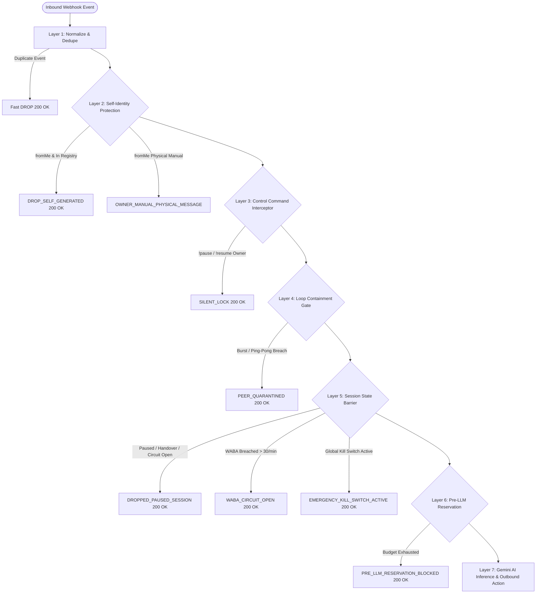
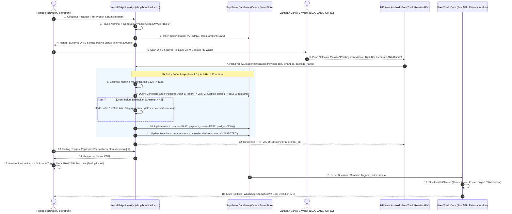

# 🏛️ BOONTRACK ENGINEERING CONSTITUTION & CORE ARCHITECTURE

> **Golden Rule**: *"Implementation can change. Architecture contracts do not change without an explicit Architecture Decision Record (ADR)."*  
> **Core Principle**: *"Natural conversation, deterministic commerce."*

---

## 0. Architecture Principles & Non-Negotiables
1. **Backend is the single source of truth.**
2. **LLM is probabilistic and untrusted.**
3. **Transaction state must be deterministic.**
4. **Tenant isolation is mandatory at every layer.**
5. **Frontend visibility is NOT a security boundary.**
6. **Provider integrations must be replaceable through adapters.**
7. **Business logic must not be coupled to a specific AI provider.**
8. **Configuration belongs in database/environment, not hardcoded in code.**
9. **Webhook handlers must be fast, idempotent, and asynchronous where appropriate.**
10. **New features must strengthen the BoonTrack Business Graph or remain isolated as optional capabilities.**
11. **Verticals define configuration and business rules; the Core Engine defines how configuration is interpreted and executed.**
12. **Zero Fake Fallbacks on External Infrastructure**: Dilarang keras membuat generator kode tiruan (mock/hash generator) untuk menutupi kegagalan koneksi pihak ketiga (seperti WhatsApp pairing code). Kegagalan infrastruktur wajib diekspos secara jujur dan transparan sebagai error HTTP eksplisit.
13. **Single Financial Authority (Financial State Machine)**: BoonTrack accepts multiple payment evidence rails, but maintains a single financial authority: the Financial State Machine. No OCR result, Reader event, or manual action may bypass its tenant, lifecycle, idempotency, and authorization invariants.
14. **Fail-Closed Tenant Isolation**: If tenant resolution fails at any gateway (webhook router, API, checkout), the system MUST fail closed (silent drop, zero response, log security alert). Global platform sales fallbacks are strictly prohibited.
15. **Pre-LLM Transaction Gatekeeper**: All purchase confirmations, order payments, and transactional messages must be intercepted deterministically before entering probabilistic AI context.

### 0.1 Tri-Rule Database-Driven Multi-Tenant Constitution (Phase B Guardrails)
- **Rule 1 (Zero Hardcoded Tenant Logic)**: Tidak boleh membuat percabangan kode berbasis slug fisik (misal: `if tenant == 'gym'` atau `if slug in ['om_budi', 'career']`). Seluruh logika runtime wajib membaca `capabilities`, `business_type`, atau `tenant_kind` dari database Supabase (`TenantRuntimeContext`).
- **Rule 2 (No New Tenant Folders)**: Direktori `app/tenants/*` berstatus **DEPRECATED (Freeze)**. Dilarang keras menambah file, modul, atau folder baru di dalamnya. Seluruh vertikal bisnis baru harus dioperasikan melalui Core capability engine berbasis data.
- **Rule 3 (Shared Core Capabilities)**: Fitur-fitur fundamental seperti Meta CAPI, Payment QRIS (Duitku/Xendit), AI Conversational Gateway, Storage R2, dan Auth adalah mesin global terpadu milik BoonTrack Core, bukan milik vertikal tertentu. Vertikal hanya mengonsumsi capabilities ini secara deklaratif.

---

## 1. Backend Engine (Dual-Runner Python)
- **Engine**: Menggunakan **aiohttp web runner via `main.py` + FastAPI** yang di-deploy di Railway.
- **Aturan Wajib**: Setiap penambahan route, blueprint, atau middleware **WAJIB** didaftarkan di `aiohttp_app` runner. Mendaftarkan route hanya di FastAPI akan menyebabkan error `404 Not Found`.
- **CORS Whitelist (Production)**: Penanganan CORS reflection wajib diterapkan di tingkat runner. Origins yang diizinkan secara eksplisit:
  - `https://shop.boontrack.com` (Buyer Storefront)
  - `https://dashboard.boontrack.com` (Merchant Dashboard — **ditambahkan ADR 2026-09-27**)
  - `https://affiliate.boontrack.com` (Affiliate Portal)
  - `https://bossob.boontrack.com` (Super Admin)

---

## 2. Frontend & Modular Navigation (Next.js App Router — Dual Domain)

### Pemisahan Domain Buyer vs Seller (ADR 2026-09-27)

| Peran | Domain | Deskripsi |
| :--- | :--- | :--- |
| **Buyer (Pembeli)** | `shop.boontrack.com/{slug}` | Storefront publik, katalog produk, checkout, halaman sukses |
| **Seller (Merchant)** | `dashboard.boontrack.com/{slug}` | Dashboard manajemen toko, pesanan, produk, pengaturan |

Seluruh trafik dari `dashboard.boontrack.com` diproses oleh `middleware.ts` yang melakukan **internal rewrite** (bukan redirect publik) ke route `app/[tenant]/dashboard/...` di Next.js App Router. URL di browser merchant tetap berada di `dashboard.boontrack.com`.

- **Routing API**: Memanfaatkan proxy internal `/api/v1/...` dengan base URL terarah ke `https://api.boontrack.com`.
- **Adaptive Modular Registry (Progressive Disclosure)**:
  - Dilarang keras menggunakan pengecekan boolean kaku berbasis tier string lama.
  - Navigasi wajib membaca objek `capabilities` dari `TenantRuntimeContext`.
  - **Core Menu (Selalu Tampil)**: Beranda, Produk, Pesanan, Pembayaran.
  - **Conditional Core**:
    - `Pengiriman`: Hanya dirender jika `business_type === 'PHYSICAL'` dan `capabilities.shipping === true`.
    - `Booking`: Hanya dirender jika `business_type === 'FIELD_SERVICE'`.
    - Form vertikal lokal (seperti service toren/torsi) terisolasi mutlak di balik pengecekan tipe bisnis dan dilarang muncul di toko digital.

### 2.1 Canonical Domain, Edge Delivery & Funnel Routing Contract
Seluruh domain, routing funnel, edge infrastructure, dan event tracking terikat kontrak arsitektur baku:

| Domain / Route | Target Pengguna & Peran | Edge / Hosting Infra | Funnel & CTA Intent | Meta Event Trigger |
| :--- | :--- | :--- | :--- | :--- |
| `boontrack.com` | Landing Page Korporat & Solusi | Cloudflare Worker (`patient-smoke-84ed`) | Edukasi platform & navigasi produk | `PageView` |
| `boontrack.com/onboarding` | B2B, B2G, Custom IoT & Hardware | Cloudflare Worker (`patient-smoke-84ed`) | Form Audit & Booking Architect | `Lead` |
| `career.boontrack.com` | AI Career Growth & Talent Pool | Cloudflare Worker (`silent-water-8c2e`) | Landing page career & intake CV | `PageView` / `Lead` |
| `app.boontrack.com` | Pintu Masuk Portal Aplikasi | Vercel (Next.js) | Hub Utama (Onboarding redirect ke `boontrack.com/onboarding`) | - |
| `shop.boontrack.com/register` | Merchant Self-Serve (UKM / Retail) | Vercel (Next.js) | Registrasi Toko Baru Langsung | `InitiateCheckout` (Trial), `Purchase` (Lunas) |
| `shop.boontrack.com/affiliate/register` | Calon Mitra Afiliasi | Vercel (Next.js) | Registrasi Mandiri Program Afiliasi | `CompleteRegistration` |
| `affiliate.boontrack.com` | Mitra Affiliate Aktif (role: 'affiliate') & Affiliate Manager (role: 'am' - Kang Sakti / buzzerukm) | Vercel (Next.js) | Dashboard Mandiri Mitra, serta Agregasi Metrik Jaringan Downline & Monitoring Payout khusus role AM. | - |
| `dashboard.boontrack.com` | Merchant (Seller) — semua tier | Vercel (Next.js) via internal rewrite middleware | Login & Dashboard manajemen toko. Root `/` dan `/login` di-rewrite ke `/login`; path `/{slug}` di-rewrite ke `/[tenant]/dashboard`. URL tetap di bawah `dashboard.boontrack.com`. | - |
| `bossob.boontrack.com/admin` | Super Admin Internal | Vercel (Next.js) | Control Plane, Leads Pipeline & Tenant Registry | - |

> **Contract Rule**: Setiap domain baru yang ditambahkan ke ekosistem BoonTrack **WAJIB** didaftarkan di tabel ini beserta edge infra, funnel intent, dan Meta event trigger-nya sebelum dipublikasikan ke produksi.

### 2.2 Auth-Only Affiliate Dashboard Standard (Production Contract)
1. **Automated Session Authentication (Cookie / JWT Based)**:
   - Halaman portal afiliasi (`/affiliate/dashboard` dan `/affiliate`) WAJIB beroperasi secara murni *auth-only* berbasis sesi terotentikasi (JWT Bearer / HTTP-only Secure Cookie `authSession` / `affiliate_code`).
   - Data profil mitra, kode referral unik personal, metrik performa (klik, lead masuk, toko trial aktif, toko berbayar, komisi tercatat), serta link promosi WAJIB dimuat secara otomatis dari sesi aktif tanpa intervensi manual.
2. **Larangan Mutlak Manual Search di Level Produksi**:
   - DILARANG KERAS menampilkan kotak input pencarian manual ("KODE REFERRAL MITRA") atau tombol pencarian ("Cari Mitra") di level produksi.
   - Mitra tidak boleh dibebani untuk mencari data dirinya sendiri.
   - Jika sesi autentikasi belum terdeteksi / expired, antarmuka wajib mengarahkan mitra secara elegan ke alur login OTP WhatsApp resmi (`/affiliate/login`).

---

## 3. Entitlement Engine & Security Guard
- **Source of Truth**: Menggunakan skema relasional: `features` → `plans` → `plan_entitlements` → `tenant_entitlements` (bukan array string sederhana di tabel tenants).
- **Pemisahan Konsep**: 
  - *Feature* = kapabilitas teknis sistem internal (contoh: `AI_BOT`, `META_CAPI`).
  - *Add-on* = paket komersial yang dibeli user.
- **FastAPI Enforcement**: Setiap endpoint privat wajib memvalidasi entitlement via guard/dependency decorator. Kembalikan error `403 FEATURE_NOT_ENTITLED` jika hak akses tidak aktif.

### 3.1 Entitlement & Commercial Subscription Tiers (Contract ADR)
Ekosistem BoonTrack meresmikan standarisasi paket komersial yang mengikat seluruh lapisan (Frontend UI, Onboarding Gateway, Billing Invoicing, dan PostgreSQL Database):

| Nama Komersial (UI) | Tier PostgreSQL Enum | Durasi & Skema Harga | Hak Akses Fitur Utama |
| :--- | :--- | :--- | :--- |
| **Paket Checkout Lite (Entry)** | `CHECKOUT_LITE` | Rp 59.000 / bulan | Checkout engine instan, single product page checkout, maksimal 3 produk aktif, QRIS dinamis 0% MDR, notifikasi order ringkas, checkout digital & fisik (lazy shipping maks 1 ekspedisi), basic Browser Pixel tracking. Tanpa Meta CAPI, tanpa AI bot, tanpa multi-seat. |
| **Solo / Starter** | `STARTER` | Rp 0 (Trial 7 Hari Penuh) / Rp 199.000/bln | Storefront mandiri, katalog tanpa batas, cek ongkir multi-ekspedisi, QRIS dinamis, Bot WhatsApp auto-reply dasar. |
| **Ads Performance** | `PRO_SCALE` | Rp 299.000 / bulan (Trial 7 Hari Promo) | Semua fitur STARTER + Meta & TikTok CAPI Server-Side, God Button konversi, 2 Seats CS Inbox, Advanced Analytics. |
| **Team Scale** | `ENTERPRISE` | Rp 499.000 / bulan | Semua fitur PRO_SCALE + Unlimited Multi-Seat CS, Official Meta Cloud API (WABA), Broadcast WA, Custom Domain + SSL. |

> **ADR Database Invariant**:
> Kolom `tenants.tier` dan `shop_subscriptions.plan_tier` di PostgreSQL Supabase serta enum SQLAlchemy/Pydantic di Core ENGINE mendukung canonical tier: `'CHECKOUT_LITE'`, `'STARTER'`, `'PRO_SCALE'`, dan `'ENTERPRISE'` (serta `'FREE'` untuk internal testing). Seluruh string legacy (seperti `GROWTH`, `growth_tracking`, `proscale`, `team_scale`, `solo`, `checkout_lite`, `lite`) wajib ditransformasikan melalui adapter/migrasi database ke enum resmi di atas.

### 3.1.1 CS Seat Entitlement & Live CS Inbox Access Rules (ADR 2026-10-01)
Aturan alokasi kuota kursi CS (CS Seats) berlaku ketat dan deterministik di seluruh layer platform (Database `tenant_users`, API Gateway `/api/inbox/team-members`, dan Dashboard Frontend `TeamChatTab.tsx` / `InboxConsole.tsx`):

| Plan Tier | Canonical Key | CS Seat Quota | Inbox Access Policy | Aksi Tombol '+ Tambah CS Seat' |
| :--- | :--- | :--- | :--- | :--- |
| **Checkout Lite** | `CHECKOUT_LITE` | **0 Seat** | **Locked (Gembok)**: Menu Inbox terkunci. | Membuka Modal Paywall: *"Fitur Live CS Inbox hanya tersedia mulai paket Solo atau Ads Performance."* |
| **Solo / Starter** | `STARTER` / `SOLO` | **1 Seat** | Akses 1 Agent CS Live. | Jika `activeCsCount < 1`: Buka Form Undang CS. Jika `>= 1`: Buka Modal Upgrade Paywall ke Ads Performance (2 Seats). |
| **Ads Performance** | `PRO_SCALE` / `ADS_PERFORMANCE` / `TRIAL` | **2 Seats Gratis** | Akses 2 CS Live Multi-Agent + Bot AI. | Jika `activeCsCount < 2`: Buka Form Undang CS. Jika `>= 2`: Buka Modal Upgrade Paywall ke Team Scale (5 Seats). |
| **Team Scale** | `ENTERPRISE` / `TEAM_SCALE` | **5 Seats Max** | Akses Tim Skala Penuh hingga 5 CS. | Jika `activeCsCount < 5`: Buka Form Undang CS. Jika `>= 5`: Modal Limit Maksimal (Hubungi Enterprise Support). |

---

## 4. Fulfillment & Checkout Logic
- **Fulfillment Resolver**:
  - `DIGITAL`: Memotong otomatis seluruh field logistik (alamat, kecamatan, kurir, ongkir). Checkout hanya meminta Nama, WhatsApp, Email, lalu bypass langsung ke auto-delivery payload saat status pesanan menjadi `PAID`.
  - `PHYSICAL`: Mengaktifkan kalkulasi ongkir dan form logistik pengiriman lengkap.
- **Dynamic Links**: Link checkout WhatsApp wajib menggunakan resolver dinamis (`shop.boontrack.com/{tenant_slug}` atau custom domain), dilarang hardcode domain tertentu.

---

### 4.2 Ingress Webhook Pipeline V2 & Outbound Message Registry
Setiap pesan keluar yang diterbitkan oleh sistem bot (baik berupa pesan selamat datang, balasan AI, eskalasi serah terima manual / handover, maupun notifikasi order & Dynamic QRIS) WAJIB didaftarkan ke registri pesan keluar:
- **Tabel / Entitas**: `outbound_messages`
  * `id`: UUID (Primary Key)
  * `tenant_id`: Identifier tenant toko
  * `conversation_id`: Sesi percakapan pelanggan
  * `runtime_instance_id`: Instance gateway (Evolution API / Meta Cloud API)
  * `wa_message_id`: ID pesan unik WhatsApp (`wamid...` atau Baileys `key.id`)
  * `recipient_jid`: Nomor tujuan / WhatsApp JID
  * `message_type`: Tipe pesan (`text`, `image`, `order_notify`, `handover`)
  * `content_hash`: SHA-256 hash dari konten pesan untuk deduplikasi cepat
  * `source`: Sumber pengiriman (`bot`, `system`, `broadcast`, `handover`, `order_notify`)
  * `created_at`: Timestamp UTC presisi
- **Pencatatan Sinkron & Cache Sub-Millisecond**: `wa_message_id` dicatat ke dalam in-memory Set/Cache sebelum/saat pengiriman dan disimpan persisten ke tabel database `outbound_messages`.
- **Zero Self-Echo Guarantee**: Ketika webhook WhatsApp menerima event `messages.upsert` dengan `fromMe == True`, sistem memeriksa `wa_message_id` di registri ini. Jika ditemukan, pesan seketika di-drop (`DROP_SELF_GENERATED`, LLM = 0, Outbound = 0).

#### 4.2.1 Diagram 7-Layer Ingress Webhook Pipeline V2

```mermaid
flowchart TD
    Inbound([Inbound Webhook Event]) --> L1[Layer 1: Normalize & Dedupe]
    L1 -->|Duplicate Event| DropDedupe[Fast DROP 200 OK]
    L1 --> L2{Layer 2: Self-Identity Protection}
    L2 -->|fromMe & In Registry| DropEcho[DROP_SELF_GENERATED 200 OK]
    L2 -->|fromMe Physical Manual| Coexist[OWNER_MANUAL_PHYSICAL_MESSAGE]
    L2 --> L3{Layer 3: Control Command Interceptor}
    L3 -->|!pause / !resume Owner| SilentLock[SILENT_LOCK 200 OK]
    L3 --> L4{Layer 4: Loop Containment Gate}
    L4 -->|Burst / Ping-Pong Breach| Quarantine[PEER_QUARANTINED 200 OK]
    L4 --> L5{Layer 5: Session State Barrier}
    L5 -->|Paused / Handover / Circuit Open| DropBarrier[DROPPED_PAUSED_SESSION 200 OK]
    L5 -->|WABA Breached > 30/min| DropWABA[WABA_CIRCUIT_OPEN 200 OK]
    L5 -->|Global Kill Switch Active| DropKill[EMERGENCY_KILL_SWITCH_ACTIVE 200 OK]
    L5 --> L6{Layer 6: Pre-LLM Reservation}
    L6 -->|Budget Exhausted| DropBudget[PRE_LLM_RESERVATION_BLOCKED 200 OK]
    L6 --> L7[Layer 7: Gemini AI Inference & Outbound Action]
```


---

## 5. Monetization & Entitlement Lifecycle (Flexible Policy)
- **Status Lifecycle Engine**: Mendukung transisi status dinamis: `TRIAL`, `ACTIVE`, `EXPIRED`, `CANCELLED`. Durasi aktif dan kuota pemakaian dibaca dari database (`valid_until`, `usage_limit`), bukan di-hardcode.

### 5.1 Four Official Subscription Tiers (Canonical Standard)
Ekosistem BoonTrack (frontend registrasi, gateway onboarding, billing Xendit, dan database PostgreSQL) distandarisasi pada 4 tier resmi:
0. **Paket Checkout Lite** (`tier = 'CHECKOUT_LITE'`)
   - Harga: Rp 59.000 / bulan (Entry tier / Instant Checkout Engine).
   - Hak Akses: Single Page Checkout siap jual, maksimal 3 produk aktif, QRIS dinamis 0% MDR, notifikasi order ringkas WhatsApp, tracking browser (Meta & TikTok Pixel), pengiriman fisik dasar (lazy shipping maksimal 1 ekspedisi) dan produk digital.
   - Pembatasan: Tanpa Server-Side CAPI, tanpa AI Conversational Bot, tanpa Multi-Seat CS Inbox, tanpa Broadcast WABA template, tanpa Advanced Analytics.
1. **Solo / Starter** (`tier = 'STARTER'`)
   - Harga: Rp 0 (Reverse Trial 7 Hari), normal Rp 199.000 / bulan.
   - Hak Akses: Storefront mandiri, katalog produk tanpa batas, kalkulasi ongkir multi-ekspedisi, QRIS dinamis 0% MDR, bot auto-reply dasar.
2. **Ads Performance** (`tier = 'PRO_SCALE'`)
   - Harga: Rp 299.000 / bulan.
   - Hak Akses: Semua fitur Solo/Starter + Meta & TikTok CAPI Server-Side, God Button konversi, 2 Seats CS Inbox, Advanced Analytics.
3. **Team Scale** (`tier = 'ENTERPRISE'`)
   - Harga: Rp 499.000 / bulan.
   - Hak Akses: Semua fitur Ads Performance + Full Skala Tim, CS Inbox Unlimited / Multi-seat, Integrasi WhatsApp WABA & AI Bot Omnichannel, Custom Domain + SSL.

> **Database & Schema Invariant**: Kolom `tenants.tier` di database PostgreSQL Supabase dan SQLAlchemy Core WAJIB menggunakan nilai enum kanonikal: `'CHECKOUT_LITE'`, `'STARTER'`, `'PRO_SCALE'`, atau `'ENTERPRISE'`.

- **Cost-Guarding Enforcement**:
  - Membedakan fitur berbiaya marjinal rendah (Storefront, Katalog, Input Pesanan) dengan fitur berbiaya variabel pihak ketiga (AI Bot Token, Sesi WhatsApp).
  - Ketika akun berada di status tanpa entitlement bot (misal: mode dasar atau promo habis), backend worker wajib menonaktifkan panggilan ke AI/WhatsApp secara otomatis tanpa merusak data katalog dan riwayat pesanan.
- **Identity & Fraud Guard**: Pencegahan eksploitasi promo berulang berbasis identitas bernilai riil (verifikasi nomor WhatsApp unik dan rekening payout bank).

---

## 6. Media Storage
- **Penyimpanan Utama**: Cloudflare R2 (path `media/`).
- **Khusus QRIS**: Wajib format lossless PNG dengan solid background (bukan transparan) di folder `qris/`.
- **Fallback**: Supabase Storage.

---

## 7. Database & Auth
- **Database**: PostgreSQL Supabase (arsitektur multi-tenant berbasis `tenant_id`).
- **Edge Routing**: Cloudflare Edge Routing.

---

## 8. Unified Natural Engine & Conversational Architecture

### 8.1 Core Philosophy & Unified Natural Engine
- **Prinsip Utama**: *"Natural conversation, deterministic commerce."*
- **Karakteristik LLM**: Model Bahasa Besar (LLM) bersifat probabilistik dan secara mendasar **untrusted** untuk pencatatan buku besar (*ledger*), kalkulasi harga, alokasi stok, dan validasi status transaksi.
- **Sinergi Dua Alam**:
  - *Conversational Layer* bertanggung jawab untuk empati, negosiasi, klarifikasi bahasa gaul, dan percakapan natural dengan calon pembeli.
  - *Deterministic State Machine* bertanggung jawab mutlak atas validasi bisnis, perhitungan subtotal/diskon, pembuatan QRIS unik, penguncian inventaris, dan transisi status order.
- **Zero Hallucination Guarantee**: Sistem menjamin tidak ada halusinasi data transaksi; backend state machine selalu menjadi otoritas pemutus terakhir (*ultimate authority*).

---

### 8.2 Three-Pillar Hybrid Core
Sistem percakapan cerdas BoonTrack beroperasi di atas tiga pilar independen yang memiliki batasan wewenang tegas:

```text
┌─────────────────────────────────────────────────────────────────────────┐
│                       THREE-PILLAR HYBRID CORE                          │
├──────────────────────────┬───────────────────────┬──────────────────────┤
│  PILLAR 1: PERSONA LAYER │ PILLAR 2: CONV. LLM   │ PILLAR 3: STATE MACH.│
│  (Presentation Policy)   │ (Intelligence Layer)  │ (System Authority)   │
│  "HOW it speaks"         │ "HOW it understands"  │ "WHAT it can do"     │
├──────────────────────────┼───────────────────────┼──────────────────────┤
│ • Tone & Empathy Voice   │ • NLU & Slang Parser  │ • Catalog & Stock    │
│ • Greeting & Closings    │ • Intent Extraction   │ • Cart & Total Bill  │
│ • Objection Handling     │ • Entity Resolution   │ • Dynamic QRIS / Pay │
│ • Do/Don't Directives    │ • Natural Synthesis   │ • Order Lifecycle    │
│ [DILARANG TENTUKAN DATA] │ [UNTRUSTED PROPOSAL]  │ [SINGLE TRUTH AUTHORITY]
└──────────────────────────┴───────────────────────┴──────────────────────┘
```

1. **Pillar 1 — Seller Persona Layer (Presentation Policy - HOW it speaks)**
   - Mengatur tone bahasa (santai, formal, ramah, konsultatif), greeting, objection handling, closing style, dan batasan kepribadian brand toko.
   - **Authority Boundary**: Persona DILARANG KERAS menentukan kebenaran data transaksional (harga produk, ketersediaan stok, validitas pesanan, status pembayaran).
2. **Pillar 2 — Conversational LLM (Intelligence Layer - HOW it understands)**
   - Bertanggung jawab atas Natural Language Understanding (NLU), deteksi intent, ekstraksi entitas, normalisasi bahasa daerah/slang, dan perangkai respon natural.
   - **Authority Boundary**: Output LLM diperlakukan sebagai *untrusted proposal*. LLM DILARANG memutasi database pesanan/pembayaran, menghitung nominal final, atau membuat payload QRIS sendiri.
3. **Pillar 3 — Deterministic State Machine & Business Graph (The System Authority - WHAT it can do)**
   - Otoritas tunggal untuk alur percakapan terstruktur, katalog, stok, validasi checkout, payload QRIS dinamis, aturan bisnis, dan CAPI events. Backend state selalu meng-override interpretasi LLM.

---

### 8.3 Separation of Concerns: Configuration vs Runtime
Arsitektur memisahkan secara tegas antara **Fase Konfigurasi (Setup & Tuning)** dan **Fase Runtime (Interaksi Aktif Pelanggan)**:

1. **Fase Konfigurasi (BoonPilot - The Setup Architect)**:
   - BoonPilot bertindak sebagai konsultan bisnis pintar dan asisten konfigurasi bagi merchant.
   - Menghasilkan proposal terstruktur berbasis tipe `BusinessConfigurationProposal` (`types/boonpilot.ts`).
   - Siklus hidup proposal: `DRAFT` → `VALIDATED` → `PUBLISHED` (atau `REJECTED`).
   - Proposal yang telah di-validasi dan di-publish oleh merchant tersimpan di database Supabase sebagai konfigurasi resmi toko.
2. **Fase Runtime (Conversational Runtime Engine - The Real-Time Executor)**:
   - Engine runtime membaca konfigurasi toko yang berstatus `PUBLISHED` dari database Supabase sebagai parameter *read-only*.
   - Runtime engine mengeksekusi pipeline pemrosesan sinyal chat secara deterministik.
   - Kode internal BoonPilot TIDAK dijalankan di alur eksekusi pesan WhatsApp pembeli langsung.

---

### 8.4 8-Layer Ingress Webhook Architecture & Pair Safety Budget (dengan Gate C)

> **Doktrin Resmi CTO Office #1**:
> *"BoonTrack tidak berasumsi bahwa setiap inbound message berasal dari manusia. Setiap external conversational event diperlakukan sebagai untrusted input dan wajib melewati bounded safety, cost, and interaction controls sebelum dapat memicu AI inference atau outbound action."*

Setiap pesan masuk dari seluruh gateway (BoonTrack WhatsApp Engine / BoonTrack Gateway maupun Meta WABA Cloud API) wajib melalui evaluasi sekuensial 8 lapis pengamanan (*8-Layer Ingress Webhook Architecture V2 dengan Gate C*):
- **Layer 1: Normalization & Inbound Deduplication**
  Normalisasi `sender_phone`, sanitasi `tenant_slug`, ekstraksi `wa_message_id`, unwrapping pesan (ephemeral, viewOnce, button reply, list response), serta deduplikasi in-memory berbasis sliding window 120 detik.
- **Layer 2: Self-Identity Protection & Coexistence Mode**
  Jika `fromMe == True`:
  * Cek `wa_message_id` di `outbound_messages`.
  * **FOUND**: Drop instan dengan respon HTTP 200 OK (`DROP_SELF_GENERATED`). Zero LLM call, Zero Outbound.
  * **NOT FOUND**: Ditandai sebagai pesan fisik manual Owner (*Coexistence Mode*). Pesan tidak memicu auto-reply bot ke diri sendiri, tetapi dievaluasi pada Layer 3 untuk perintah kontrol `!pause` / `!resume`.
- **Layer 3: Control Command Interceptor - Silent Lock**
  Menangkap perintah `!pause`, `!resume`, `/admin pause`, `/admin resume`, `pause`, `resume`, `#pause`, `#resume`:
  * **HANYA BERLAKU** jika dikirim oleh OWNER / ADMIN terdaftar yang divalidasi via RBAC Scope Detection.
  * `!pause`: Mengubah state sesi/tenant `is_paused = True`. Mengembalikan respon HTTP 200 OK secara hening (*Silent Lock*: NO LLM, NO Outbound).
  * `!resume`: Mengubah state `is_paused = False` serta mereset status karantina loop. Mengembalikan respon HTTP 200 OK hening.
  * **Jika dikirim oleh CUSTOMER biasa**: Perintah kontrol diabaikan secara tegas; pesan diproses sebagai obrolan pelanggan biasa.
- **Layer 4: [P0 NEW] Loop Containment Gate & Pair Safety Budget**
  * **Format Tracking Key**: `loop_key = f"{tenant_id}:{conversation_id}:{peer_identity}"`.
  * **Sliding Window Per-Peer**: Mengukur velocity, burst rate (default 5 pesan dalam window 10 detik), dan message depth.
  * **Automated Containment**: Jika terdeteksi rapid ping-pong atau burst spam antar bot, pair circuit breaker seketika trip ke status `PEER_QUARANTINED` (Zero LLM, Zero Outbound).
- **Layer 5: Session State Barrier**
  * Memvalidasi apakah sesi toko dalam kondisi `is_paused == True`, `HANDOVER_TO_HUMAN`, atau `circuit_state == OPEN`.
  * Memvalidasi hard-cap WABA runaway breaker (`WABA_CIRCUIT_OPEN`).
  * Memvalidasi emergency switch `GLOBAL_AI_OUTBOUND_ENABLED` (jika non-aktif, obrolan conversational dibisukan namun flow transaksional order & Dynamic QRIS tetap berjalan).
  * Pelanggaran pada layer ini menghasilkan fast drop HTTP 200 OK tanpa komputasi AI.
- **Layer 6: Cost & Token Budget Gate (Doktrin Pre-LLM Reservation)**
  * **Wajib**: Memanggil `safety_budget_service.reserve(loop_key, estimated_turn=1)` sebelum memanggil LLM provider.
  * **Fast DROP**: Jika alokasi kuota sesi turn habis, sistem langsung mengembalikan status HTTP 200 OK (`PRE_LLM_RESERVATION_BLOCKED`). Tidak ada inferensi Gemini yang dipanggil dan tidak ada pesan keluar (LLM = 0, Outbound = 0).
- **Layer 7: Gemini AI Inference & Outbound Action**
  * Inferensi LLM (Commerce AI Engine / Platform Assistant Engine) HANYA dijalankan bila lolos seluruh Layer 1–6 tanpa perkecualian.
  * Jika peer sedang berada dalam status verifikasi pemulihan `HALF_OPEN`, eksekusi sukses pada layer ini memicu `safety_budget_service.record_successful_turn(loop_key)` untuk memulihkan status ke `ACTIVE`.


### 8.4.1 Boundary & Role of BoonPilot
- **Definisi Peran**: BoonPilot adalah *Merchant-Facing Configuration Consultant & Knowledge Architect*, BUKAN eksekutor transaksi runtime pembeli.
- **Batas Wewenang BoonPilot**:
  - ✅ **DIPERBOLEHKAN**:
    - Mewawancarai merchant untuk menggali profil bisnis, keunggulan produk, dan gaya komunikasi.
    - Merekomendasikan template vertikal bisnis yang paling relevan.
    - Menyusun proposal konfigurasi toko (`BusinessConfigurationProposal`).
    - Menyediakan edukasi dan SOP penggunaan platform BoonTrack via `PlatformKnowledgeProvider` (`lib/boonpilotKnowledge.ts`).
  - ❌ **DILARANG KERAS**:
    - Memutasi status pesanan pelanggan (`orders` table).
    - Menghitung nilai total tagihan, diskon, atau ongkir di transaksi live.
    - Mengubah saldo atau status mutasi rekening merchant.
    - Melakukan bypass terhadap validasi skema database atau RLS Supabase.
    - Melayani chat langsung dengan pembeli akhir (*end-buyer chat runtime*).

---

### 8.5 6 Canonical Vertical Business Templates
Platform BoonTrack mendukung 6 pola bisnis vertikal utama dengan batasan kapabilitas dan aturan transaksi yang terisolasi:

1. `PHYSICAL` (Retail, Fashion, FMCG, Gadget, Kosmetik)
   - **Logistik**: Form pengiriman lengkap (alamat, kecamatan, kurir ekspedisi, ongkir otomatis via Biteship).
   - **Stok**: Pengurangan stok otomatis saat checkout/reservasi.
   - **Fulfillment**: Resi kurir fisik, packing, pengiriman reguler/kargo.
2. `DIGITAL` (E-book, Lisensi Software, Kelas Online, Asset Grafis)
   - **Logistik**: Bypass mutlak seluruh form alamat dan ongkir.
   - **Fulfillment**: Pengiriman otomatis instant (*download link*, *license key*, akses instan) begitu status pesanan menjadi `PAID`.
3. `FOOD` (F&B, Bakery, Katering, Makanan Beku)
   - **Logistik**: Prioritas kurir instan/same-day (Grab/Gojek/Lalamove) dengan radius kilometer terbatas.
   - **Fitur Khusus**: Integrasi QR Meja Toko untuk dine-in / take-away tanpa antre kasir.
4. `FIELD_SERVICE` (Servis AC, Cuci Toren, Sedot WC, Tukang/Teknisi Panggilan)
   - **Booking**: Wajib memilih tanggal, slot jam, dan area jangkauan (*service area*).
   - **Operasional**: Penugasan staf/teknisi, estimasi waktu pengerjaan di lokasi pelanggan.
   - **Pembayaran**: DP/Uang muka atau pelunasan setelah pengerjaan selesai di tempat.
5. `PROFESSIONAL_SERVICE` (Konsultan Hukum, Akuntan, Pajak, Agensi Desain, Dokter)
   - **Intake**: Kuesioner kualifikasi brief awal sebelum konfirmasi.
   - **Jadwal**: Sinkronisasi jadwal konsultasi (1-on-1 meeting slots).
   - **Invoice**: Penagihan bertahap (*milestone/retainer invoicing*).
6. `CREATOR_AGENCY` (Influencer, Content Creator, Talent Management, Video Production)
   - **Paket**: Rate card terstruktur, paket endorse, durasi penayangan konten.
   - **Workflow**: Pengumpulan brief kreatif, approval draft konten, pelunasan bertahap.

---

### 8.6 Conversational Signal Processing Pipeline
Setiap pesan masuk dari pelanggan diproses melalui pipa sekuensial 4 tahap:

```text
Inbound Message (WhatsApp / Web Widget)
                ↓
┌────────────────────────────────────────────────────────┐
│ 1. RAW SIGNAL EXTRACTOR                                │
│    • Normalisasi teks, slang, & typo                   │
│    • Ekstraksi entitas (nama produk, qty, alamat)      │
│    • Klasifikasi intent awal via Conversational LLM    │
└────────────────────────────────────────────────────────┘
                ↓
┌────────────────────────────────────────────────────────┐
│ 2. POLICY EVALUATION LAYER                             │
│    • Penerapan Persona Toko (tone, boundaries)         │
│    • Pengecekan aturan vertikal (PHYSICAL vs DIGITAL)  │
│    • Pemeriksaan Do's & Don'ts konfigurasi tenant      │
└────────────────────────────────────────────────────────┘
                ↓
┌────────────────────────────────────────────────────────┐
│ 3. DETERMINISTIC STATE MACHINE TRANSITION              │
│    • Validasi ketersediaan stok & jam operasional      │
│    • Guard transisi state (mencegah loncat alur ilegal)│
│    • Kalkulasi matematis tagihan & kode unik           │
└────────────────────────────────────────────────────────┘
                ↓
┌────────────────────────────────────────────────────────┐
│ 4. ACTION DISPATCH & RESPONSE SYNTHESIS                │
│    • Eksekusi mutasi DB (create order / reserve stock) │
│    • Generate QRIS dinamis 0% MDR                      │
│    • Trigger Meta CAPI Event (InitiateCheckout, Lead)  │
│    • Rangkai respon natural terarah ke call-to-action  │
└────────────────────────────────────────────────────────┘
```

---

### 8.7 Intent Interruption & Resume Contract
Engine percakapan memiliki kontrak mutlak untuk menangani interupsi pertanyaan di tengah-tengah alur transaksi tanpa kehilangan konteks sebelumnya:

```text
[STATE: COLLECT_ADDRESS] (Sedang meminta alamat pengiriman)
        ↓
(Customer: "Eh kak, yang warna hitam bahannya panas gak?")
        ↓
[INTERRUPTION CAPTURED: PRODUCT_SPEC_QUERY]
        ↓
1. Simpan pointer state aktif (Stack: [COLLECT_ADDRESS]).
2. Jawab pertanyaan produk secara presisi via Knowledge Base (Semantic Category: FACT).
3. Sambungkan dengan bridging kembali ke state utama.
        ↓
[RESUME_ACTION: COLLECT_ADDRESS]
(Bot: "Bahannya katun combed 30s premium kak, adem dan menyerap keringat. Boleh lanjut share kelurahan & kecamatannya kak agar ongkirnya bisa kami hitungkan?")
```

Kontrak ini menjamin pembeli tidak merasa diabaikan, namun alur transaksi tetap terkawal menuju konversi tanpa reset ke awal.

---

### 8.8 Knowledge Base Semantic Categories
Untuk menghindari halusinasi dan tumpang tindih logika, seluruh data pengetahuan toko dikategorikan ke dalam 7 kategori semantik:

1. `FACT`: Fakta absolut yang tidak dapat ditawar (spesifikasi bahan, dimensi, jam buka, lokasi toko).
2. `RULE`: Aturan logika bersyarat (minimal belanja gratis ongkir, batas maksimal booking H-1).
3. `POLICY`: Ketentuan hukum & garansi (kebijakan retur, syarat klaim garansi, pengembalian dana).
4. `FAQ`: Pertanyaan umum berulang dengan jawaban standar yang telah disetujui merchant.
5. `OBJECTION`: Formula penanganan keraguan pembeli (harga mahal, takut penipuan, pengiriman luar pulau).
6. `PERSONA`: Arahan gaya bicara, salam pembuka, panggilan pelanggan (kak, bro, sis, juragan), dan larangan frasa.
7. `CONVERSION`: Frasa penutup penawaran, pemicu *impulse buying*, pengingat keranjang belanja, dan penawaran bundling.

---

### 8.9 Deterministic Commerce & Transaction Authority
- **Pusat Kebenaran Finansial**: Database PostgreSQL Supabase adalah satu-satunya validator transaksi.
- **Kalkulasi Tagihan**: Subtotal, diskon voucher, kode unik, dan ongkir dihitung murni menggunakan logika matematika di backend, bukan angka karangan AI.
- **Kode Unik Dinamis**: Untuk memfasilitasi verifikasi transfer/QRIS tanpa biaya gateway (0% MDR), sistem menyematkan kode unik 3 digit acak/sekuensial pada total tagihan.
- **Penyelesaian Transaksi**: Status pesanan hanya dapat bermutasi menjadi `PAID` melalui:
  1. Notifikasi mutasi valid via aplikasi **BoonTrack Reader** dengan signature token terotentikasi.
  2. Webhook terverifikasi dari payment gateway (Xendit).
  3. Konfirmasi manual oleh merchant berhak akses di dashboard.

---

### 8.10 Booking, Service, and Scheduling Schema
Khusus untuk vertikal `FIELD_SERVICE` dan `PROFESSIONAL_SERVICE`:
- **Skema Penjadwalan**: Mengatur `slot_duration_minutes`, `buffer_minutes`, dan jam kerja operasional.
- **Pencegahan Double-Booking**: Pengecekan ketersediaan slot menggunakan kueri transaksional dengan penguncian baris (*row lock*) untuk mencegah dua pelanggan memesan teknisi/slot yang sama di detik yang bersamaan.
- **Service Area Geo-fencing**: Pembeli di luar daftar kecamatan/kota jangkauan ditolak dengan sopan atau diarahkan ke kuota biaya transportasi khusus.

---

### 8.11 Fulfillment & Delivery Boundary Enforcement
- **Isolasi Fitur Pengiriman**:
  - Untuk toko `DIGITAL`, form kurir, input resi, dan ongkir disembunyikan sepenuhnya dari UI merchant dan tidak pernah dieksekusi di backend.
  - Untuk toko `PHYSICAL`, validasi alamat dan ketersediaan kurir ekspedisi wajib terpenuhi sebelum status order diproses ke pengiriman.
- **Auto-Delivery Payload**: Produk digital menyimpan aset pengiriman (link Google Drive, file license, kredensial) terenkripsi di database, yang langsung dikirim via WhatsApp/Email pembeli saat status pesanan diverifikasi lunas.

---

### 8.12 Conversion Engine, Voucher, and Payment Rules
- **Filosofi No-FAQ**:
  - Halaman produk tidak memerlukan deretan teks FAQ panjang yang mengalihkan perhatian pembeli.
  - Fokus halaman toko adalah foto estetik, kejelasan manfaat, dan pemicu *impulse buying* (bundling promo).
  - Pertanyaan mendalam dan keraguan pembeli diselesaikan secara interaktif oleh bot WhatsApp.
- **Otomasi QRIS 0% MDR**:
  - Merchant mengunggah gambar QRIS statis toko (BCA, DANA, GoPay, QRIS bank lain).
  - Sistem menyematkan kode unik nominal dan membaca notifikasi mutasi via BoonTrack Reader APK.
  - Transaksi lunas otomatis dalam hitungan detik tanpa potongan MDR pihak ketiga.

---

### 8.13 Verification, Mutation Guard & Safety Invariants
1. **Zero Hardcoding Invariant**: Tidak ada slug toko, daftar produk, atau link statis yang di-hardcode dalam kode frontend maupun backend. Semua data berasal dinamis dari database Supabase (`tenants` table).
2. **Tenant Data Isolation**: Seluruh kueri wajib menyertakan filter `tenant_id` dan mematuhi isolasi Supabase Row Level Security (RLS).
3. **Proposal Publication Guard**: Konfigurasi baru hasil perbincangan dengan BoonPilot tidak boleh langsung memengaruhi runtime sebelum melalui review dan validasi status `PUBLISHED` oleh merchant.
4. **Audit Trail**: Setiap perubahan konfigurasi dan mutasi status transaksi tercatat dengan timestamp dan identitas pengubah demi transparansi operasional.

---

## 9. WhatsApp Multi-Tenant Gateway & Device Pairing Architecture

### 9.1 Single Production Engine Contract (Evolution API v2)
- **Official Gateway Engine**: Gateway WhatsApp multi-tenant resmi BoonTrack di production adalah **Evolution API v2** yang ter-deploy terisolasi di Railway dengan dependency Redis dan PostgreSQL.
- **Alamat Gateway Production**:
  - `EVOLUTION_API_URL`: Mengarah ke instance Railway resmi (`https://evolution-api-production-abb7.up.railway.app` atau private domain internal Railway).
  - `AUTHENTICATION_API_KEY` / `EVOLUTION_API_KEY`: Token otentikasi wajib sinkron 1:1 antara Railway instance Evolution API dan `boontrack-core`.
- **Status Engine Lain**: WAHA hanya berstatus local development container / secondary driver dan BUKAN driver gateway production aktif. Tidak diperbolehkan mengarahkan panggilan production ke WAHA tanpa ADR resmi.

### 9.2 Device Pairing & Authentication Protocol
Platform menyediakan dua mekanisme penautan perangkat WhatsApp bagi tenant secara real-time:
1. **Scan QR Code (Primary & Ultra-Stable)**:
   - Dashboard polling status session ke endpoint Evolution API `/instance/connect/{instance}`.
   - Mengambil data string base64 / QR code langsung dari Evolution API.
   - Di-render sebagai gambar QR di dashboard merchant (`WhatsAppTab.tsx`).
2. **Phone Number Pairing Code (Secondary - 8 Character Format)**:
   - Tenant memasukkan nomor telepon aktif (format internasional `628xxx`).
   - Backend memanggil endpoint resmi Evolution API v2:
     `GET /instance/connect/{instance}?number={clean_phone}`
     Headers: `apikey: {EVOLUTION_API_KEY}`
   - Nilai balik wajib diambil dari field resmi `pairingCode` atau `code` yang diterbitkan oleh WhatsApp Meta server melalui Baileys socket.
   - Karakter kode resmi adalah tepat 8 digit alfanumerik (`XXXX-XXXX`).
   - DILARANG KERAS merender raw QR string (teks panjang berawalan `2@...`) ke dalam form pairing code.

### 9.3 Zero Fake Fallback & Transparent Error Policy
- Jika Evolution API belum siap, session gagal, atau nomor tidak valid:
  - Backend DILARANG menghasilkan string acak (deterministic fallback string).
  - Backend wajib mengembalikan respons error HTTP yang sesungguhnya ke frontend (502 Gateway Error atau status relevan) beserta detail kendala.
  - UI frontend wajib menampilkan banner instruksi perbaikan yang jelas kepada merchant, bukan menampilkan kode 8-digit palsu yang pasti ditolak saat diinput ke HP.

### 9.4 Architectural Isolation: BoonTrack Shop vs BoonTrack Career
- **BoonTrack Shop (Multi-Tenant Gateway)**:
  - Setiap merchant memiliki sesi mandiri di Evolution API yang dipetakan via tabel `whatsapp_connections` (dilarang menebak via slug toko).
  - Mengisolasi webhook katalog, penerimaan order, dan obrolan pelanggan per toko.
- **BoonTrack Career (Single-Pipeline Dedicated)**:
  - Menggunakan 1 nomor WhatsApp sistem tersentralisasi khusus untuk evaluasi CV ATS, intake pendaftaran, dan review kandidat.
  - Konfigurasi instance Shop dilarang dicampuradukkan dengan routing pesan Career.

### 9.5 Bidirectional Message Lifecycle & Transport Layer Contract
WhatsApp pada BoonTrack diperlakukan secara mutlak sebagai **bidirectional transport layer**, bukan business logic engine. BoonTrack Core tetap menjadi satu-satunya otak transaksional.

1. **Pipeline Arsitektur Dua Arah**:
   - **Inbound**: WhatsApp User → Evolution API v2 → Inbound Webhook → Signature & Payload Validation → Idempotency Check → Message Persistence → Inbound Queue → HTTP 200 OK → Background Worker → Conversation Engine (LLM / State Machine).
   - **Outbound**: Business Logic / State Machine → Outbound Message Command → Outbound Queue → Worker Rate-Limiter & Deduplicator → WhatsApp Adapter → Evolution API v2 → WhatsApp User.
2. **Fast & Asynchronous Inbound Webhook**:
   - Webhook handler DILARANG memanggil LLM atau mengeksekusi mutasi bisnis berat secara sinkron.
   - Webhook wajib merespons `HTTP 200 OK` dalam waktu < 500ms setelah pesan divalidasi dan dimasukkan ke antrean (*queue*).
3. **Strict Inbound Idempotency (P0 Guard)**:
   - Provider WhatsApp/Evolution API kerap melakukan webhook retry saat jaringan fluktuatif.
   - Idempotency key wajib dibentuk dari kombinasi: `{tenant_id}:{provider_message_id}:{event_type}`.
   - Jika key sudah terdaftar di database/cache Redis: Abaikan pemrosesan ulang dan langsung kembalikan status ACK (`HTTP 200`).
4. **Decoupled Outbound Queue**:
   - Dilarang memanggil endpoint kirim pesan pihak ketiga langsung dari alur transaksi (*blocking call*).
   - Seluruh pesan keluar wajib melalui antrean outbound untuk menjamin retry terukur, rate-limiting, deduplikasi, dan toleransi kegagalan gateway.

### 9.6 Message Event Schema & Conversation Relationship
Sistem memisahkan secara ketat antara entitas **Conversation** (konteks percakapan) dan **Message Event** (rekam jejak pesan individual):

1. **Relasi 1-to-Many**: Satu `Conversation` menaungi banyak `Message Events` lintas tipe (text, media, audio, interactive button, system event).
2. **Message Event Minimum Contract**:
   - `message_id` (UUID internal)
   - `tenant_id`
   - `conversation_id`
   - `direction` (`INBOUND` | `OUTBOUND`)
   - `platform` (`WHATSAPP_BAILEYS` | `WHATSAPP_WABA`)
   - `sender` & `recipient` (nomor telepon E.164)
   - `message_type` (`text`, `image`, `document`, `audio`, `interactive`, `system`)
   - `message_body`
   - `provider_message_id` (ID unik dari WhatsApp/Meta)
   - `status` (`QUEUED`, `SENDING`, `SENT`, `DELIVERED`, `READ`, `FAILED`)
   - `occurred_at` & `received_at`
   - `metadata` (JSON payload)
3. **Message Ordering & FIFO Enforcement**:
   - Pesan dalam satu `conversation_id` wajib dieksekusi berurutan (*sequential FIFO ordering*) menggunakan penanda urutan (`sequence_number` atau timestamp presisi) untuk mencegah race condition (misal: penentuan ukuran produk terproses sebelum pertanyaan ketersediaan warna).

### 9.7 Operational Observability, Lifecycle States & Health Metrics
Pairing berhasil tidak sama dengan gateway yang beroperasi sehat. Sistem memantau status operasional secara terpisah:

1. **Connection State Lifecycle**:
   - `CREATED` → `PAIRING` → `CONNECTED` → `DISCONNECTED` → `RECONNECTING` → `ERROR` → `LOGGED_OUT`.
   - Dashboard merchant wajib menampilkan visual status yang akurat (🟢 Connected, 🟡 Reconnecting, 🔴 Disconnected / Perlu Tindakan).
2. **Decoupled Metric Health (IT & Telemetry Dashboard)**:
   - Status kesehatan dipisah per layer: *Connection Health*, *Inbound Webhook Health*, *Queue Lag*, *AI Processing Latency*, dan *Outbound Delivery Success Rate*.

### 9.8 Multi-Tier Circuit Breaker, Exponential Quarantine & Velocity Isolation

> **Doktrin Resmi CTO Office #2**:
> *"Loop protection is scoped from conversation/peer upward; global breakers are last-resort containment, not the first line of defense."*

1. **Hierarki Bottom-Up Multi-Tier Circuit Breaker**:
   - **Tier 1 (Peer / Pair Breaker)**: Terisolasi pada level `loop_key = f"{tenant_id}:{conversation_id}:{peer_identity}"`. Karantina hanya membisukan AI pada nomor/peer pelanggar. Peer lain, transaksi katalog web, dan QRIS tetap berjalan 100%.
   - **Tier 2 (Tenant Breaker)**: Mengisolasi satu tenant toko jika terjadi anomali sistem internal pada tenant tersebut tanpa mengganggu tenant lain.
   - **Tier 3 (WABA Breaker - Hard-Cap 30 Outbound / Menit)**: Khusus nomor resmi WABA platform (+62 851-8183-0080), diterapkan hard-cap ketat maksimal 30 pesan outbound per menit. Jika breach -> `WABA_CIRCUIT_OPEN`.
   - **Tier 4 (Global Emergency Kill Switch)**: `GLOBAL_AI_OUTBOUND_ENABLED` sakelar darurat pamungkas tingkat platform (last-resort containment).

2. **State Machine & Exponential Cooldown**:
   - **Siklus State**: `ACTIVE` → `LOOP_SUSPECTED` → `CIRCUIT_OPEN` → `PEER_QUARANTINED` → `HALF_OPEN` → `ACTIVE`.
   - **Jadwal Exponential Cooldown**:
     * **Pelanggaran 1**: Cooldown 30 detik. Setelah durasi berakhir, status bertransisi ke `HALF_OPEN` untuk mengizinkan 1 probe turn. Jika probe berhasil, pulih ke `ACTIVE`.
     * **Pelanggaran 2**: Karantina 5 menit (300 detik).
     * **Pelanggaran 3+**: Karantina 30 menit (1800 detik) atau memerlukan resume manual oleh owner/admin via command `!resume`.
   - **Scoped Isolation Invariant**: Karantina peer tidak pernah mematikan webhook toko, tidak mengganggu pelanggan lain yang sedang bertransaksi, dan alur pembayaran QRIS tetap 100% responsif.

3. **Pemisahan Handover Pause vs Circuit Breaker**:
   - **Handover Pause (`is_paused = True`)**: Merupakan state bisnis operasional ketika merchant/admin toko mengambil alih percakapan secara sadar atau pembeli meminta CS manusia. Bot masuk mode *silent listener*.
   - **Circuit Breaker (`circuit_state = 'OPEN'`)**: Merupakan mekanisme perlindungan infrastruktur darurat untuk memutus loop runaway (*runaway bot loop / rate limit breach*).
   - Keduanya diuji secara terpisah pada Layer 5 Ingress Barrier untuk menghasilkan metrik telemetri yang presisi.

4. **Environment Flags & Emergency Controls**:
   - `GLOBAL_AI_OUTBOUND_ENABLED` (default `True`): Sakelar darurat global. Jika dinonaktifkan, seluruh conversational LLM mati, sementara alur transaksional e-commerce (notifikasi order dan Dynamic QRIS) tetap 100% fungsional.
   - `WABA_AI_OUTBOUND_ACTIVE` (default `True`): Mengontrol respon bot AI pada nomor WABA platform.

### 9.8 Human Handoff & Business Graph Attribution
1. **Human Handoff State**:
   - Conversation memiliki status kontrol: `AI_ACTIVE` → `HANDOFF_REQUESTED` → `HUMAN_ACTIVE` → `AI_RESUMED`.
   - Jika pelanggan meminta interaksi manusia atau terdeteksi eskalasi komplain kritis, bot AI seketika masuk status pause (*silent listener*) dan kendali penuh diserahkan ke CS/Merchant.
2. **Outbound Business Graph Attribution**:
   - Setiap pesan outbound wajib merekam atribut pemicu (`trigger_source`: `ORDER_PAYMENT_PENDING`, `ABANDONED_CART_FOLLOWUP`, `AI_RECOMMENDATION`, `HUMAN_AGENT`).
   - Memungkinkan analisis deterministik: percakapan mana yang secara langsung menghasilkan konversi transaksi dan omzet merchant (*Conversation → Decision → Transaction → Revenue*).

---

## 10. Core Adapter Engine & Unit Economics Architecture

### 10.1 Pluggable Payment Adapter Standard
- Setiap tenant mengeksekusi pembayaran melalui `PaymentAdapterFactory` berdasarkan `tenants.metadata.payment_config`.
- **Automated Gateway**: Menggunakan kontrak standar (`create_transaction`, `check_status`, `handle_webhook`) untuk Duitku, Xendit, dan Midtrans. State Machine masuk ke `WAITING_PAYMENT_WEBHOOK`.
- **Manual Transfer / Static QRIS**: Menyajikan instruksi rekening manual atau URL QRIS statis. State Machine beralih ke alur `WAITING_TRANSFER_PROOF` (verifikasi bukti transfer visual via WhatsApp).
- **Zero Provider Hardcode**: Dilarang mengikat logic transaksi langsung ke SDK provider tertentu di luar direktori `app/services/payment/`.

### 10.2 Multi-Aggregator Shipping Standard
- Kalkulasi ongkir dan pembuatan resi diatur oleh `ShippingAdapterFactory` berdasarkan `tenants.metadata.shipping_config`.
- **Categorized Routing**: Pemisahan tegas antara layanan kurir `instant` (GoSend, GrabExpress) dan `regular_cargo` (JNE, J&T, SiCepat).
- **Failover Redundancy**: Setiap kategori wajib mendukung penentuan `primary_provider` dan `fallback_provider` (Biteship, Komship, Shipper) guna mencegah kegagalan checkout saat aggregator mengalami downtime.

### 10.3 Unit Economics & Cost Telemetry Gate
- **AI Token Metering**: Setiap inferensi LLM wajib mencatat payload `{ tenant_id, session_id, prompt_tokens, candidate_tokens, model }` secara asinkron (non-blocking) untuk evaluasi margin per transaksi.
- **WhatsApp Session Accounting**: Webhook gateway wajib mencatat counter volume arah pesan (`INBOUND` / `OUTBOUND`) serta klasifikasi sesi per `tenant_id`.
- **CAPI Closed-Loop Integrity**: Event Meta CAPI `Purchase` wajib menyertakan `custom_data: { value: float, currency: 'IDR' }` riil dari transaksi guna menjamin akurasi perhitungan ROAS merchant.

---

## Storage & Asset Distribution Architecture

### 1. Canonical Asset Domain & Infrastructure
- **Public Domain**: `https://assets.boontrack.com` (Cloudflare R2 Custom Domain).
- **Storage Provider**: Cloudflare R2 Object Storage (Bucket: `boontrack-media`).
- **Stateless Runtime**: Aplikasi Next.js dan Core Backend tidak menyimpan file statis di disk lokal container/server. Seluruh payload upload langsung diteruskan dan dialirkan ke Cloudflare R2.

### 2. Client-Side Pre-Processing
- **Auto-Conversion**: Gambar diproses di browser menjadi format `image/webp` sebelum dikirim.
- **Constraints**: Resolusi maksimum dibatasi `1200px` (aspect-ratio preserved), kualitas kompresi `0.85`, batas maksimal ukuran file `5 MB`.

### 3. Sanitization & Auto-Healing Guardrails
- **Endpoint Contract**: Response dari endpoint upload (`/api/v1/upload`) wajib mengembalikan URL kanonikal berbasis `https://assets.boontrack.com/...`.
- **Sanitization Layer (`sanitizeImageUrl`)**:
  - Merewrite URL legacy (`api.boontrack.com`, backend Railway `boontrack-core-production.up.railway.app`, variasi `asset.boontrack.com` singular, dan dev URL `*.r2.dev`) langsung ke `https://assets.boontrack.com/${path}`.
  - Memaksa upgrade protokol dari `http://` ke `https://`.
- **Client Auto-Healing**: Form edit produk mendeteksi URL legacy saat render pertama kali dan menyembuhkan state data menjadi URL kanonikal sebelum disimpan kembali ke Supabase.

---

## 🗄️ Media & Asset Storage Standard Pattern (Cloudflare R2 + Supabase)

### 1. Separation of Concerns
* **Cloudflare R2 (Object Storage / Binary Data)**:
  * Gudang penyimpanan fisik untuk seluruh berkas media berat: QRIS statis, katalog foto produk, bukti bayar konsumen, video promosi, dan PDF invoice.
  * Diakses via Custom Domain publik (misal: `assets.boontrack.com`) untuk menjamin **Zero Egress Fee** tanpa beban biaya bandwidth.
  * **Fallback**: Supabase Storage hanya aktif jika koneksi/kredensial API R2 gagal merespons saat proses upload.

* **Supabase PostgreSQL (State Machine & Relational Metadata)**:
  * Database **DILARANG** menyimpan data biner atau string base64.
  * Database hanya menyimpan string URL publik R2 di kolom metadata JSONB atau kolom URL relasional:
    ```json
    {
      "payment_config": {
        "mode": "MANUAL_TRANSFER",
        "static_qris_url": "https://assets.boontrack.com/qris/1769366055685_whatsapp_image.jpg",
        "bank_accounts": [...]
      }
    }
    ```

### 2. S3/R2 Object Key Naming Conventions
Penamaan key/path di bucket Cloudflare R2 wajib seragam dan scoped per konteks/tenant:
* **QRIS Toko**: `qris/{timestamp}_{sanitized_filename}`
* **Foto Produk**: `products/{tenant_id}/{product_id}_{timestamp}.webp`
* **Bukti Transfer**: `proofs/{tenant_id}/{order_id}_{timestamp}.jpg`
* **Video/Media Kampanye**: `media/{tenant_id}/videos/{hash}_{timestamp}.mp4`
* **Resume Mentah**: `resumes/{user_id}/raw/{timestamp}_{filename}.pdf`
* **Resume ATS Terkompilasi**: `resumes/{user_id}/generated/ats_{user_id}_{timestamp}.pdf`

### 3. Database Mutation & Schema Integrity Guard
* Setiap operasi `UPDATE` / `PATCH` pada entitas tenant pasca pembaruan berkas media:
  * **DILARANG KERAS** menyertakan field otomatis seperti `updated_at` kecuali kolom tersebut sudah nyata terdaftar di schema tabel `tenants` Supabase.
  * Operasi pembaruan wajib menargetkan kolom `metadata` secara aman (JSONB merge) tanpa merusak struktur data yang telah ada.

### 4. 📄 Career Resume & Document Pipeline Standard
1. **Ingestion File Mentah**:
   - Sumber: Web upload atau WhatsApp incoming webhook.
   - Penanganan: File binary dibaca via in-memory stream (`io.BytesIO`), langsung dialirkan ke Cloudflare R2 dengan key:
     `resumes/{user_id}/raw/{timestamp}_{filename}.pdf`
   - Metadata Supabase: Simpan URL R2 ke kolom `raw_file_url` tabel `career_resumes`. Tidak ada biner yang disimpan ke database.

2. **Ekstraksi Teks & Analisis AI**:
   - Stream bytes dibaca langsung oleh parser (`pypdf` / `pdfplumber`) dari memori atau R2 stream.
   - Hasil parsing dikirim ke AI Engine. Output analisis disimpan sebagai JSON murni pada kolom `parsed_content` / `analysis_result` (tipe `jsonb`).

3. **ATS Generation & Distribution**:
   - Hasil kompilasi ATS di-render dan dialirkan langsung ke Cloudflare R2 dengan key:
     `resumes/{user_id}/generated/ats_{user_id}_{timestamp}.pdf`
   - URL publik yang dikembalikan: `https://assets.boontrack.com/resumes/{user_id}/generated/...`
   - Simpan URL ke kolom `generated_file_url` dan kirimkan tautan tersebut ke WhatsApp user.

---

## 11. Merchant Dashboard Navigation & Dynamic Vertical Standard

### 11.1 Canvas Layout & Live Phone Preview Isolation Rule
1. **Full-Width Canvas (`w-full`)**:
   - Tab Dashboard/Beranda Utama wajib menggunakan kanvas kerja 100% lebar penuh horizontal (`w-full`) agar kartu metrik ringkasan, widget link bio, dan checklist onboarding tertata lega.
   - Dilarang keras menampilkan `LivePhonePreview` di tab Dashboard (baik di samping layar desktop maupun di bawah layar mobile).
2. **Strict Live Preview Isolation**:
   - Komponen `LivePhonePreview` HANYA di-render pada tab `themes` / `storefront` (Tampilan & Tema) dalam format split 2-kolom desktop (`lg:flex`).
   - Seluruh tab operasional lainnya (`dashboard`, `catalog`, `orders`, `whatsapp`, `inbox`, `tracking`, `finance`, serta menu vertikal spesifik) wajib berstatus 100% lebar penuh (`w-full`) tanpa frame ponsel.
3. **Canonical Store URL & Absolute Link Enforcement**:
   - Seluruh tombol dan aksi "Salin Tautan" wajib menyalin URL etalase kanonikal:
     `https://shop.boontrack.com/[tenantSlug]`
   - ⚠️ **Perubahan ADR 2026-09-27**: URL etalase publik yang benar adalah `https://shop.boontrack.com/[tenantSlug]`, **BUKAN** `https://boontrack.com/[tenantSlug]`. `boontrack.com` adalah landing page korporat — bukan storefront publik merchant.

### 11.2 Canonical Business Vertical Navigation Matrix
Navigasi sidebar (`DashboardSidebar.tsx`) pada grup `STORE ENGINE` menyematkan Menu Dinamis (#3) yang beradaptasi secara ketat mengikuti `tenants.category`:

| Canonical Enum (`tenants.category`) | Label Kategori UI | Modul Vertikal | Menu Khusus Operasional (#3 Store Engine) | Target Tab | Ikon Sidebar | Fitur & Batasan Operasional |
| :--- | :--- | :--- | :--- | :--- | :--- | :--- |
| `PHYSICAL` | Retail & Produk Fisik | `physical-retail` | **Logistik & Ekspedisi** | `shipping` | `Truck` | Multi-kurir ekspedisi (JNE, J&T, SiCepat), input berat/dimensi, resi otomatis. Dilarang form booking jam atau link file. |
| `FOOD` | Kuliner & F&B | `fnb-culinary` | **Kurir Instan & Dapur** | `shipping` | `Bike` / `UtensilsCrossed` | Pola GoFood/GrabFood: kurir instan, takeaway vs delivery, radius KM, pesanan dapur. Dilarang opsi kurir reguler berhari-hari. |
| `FIELD_SERVICE` | Jasa Booking & Lapangan | `field-service` | **Jadwal & Booking Servis** | `booking` | `CalendarCheck` | Kalender teknisi lapangan, slot kedatangan, alamat survei. Dilarang keranjang belanja add-to-cart produk fisik. |
| `PROFESSIONAL_SERVICE` | Jasa Travel, Properti, Showroom & Konsultan | `pro-service` | **Jadwal & Sesi Konsultasi** | `booking` | `Calendar` / `Compass` | Form janji temu, survei properti, test drive mobil, simulasi DP/angsuran. Dilarang checkout keranjang belanja instan. |
| `DIGITAL` | Produk Digital & Edukasi | `digital-product` | **Akses Unduh & Lisensi** | `downloads` | `FolderKey` / `Download` | Link download instan (Drive, Notion, ZIP), proteksi lisensi, akses member area. Dilarang form alamat dan ongkir. |
| `CREATOR_AGENCY` | Affiliate, Agensi Live & Kreator | `creator-agency` | **Manajemen Kampanye & UGC** | `campaigns` | `Share2` / `Percent` | Manajemen tautan rujukan affiliate, jadwal live streaming talent, kode kupon diskon kreator. |

### 11.3 Static AI Bot Invariant
- Setiap tenant yang dibuat otomatis memiliki konfigurasi status bot aktif secara baku:
  `is_bot_active: true` dan `bot_paused: false`.
- Webhook pesan masuk menyalurkan percakapan langsung ke Conversation Engine tanpa mewajibkan toggle manual dari pihak merchant.

## 12. BoonTrack Shop Platform Affiliate & AM Engine

### 12.1 Core Architectural Principles
- **Dual-Tier System Separation**:
  - **Platform Affiliate (BoonTrack AM Engine)**: Mengatur akuisisi merchant baru untuk berlangganan SaaS/platform BoonTrack. Memiliki hierarki manajerial (AM) dan downline (Affiliate Mitra).
  - **Store-Level Affiliate (Merchant Level - In RFC)**: Sistem komisi mandiri internal toko agar seller dapat merekrut reseller/kreator produk fisik/digital masing-masing.
- **Master AM Hierarchy**:
  - Entitas `role: 'am'` membawahi pool affiliate lapangan (`role: 'affiliate'`).
  - Master AM default saat ini: **Kang Sakti (`buzzerukm`)**.
  - Mitra baru yang mendaftar via portal publik `/affiliate/register` secara otomatis terikat di bawah `parent_am_id` Master AM aktif.
  - Akun mitra lapangan (seperti `ref: ob`) berstatus downline langsung di bawah Master AM.

### 12.2 Economic & Security Boundary
- **Compensation Rate**: Payout platform default 25% untuk mitra yang membawa merchant closing.
- **Downstream Metric Aggregation**:
  - Dashboard AM secara real-time mengagregasi total leads, toko trial, dan omzet pipeline dari seluruh sub-affiliate di bawah naungannya.
  - Mitra biasa hanya memiliki akses visibilitas terhadap pipeline dan komisi miliknya sendiri (*isolated single-tier view*).
- **Zero-WhatsApp-Cost Authentication**:
  - Autentikasi portal affiliate murni menggunakan Supabase Magic Link dan Email Token via Resend (`affiliate@boontrack.com` / `Boon Pilot`).
  - Saluran WhatsApp diisolasi eksklusif hanya untuk notifikasi transaksional bernilai revenue (misal: closing konversi & pencairan payout).

### 12.3 Scalability & Multi-AM Expansion
- **Control Plane Ready**:
  - Superadmin dapat menerbitkan AM baru per regional/wilayah (provinsi/luar negeri) melalui portal admin.
  - Setiap AM baru memiliki kuota dan pool sub-affiliate terisolasi tanpa merombak arsitektur inti database.

---

## WhatsApp Gateway & Multi-Tenant Connection Architecture

### 1. Core Principle (Mapping Authority)
- **Tenant Identity ≠ Gateway Instance Identity**:
  - `tenant_id` atau `tenant_slug` adalah entitas bisnis internal, bukan nama instans koneksi pada WhatsApp Gateway (Evolution API).
  - Frontend/Client **DILARANG KERAS** menebak, mengasumsikan, atau membuat nama instance Evolution API secara mandiri via slug toko (misal: dilarang mengasumsikan instance = `${tenant.slug}`).
  - Resolusi instans dan routing pesan WAJIB selalu melalui backend API resmi (`/api/v1/whatsapp/...`).
- **Single Source of Truth (`whatsapp_connections`)**:
  - Sumber kebenaran tunggal untuk seluruh metadata koneksi WhatsApp adalah database, khususnya tabel `whatsapp_connections`.
  - Seluruh parameter instance (nama instance, gateway provider, nomor telepon terikat, status koneksi, dan endpoint) dikelola dan dipetakan langsung dari tabel `whatsapp_connections`.
  - Backend resolver (`get_or_create_evolution_session`, `resolve_dynamic_tenant_for_whatsapp`, dan webhook ingress) menggunakan tabel ini sebagai otoritas tunggal pemetaan komunikasi masuk dan keluar.

### 2. Connection Modes
Sistem mendukung 3 mode koneksi WhatsApp sesuai kapabilitas dan peruntukan layanan:
1. **SHARED (Shared Multi-Tenant Gateway)**:
   - **Deskripsi**: Default MVP/Starter via single gateway `"boontrack-gateway"` (atau nomor transaksional resmi sistem).
   - **Peran**: Dikhususkan untuk notifikasi transaksional/outbound satu arah (order confirmation, OTP login/verifikasi, link pembayaran, dan konfirmasi lunas).
   - **Karakteristik**: Berbiaya efisien, tanpa memerlukan pairing nomor pribadi merchant, namun tidak melayani percakapan 2-way bot toko.
2. **DEDICATED (Dedicated Baileys Instance)**:
   - **Deskripsi**: Instance Baileys tersendiri per-tenant untuk nomor toko pribadi merchant.
   - **Peran**: Mendukung komunikasi 2 arah (2-way chat), penerimaan pesan masuk real-time (inbound webhook), serta eksekusi AI Assistant (Conversational Engine / BoonPilot).
   - **Provisioning**: Dibuat secara dinamis via Evolution API v2 melalui alur scan QR code atau pairing code 8-digit, dan dicatat permanen di `whatsapp_connections`.
3. **OFFICIAL (Meta Cloud API / WABA)**:
   - **Deskripsi**: Jalur resmi Meta Cloud API (WhatsApp Business Account / WABA) untuk skala Enterprise.
   - **Peran**: Notifikasi massal berskala besar (broadcast), verifikasi centang hijau (Official Business Account), SLA tinggi, dan jaminan bebas blokir Baileys.
   - **Routing**: Dikelola melalui credentials resmi Meta (`PHONE_NUMBER_ID`, `WABA_ID`, `ACCESS_TOKEN`).

### 3. Infrastructure & Scaling Guardrails (ADR)
Pedoman keputusan arsitektur dan batasan teknis operasional infrastruktur WhatsApp Gateway:
1. **Pragmatic Hosting & Market Validation (Railway Hobby Plan Guardrail)**:
   - Infrastruktur Evolution API tetap beroperasi di Railway (Hobby Plan) untuk fase validasi pasar dan pre-launch.
   - **ADR Rule**: Tidak melakukan migrasi ke VPS mandiri (misal: Hetzner/DigitalOcean dengan Coolify/Docker Swarm) sebelum terdapat kebutuhan nyata (>20-30 dedicated instances aktif). Prioritas utama adalah menekan overhead operasional dan fokus pada konversi bisnis.
2. **Larangan Sleep / Lazy Socket untuk Nomor Conversational**:
   - **Guardrail**: Dilarang memutus socket idle (*sleep/lazy disconnect*) jika nomor toko menerima pesan masuk atau menjalankan bot AI. Memutus socket Baileys secara sepihak akan mematikan real-time inbound webhook pelanggan.
   - **Pemisahan Lifecycle Kelas Koneksi**:
     - **Class 1 (Always-On Conversational)**: Instance yang melayani 2-way chat, AI bot, dan customer service wajib berstatus *Always-On* dengan koneksi socket persisten.
     - **Class 2 (Notification-Only / Outbound)**: Instance yang murni digunakan untuk pengiriman pesan transaksional/broadcast berkala dapat menerapkan kebijakan socket hemat sumber daya.
3. **Gateway Pool Blueprint (Multi-Server Readiness)**:
   - Skalabilitas multi-server masa depan dirancang berbasis *Gateway Nodes Registry*.
   - Tabel koneksi mendukung pencatatan node gateway (`gateway_node_url`, `api_key`) sehingga penambahan server kontainer Evolution API baru di masa depan tidak akan mengubah kontrak antarmuka (*interface contract*) pada Core backend maupun Inbox frontend.

---

## 13. Webhook Boundary Isolation, Idempotency & Distributed Tracing Standard (Production Contract)

> **Architectural Status**: 🔒 **FROZEN & CERTIFIED (P0, P0.5, P1 E2E)**  
> **Core Principle**: *"phone_number_id determines domain authority. Message text, tenant slug, and AI intents NEVER determine routing boundaries."*

### 13.1 Deterministic Traffic Splitter & Domain Isolation (P0 Contract)
Setiap webhook inbound dari Meta Cloud API disaring di layer gerbang terdepan (`TrafficSplitter`) menggunakan atribut `metadata.phone_number_id` server-side registry secara deterministik:

```text
                    META WEBHOOK INBOUND
                             │
                             â–¼
                     TrafficSplitter
                             │
                      phone_number_id
                             │
              ┌──────────────┴──────────────┐
              â–¼                             â–¼
     PLATFORM_PHONE_NUMBER_ID          TENANT PHONE
              │                             │
              â–¼                             â–¼
     PlatformWebhookRouter          TenantWebhookRouter
              │                             │
       ┌──────┼──────┐             ┌────────┼────────┐
       â–¼      â–¼      â–¼             â–¼        â–¼        â–¼
    Activation Payment Support   Catalog   Order     CS
       │
       â–¼
    EARLY RETURN 200 OK
```

Platform WABA Routing (PLATFORM_TRANSACTIONAL):

Terikat mutlak pada PLATFORM_PHONE_NUMBER_ID (nomor resmi 0851-8183-0080 / +62 851-8183-0080).

Khusus melayani: System Commands registrasi (AKTIVASI BT-xxxx), notifikasi pembayaran platform, dan panduan sistem resmi (GLOBAL_FALLBACK_PLATFORM).

Terisolasi 100% dari Conversation Engine, katalog toko, keranjang belanja, dan antrean CS merchant.

Tenant WABA Routing (TENANT_SALES):

Terikat pada nomor telepon tenant yang terdaftar di database whatsapp_connections / metadata toko.

Mengalir ke TenantRuntimeContext, Conversation Engine (LLM/State Machine), katalog produk, dan CS multi-seat.

Anti-Retry Storm & Safe Acknowledgment (P1 Rule):

Jika phone_number_id yang masuk tidak dikenali di platform maupun tenant, backend DILARANG melempar HTTP 404/400 (yang memicu pengulangan kirim dari Meta berhari-hari).

Backend wajib mencatat log audit peringatan dan mengembalikan HTTP 200 OK dengan respons aman {"status": "IGNORED_UNMAPPED"}.

Pemisahan Konseptual Messaging Window vs Token Expiry (P1 Rule):

Token Expiry (Domain Bisnis - 48 Jam): Mengatur masa berlaku token BT-xxxx untuk otorisasi status registrasi tenant di database.

Messaging Window (Domain Kebijakan Provider - 24 Jam): Pengiriman pesan teks konfirmasi bebas biaya (free-form message) HANYA diizinkan jika dipicu oleh pesan inbound pengguna (is_user_initiated = True). Aktivasi di luar interaksi pengguna menahan pengiriman pesan bebas biaya guna mencegah penolakan Meta Error #131047.

System Command Early-Return:

Format AKTIVASI BT-xxxx diperlakukan sebagai perintah sistem deterministik, bukan entitas percakapan bot.

Setelah 5-parameter check (token, pengirim, status registrasi, masa berlaku 48 jam, status belum aktif) terpenuhi, sistem langsung mengembalikan status Early Return 200 OK dan menghentikan pipeline.

13.2 Idempotency Layer & Database Defense-in-Depth (P0.5 Contract)
Sistem menolak ketergantungan mutlak pada Redis/in-memory lock semata. Kepastian effectively-once side effect dikunci melalui kombinasi lapisan ganda (defense-in-depth):

Deduplication Key Hierarchy:

Primary Identity: idemp:wamid:{provider_message_id} (berbasis ID resmi pesan Meta wamid).

Fallback Identity: SHA-256 hash dari sender_phone + raw_text + timestamp dengan jendela kedaluwarsa terbatas (bounded dedup window).

Two-Phase Lock (2PL) Concurrency Control:

Fase 1 (Acquire): Atomic SETNX status IN_PROGRESS (timeout 60 detik). Jika ditemukan entri berstatus COMPLETED, sistem seketika melakukan Early Return 200 OK mengembalikan respons ter-cache tanpa mengeksekusi efek samping ulang.

Fase 2 (Commit/Release): Menyimpan hasil eksekusi (TTL 24 jam). Jika terjadi kegagalan tak terduga (unhandled exception), lock dilepaskan agar pengiriman ulang Meta yang sah dapat diproses.

Database Integrity & Uniqueness Boundary (Pagar Terakhir):

Constraint unik UNIQUE (verification_token) dan composite index (whatsapp_number, verification_token) pada tabel registrasi.

Transisi status wajib atomik:

```sql
UPDATE tenants 
SET status = 'active', is_verified = true, wa_verified_at = :now 
WHERE id = :tenant_id AND status = 'pending_wa_verification';
```

Idempotency Hit (0 Rows Affected): Jika baris terpengaruh bernilai 0 (karena sudah berstatus active), operasi diperlakukan sebagai keberhasilan idempoten: sistem merespons sukses tanpa mengeksekusi mutasi ulang ke database dan tanpa mengirim ulang pesan WhatsApp.

Crash-After-Commit Recovery Authority:

Jika proses backend mati/crash tepat setelah transaksi database berhasil dicatat namun sebelum status cache diubah menjadi COMPLETED, pengiriman ulang dari Meta diverifikasi langsung ke status database terkini. Database state bertindak sebagai otoritas pemulihan (recovery authority) tertinggi.

Strict DB Outage Degradation Boundary:

In-memory fallback/cache HANYA diperbolehkan untuk resolusi perutean (routing availability).

Otorisasi bisnis, pengesahan akun, pemotongan kuota, dan transaksi finansial WAJIB memverifikasi database langsung (source of truth).

Jika koneksi database terputus, sistem wajib mengeksekusi kegagalan terkontrol (HTTP 503 DATABASE_UNAVAILABLE) agar provider melakukan exponential retry, dilarang mengasumsikan keberhasilan berbasis memori lokal yang berpotensi stale.

13.3 Distributed Tracing & Observability Taxonomy (Production Standard)
Sistem observability dirancang untuk memantau kebenaran bisnis (business truth), bukan sekadar metrik infrastruktur (CPU/RAM). Seluruh siklus hidup pesan dan transaksi wajib membawa taksonomi identitas terpisah:

1. Identitas Taksonomi Konteks
trace_id: UUID tunggal untuk satu siklus eksekusi request/runtime flow (contextvars).

correlation_id: Identifier payung yang mengaitkan seluruh siklus bisnis dari hulu ke hilir (mulai dari chat masuk, pembuatan order, checkout, QRIS, settlement pembayaran, hingga dispatch WhatsApp dan Meta CAPI).

order_id: Identitas unik entitas pesanan bisnis internal.

payment_id: Identitas mutasi/transaksi pembayaran internal.

wamid: Identitas spesifik pesan yang diterbitkan Meta WhatsApp.

provider_event_id: Identitas unik event yang diterbitkan oleh payment gateway (Midtrans/Tripay/Xendit) atau agregator kurir.

2. Skema Log JSON Terstruktur (Mandatory Production Log)
Setiap event operasional wajib mencatat format log terstruktur yang terisolasi dalam cakupan tenant_id:

```json
{
  "timestamp": "ISO-8601",
  "trace_id": "...",
  "correlation_id": "...",
  "tenant_id": "...",
  "service": "payment_gateway",
  "event_type": "PAYMENT_SETTLEMENT_PROCESSED",
  "entity_type": "order",
  "entity_id": "ORD-1769617304114-7271",
  "provider": "xendit",
  "provider_event_id": "67cb123...",
  "status": "SUCCESS",
  "duration_ms": 142,
  "error_code": null
}
```

13.4 Production E2E Certification Gates
Setiap rilis operasional wajib memvalidasi integritas alur menyeluruh melalui 8 skenario pengujian:

Happy Path Flow: Inbound WA -> Product Intent -> Checkout -> QRIS Generation -> Payment Webhook -> Atomic LUNAS Transition -> Outbound WA Notification -> Meta CAPI Purchase.

Duplicate Inbound & Webhooks: Mengirimkan webhook transaksi identik secara berulang menghasilkan status HTTP 200 OK dengan tepat satu kali eksekusi efek samping (single side-effect).

Delayed Webhook Recovery: Penanganan event pembayaran yang tiba terlambat tetap memperbarui transaksi secara benar tanpa false rejection.

Provider Error & Timeout Resilience: Penanganan kegagalan gateway eksternal via fallback generator tanpa merusak state transaksi.

Database Outage Graceful Handling: Kegagalan database pada alur finansial wajib menghasilkan kegagalan terkontrol (HTTP 503 DATABASE_UNAVAILABLE) tanpa mutasi parsial dan tanpa asumsi sukses di in-memory cache.

Decoupled CAPI Failure Isolation: Kegagalan API Meta CAPI (HTTP 5xx/Timeout) tidak boleh membatalkan status pelunasan transaksi pesanan; transaksi tetap LUNAS dan WA tetap terkirim.

Tenant Isolation Audit: Log, data transaksi, dan context trace Tenant A terisolasi mutlak dan kedap 100% dari Tenant B.

Worker & Service Restart Reconciliation: Event yang tertahan saat restart layanan backend dapat dilanjutkan atau direkonsiliasi secara aman dan idempotent.

---

## 14. ARCHITECTURAL STANDARD: TENANT STATIC-TO-DYNAMIC QRIS EMVCo TRANSFORMATION

> **Architectural Status**: 🔒 **PRODUCTION STANDARD & COMPATIBILITY CERTIFIED (blu by BCA Digital, BCA Mobile, DANA 100%)**  
> **Core Principle**: *"Never mutate acquirer identity tags (Tag 01 & Tag 62). Only perform precision injection of transaction amount (Tag 54) and recompute CRC16-CCITT."*

### 14.1 The 4 Immutable Rules of Dynamic QRIS Transformation

Ketika string QRIS statis dari merchant acquirer (GoPay, DANA, ShopeePay, dsb.) ditransformasikan menjadi Dynamic QRIS dengan nominal pesanan (amount injection), sistem **WAJIB** tunduk pada 4 hukum arsitektur berikut:

#### 1. Dynamic Tag 01 Standard ('010212' Sesuai Regulasi ASPI Bank Indonesia)
- **Hukum**: Jika payload diawali `000201010211`, ganti menjadi `000201010212` saat menginjeksi Tag 54 (Nominal).
- **Rasional**: Standar resmi ASPI (Asosiasi Sistem Pembayaran Indonesia) dan Bank Indonesia menetapkan bahwa setiap QRIS yang menyertakan Tag 54 (Transaction Amount) wajib memiliki Point of Initiation Method bernilai `12` (Dinamis). Aplikasi perbankan seperti **blu by BCA Digital** memvalidasi keberadaan Tag 01 = `12` ketika nominal telah dispesifikasikan.

#### 2. Preservation of Acquirer Tag 62 (No Overwrite / No Duplication)
- **Hukum**: **Dilarang keras** menimpa, menghapus, atau memodifikasi Tag 62 bawaan acquirer merchant (contoh: `62070703A01` pada GoJek/GoPay).
- **Rasional**: Tag 62 bawaan berisi data identitas terminal atau sub-merchant acquirer asli. Menimpa Tag 62 dengan nomor invoice internal atau menyisipkan Tag 62 kedua di akhir payload merusak struktur TLV (Tag-Length-Value) acquirer dan menyebabkan kegagalan decoding m-banking. Tag 62 bawaan acquirer wajib dipertahankan apa adanya.

#### 3. Precision Injection of Tag 54 & Anti-Duplication Cleaning
- **Hukum**: Tag 54 lama yang mungkin sudah ada dibersihkan terlebih dahulu sebelum Tag 58. Tag 54 baru dibentuk dengan format:
  ```python
  amt_str = str(int(amount))
  tag_54 = f"54{len(amt_str):02d}{amt_str}"
  ```
  dan disisipkan **tepat sebelum Tag 58 (`5802ID` atau `5802` - Country Code)**.
- **Rasional**: Menjamin tidak ada duplikasi Tag 54 pada re-injeksi transaksi dan memastikan nominal terbaca presisi oleh parser perbankan.

#### 4. Strict CRC16-CCITT Recalculation (Poly 0x1021, Init 0xFFFF)
- **Hukum**:
  1. Hapus 4 karakter hex CRC lama di belakang string beserta prefix `6304`.
  2. Susun ulang payload dengan menambahkan Tag 63 header: `payload_body + "6304"`.
  3. Hitung ulang checksum menggunakan algoritma **CRC16-CCITT standard EMVCo** (polinomial `0x1021`, nilai inisial `0xFFFF`).
  4. Satukan string payload dengan 4 karakter hex uppercase hasil kalkulasi.

### 14.2 Canonical Reference & Validation Vector (Merchant 'kurastoren')
- **Static Master (Raw EMVCo dari Acquirer GoPay/BCA)**:
  ```text
  00020101021126610014COM.GO-JEK.WWW01189360091437387604280210G7387604280303UMI51440014ID.CO.QRIS.WWW0215ID10265733762290303UMI5204899953033605802ID5925Basti als, Digital & Krea6008KARAWANG61054131462070703A016304EE91
  ```
- **Dynamic Injected Output (Nominal Rp 75.000)**:
  ```text
  00020101021226610014COM.GO-JEK.WWW01189360091437387604280210G7387604280303UMI51440014ID.CO.QRIS.WWW0215ID10265733762290303UMI5204899953033605405750005802ID5925Basti als, Digital & Krea6008KARAWANG61054131462070703A0163042F39
  ```
- **Hasil Verifikasi**:
  - Tag 01: `010212` (Dinamis sesuai ASPI).
  - Tag 54: `540575000` (Disisipkan tepat sebelum `5802ID`).
  - Tag 62: `62070703A01` (Utuh bawaan acquirer).
  - Tag 63: `63042F39` (CRC16-CCITT kalkulasi ulang menghasilkan `2F39`).

### 14.3 Visual QRIS Decoding via html5-qrcode & EMVCo Standard Specifications

Untuk mempermudah merchant yang memiliki barcode statis cetak fisik dari acquirer (DANA Bisnis, GoPay Usaha, BCA QRIS, dll.), sistem menyediakan fitur decoding visual langsung di browser:

1. **Client-Side Decoding via html5-qrcode**:
   - Saat merchant mengunggah file gambar QRIS di dashboard toko (`/dashboard`), client mengeksekusi library `html5-qrcode` (`Html5Qrcode.scanFile(file, false)`).
   - Decoding berlangsung 100% di sisi browser merchant tanpa membebani server backend.
   - Hasil ekstraksi berupa raw EMVCo payload string yang divalidasi keutuhannya (wajib diawali `000201` dan lolos validasi checksum CRC16 Tag 63).
   - String mentah disimpan ke database Supabase pada kolom `tenants.metadata.payment_settings.qris_raw` bersama dengan URL gambar publik di Cloudflare R2 / Supabase Storage.

2. **Tabel Spesifikasi EMVCo Tag QRIS Dinamis BoonTrack**:
   | Tag EMVCo | Nama Atribut | Nilai Standar BoonTrack | Fungsi & Aturan Regulasi ASPI / BI |
   | :--- | :--- | :--- | :--- |
   | **Tag 01** | Point of Initiation Method | `12` (Dynamic) | Wajib bernilai `12` jika transaksi membawa nominal unik (Tag 54). Menghindari penolakan decoding m-banking (blu BCA, Livin, dll.). |
   | **Tag 53** | Transaction Currency Code | `360` | Kode mata uang resmi Rupiah Indonesia (ISO 4217). |
   | **Tag 54** | Transaction Amount | Nominal Dinamis (contoh: `54041125`) | Nilai total tagihan pesanan setelah ditambah/dikurangi kode unik acak downward 1-999. |
   | **Tag 58** | Country Code | `ID` | Kode negara Republik Indonesia (ISO 3166-1 alpha-2). |
   | **Tag 62** | Additional Data Field | *Preserved as-is* | Dilarang keras menimpa data bawaan terminal acquirer. Wajib dipertahankan utuh. |
   | **Tag 63** | CRC16 Checksum | 4 digit hex uppercase (contoh: `63042F39`) | Dihitung menggunakan polinomial `0x1021` dengan initial value `0xFFFF`. |

---

## 15. END-TO-END HYBRID COMMERCE ARCHITECTURE & DATA FLOW

Platform BoonTrack menerapkan arsitektur *Hybrid Event-Driven Commerce* yang menghubungkan antarmuka pembeli (Next.js), sistem perbankan nasional (QRIS EMVCo), perangkat kasir lokal (Android Reader APK), shared state database (Supabase), dan background intelligence engine (FastAPI Core).

### 15.1 Diagram Alur Transaksi & Settlement (Mermaid Sequence)


```mermaid
sequenceDiagram
    autonumber
    actor Buyer as Pembeli (Browser / Storefront)
    participant Vercel as Vercel Edge / Next.js (shop.boontrack.com)
    participant Supabase as Supabase Database (Orders State Store)
    actor Bank as Jaringan Bank / E-Wallet (BCA, DANA, GoPay)
    participant Android as HP Kasir Android (BoonTrack Reader APK)
    participant Core as BoonTrack Core (FastAPI / Railway Worker)

    Buyer->>Vercel: 1. Checkout Pesanan (Pilih Produk & Buat Pesanan)
    Vercel->>Vercel: 2. Hitung Nominal + Generate Dynamic QRIS EMVCo (Tag 54)
    Vercel->>Supabase: 3. Insert Order (status: 'PENDING', gross_amount: 1125)
    Vercel-->>Buyer: 4. Render Dynamic QRIS & Mulai Polling Status (Interval 2000ms)

    Buyer->>Bank: 5. Scan QRIS & Bayar Rp 1.125 via M-Banking / E-Wallet
    Bank-->>Android: 6. Push Notifikasi Mutasi ("Pembayaran Masuk - Rp1.125 diterima DANA Bisnis")

    Android->>Vercel: 7. POST /api/v1/reader/notification (Payload: text, tenant_id, package_name)

    rect rgb(240, 248, 255)
    note over Vercel,Supabase: 3x Retry Buffer Loop (Jeda 1.5s) Anti-Race Condition
    Vercel->>Vercel: 8. Ekstraksi Nominal via Regex (Rp1.125 -> 1125)
    Vercel->>Supabase: 9. Query Candidate Order Pending (Jalur 1: Tenant -> Jalur 2: Global Fallback -> Jalur 3: Toleransi)
    alt Order Belum Ditemukan & Attempt <= 3
        Vercel->>Vercel: Jeda buffer 1500ms lalu ulangi query (mengatasi jeda insert checkout)
    end
    Vercel->>Supabase: 10. Update Atomic: status='PAID', payment_status='PAID', paid_at=NOW()
    Vercel->>Supabase: 11. Update Heartbeat: tenants.metadata.reader_device (status='CONNECTED')
    end

    Vercel-->>Android: 12. Response HTTP 200 OK (matched: true, order_id)

    Buyer->>Vercel: 13. Polling Request (/api/orders?tenant=xxx atau /checkout/[id])
    Vercel-->>Buyer: 14. Response Status 'PAID'
    Buyer->>Buyer: 15. Auto-redirect ke Invoice Sukses + Trigger Meta Pixel/CAPI Purchase (Deduplicated)

    Supabase->>Core: 16. Event Dispatch / Realtime Trigger (Order Lunas)
    Core->>Core: 17. Eksekusi Fulfillment (Akses Kelas / Konten Digital / Slot Jadwal)
    Core-->>Buyer: 18. Kirim Notifikasi WhatsApp Otomatis (WA Bot / Evolution API)
```

### 15.2 Ingestion Webhook & 3x Retry Buffer Resilience

Endpoint penerima webhook notifikasi di Next.js (`/api/v1/reader/notification`) dirancang untuk tahan terhadap fluktuasi latensi jaringan seluler:

1. **Pencegahan Race Condition (3x Retry Buffer Loop)**:
   - **Kasus Nyata**: Pembeli melakukan transfer QRIS begitu cepat atau sinyal seluler pembeli mengalami delay saat melakukan insert order ke Supabase, sehingga push notifikasi bank tiba di HP Reader dan diteruskan ke server *sebelum* proses insert order dari browser pembeli selesai dicatat di database.
   - **Solusi Arsitektur**: Handler webhook menerapkan loop toleransi:
     ```typescript
     const MAX_RETRIES = 3;
     const RETRY_DELAY_MS = 1500;
     // Total toleransi waktu tunggu: 4.5 detik
     ```
   - Jika pada percobaan pertama pesanan berstatus `PENDING` belum ditemukan, server tidak langsung menolak transaksi, melainkan menunggu jeda buffer 1.5 detik sebelum mencoba query ulang ke database.

2. **Strategi 3-Tier Order Matching**:
   - **Jalur 1 (Tenant Exact Amount)**: Mencocokkan nominal dengan pesanan pending pada tenant spesifik. Kueri dipagari validasi format UUID untuk menghindari error syntax PostgreSQL `22P02`.
   - **Jalur 2 (Global Exact Amount Fallback)**: Jika konfigurasi tenant di HP Reader tidak cocok (misal HP terdaftar sebagai `buzzerukm` namun toko yang melayani transaksi adalah `hellohijau`), keunikan kode unik transaksi 3 digit menjamin pencocokan global tetap akurat 100% tanpa salah sasaran.
   - **Jalur 3 (Unique Code Tolerance Match)**: Jika nominal yang tersimpan di order adalah harga dasar sebelum diskon kode unik, sistem menghitung selisih toleransi (1 s/d 999).

3. **Atomic State Mutation & Audit Trail**:
   - Mutasi status pesanan dilakukan secara atomik menggunakan `SUPABASE_SERVICE_ROLE_KEY` untuk melewati batasan Row Level Security (RLS) publik.
   - Kolom yang diperbarui: `status = 'PAID'`, `payment_status = 'PAID'`, `order_status = 'PAID'`, `paid_at = NOW()`, `updated_at = NOW()`.
   - Metadata perangkat pembaca (`reader_device`) di tabel `tenants` otomatis mencatat timestamp `last_active_at` sebagai indikator status kesehatan koneksi alat kasir.

4. **Ekstraksi Nominal via Regex & Polling**:
   - **Pembersihan Nominal IDR**: Pembersihan nominal IDR wajib menghapus pemisah ribuan titik (`.replace(/\./g, '')`) sebelum di-cast ke integer agar string seperti `'1.615'` tidak terpotong menjadi `'615'`.
   - **Polling Status Order Resmi**: Endpoint `/api/orders/[orderId]/status` dipantau setiap 2000 ms oleh frontend (`page.tsx` & `CheckoutModal.tsx`) hingga status menjadi 'PAID'.

---

## 16. COMPUTATIONAL DIVISION & RUNTIME BOUNDARIES (PEMBAGIAN PERAN KOMPUTASI)

Ekosistem BoonTrack membagi beban komputasi secara tegas ke dalam 3 tier infrastruktur sesuai karakteristik beban kerja:

| Tier Komputasi | Infrastruktur / Engine | Peran & Tanggung Jawab Utama | Alasan Arsitektural & SLA |
| :--- | :--- | :--- | :--- |
| **Edge & Presentation** | **Vercel** (Next.js 16 App Router) | • Storefront publik & landing page toko<br>• Client checkout & render QRIS dinamis<br>• Edge caching & SSR UI rendering<br>• Fast payment webhook ingestion (`/api/v1/reader/notification`)<br>• Client-side polling invoice status | **Latensi Ultra-Rendah (<100ms)**:<br>Serverless Edge menjamin penerimaan mutasi kasir instan tanpa cold-start lambat dan melayani ribuan pembeli checkout secara bersamaan tanpa scaling bottleneck. |
| **State Store & Source of Truth** | **Supabase** (PostgreSQL 15+ Managed) | • Shared transactional ledger (`orders` table)<br>• Single source of truth seluruh transaksi platform<br>• Row Level Security (RLS) isolasi data antar toko<br>• Tenant registry, catalog, & user identity<br>• Elevated operations via `SUPABASE_SERVICE_ROLE_KEY` | **ACID Compliance & Integritas Finansial**:<br>Mencegah data race, menjamin konsistensi status order, dan menjadi titik temu independen antara frontend Next.js dan backend FastAPI. |
| **Heavy Processing & AI Core** | **Railway** (FastAPI + aiohttp runner - `boontrack-core`) | • Heavy AI Reasoning (Gemini LLM & BoonPilot)<br>• Semantic vector search & RAG katalog<br>• Background workers & long-running scheduled tasks<br>• Integrasi WhatsApp WABA & Evolution API bridge<br>• Kalkulasi komisi afiliasi & audit entitlement | **Persistent Compute & Asynchronous Queue**:<br>Proses AI dan worker jangka panjang tidak cocok dijalankan di serverless function yang memiliki batas timeout eksekusi (Vercel max 15-60s). |

---

## 17. REGULATORY & LEGAL DEFENSIVE POSITIONING

Untuk menjamin kepatuhan penuh terhadap regulasi Bank Indonesia, OJK, dan undang-undang sistem pembayaran nasional, BoonTrack menerapkan arsitektur pemisahan legalitas (*dual-track payment architecture*):

### 17.1 Platform Subscriptions & Public SaaS (PJP Kategori 1 Official Partner)
- **Cakupan**: Pembayaran biaya langganan software BoonTrack oleh merchant (`shop_subscriptions`), tier langganan (`CHECKOUT_LITE`, `STARTER`, `PRO_SCALE`, `ENTERPRISE`), dan penagihan add-on platform.
- **Kepatuhan Regulasi**: Diproses 100% secara resmi melalui mitra Penyelenggara Jasa Pembayaran (PJP) Berlisensi Bank Indonesia Kategori 1 (**PT Sinar Digital Terdepan / Xendit**).
- BoonTrack tidak bertindak sebagai payment gateway publik independen tanpa izin; seluruh dana langganan SaaS disalurkan melalui rekening escrow dan gateway berlisensi resmi.

### 17.2 Merchant Store Direct-Settlement (BoonTrack Reader APK)
- **Cakupan**: Transaksi penjualan produk/jasa antara pembeli akhir (*end-buyer*) dengan toko milik merchant.
- **Definisi Perangkat Lunak**: BoonTrack Reader adalah modul utilitas lokal perangkat keras Android (*local client-side device automation tool*) yang memanfaatkan API resmi sistem operasi Android (`NotificationListenerService`).
- **Direct-to-Merchant Settlement**: Dana transaksi pembeli masuk **100% secara langsung ke rekening bank atau e-wallet milik merchant sendiri** (BCA, DANA Bisnis, GoPay Usaha, Mandiri, dsb.).
- **Jaminan Non-Custodial & Zero Fund Holding**:
  1. BoonTrack **TIDAK PERNAH** menampung, mengendapkan, menguasai, atau memfasilitasi penampungan dana (*escrow*) milik pembeli atau merchant.
  2. BoonTrack **TIDAK** memotong biaya admin/komisi per transaksi secara langsung dari saldo mutasi kasir.
  3. BoonTrack **BUKAN** dompet digital (*e-wallet*), bukan penyedia transfer dana pihak ketiga, dan bukan acquirer QRIS.
  4. Posisi hukum BoonTrack Reader murni sebagai **asisten pencatat akuntansi kasir otomatis** (pengganti peran manusia yang memeriksa notifikasi SMS/mutasi bank di kasir dan mencatat centang lunas di buku kas internal toko).
- **OS Background Resilience (Infinix / XOS Guard)**: Untuk menjaga NotificationListenerService tetap aktif di latar belakang, perangkat kasir wajib menyalakan Auto-start, mengatur optimasi baterai ke 'Unrestricted / Tanpa Batasan', mengunci aplikasi di Recent Apps (gembok), dan menonaktifkan fitur 'Hapus izin jika aplikasi tidak digunakan'.
  1. Wajib menyalakan **Auto-start** pada pengaturan manajemen aplikasi HP kasir.
  2. Setel konsumsi baterai ke mode **Unrestricted** (Tanpa Batasan Penghemat Baterai).
  3. **Kunci aplikasi di Recent Apps** (ikon gembok) agar service listener tidak dihentikan paksa oleh pembersih memori sistem.
  4. Nonaktifkan opsi **'Hapus izin jika aplikasi tidak digunakan'** (*Auto-revoke permissions: Off*) agar izin Notification Access tetap aktif permanen.

---

## 18. MODULAR PAYMENT DOMAIN BOUNDARY & VENDOR-AGNOSTIC EVENT AUDIT (P0)

> **Architectural Status**: 🔒 **PRODUCTION STANDARD (TICKET 1.1 / BATCH 1)**  
> **Core Principle**: *"Payment gateways and reader adapters are replaceable infrastructure plugins. Business logic and order lifecycle must only depend on vendor-neutral domain contracts."*

### 18.1 Modular Provider Interfaces (Separation of Concerns)

Sistem memisahkan domain pembayaran menjadi 3 interface TypeScript / Python terpisah (`lib/payment/contracts.ts`):

```typescript
// 1. Inisiasi Pembayaran (Payment Intent & Dynamic QR Generation)
export interface PaymentInitiationProvider {
  readonly providerId: string;
  createPaymentIntent(request: PaymentIntentRequest): Promise<PaymentIntentResult>;
  generateQrPayload?(orderId: string, amount: number, metadata?: Record<string, unknown>): Promise<string>;
}

// 2. Deteksi & Verifikasi Konfirmasi Pembayaran (Webhook Ingestion & Polling)
export interface PaymentConfirmationProvider {
  readonly providerId: string;
  verifyPayment(request: PaymentVerificationRequest): Promise<PaymentVerificationResult>;
  parseWebhookPayload(rawBody: string | Record<string, unknown>, headers?: Record<string, string>): Promise<NormalizedPaymentEvent>;
  pollStatus?(orderId: string): Promise<PaymentVerificationResult>;
}

// 3. Rekonsiliasi & Pencairan Dana (Settlement & Ledger Reconciliation)
export interface SettlementProvider {
  readonly providerId: string;
  reconcileBatch?(date: string, tenantId?: string): Promise<SettlementBatchResult>;
  getSettlementStatus?(settlementId: string): Promise<SettlementStatusResult>;
}
```

### 18.2 Decoupled Event Processing & Order Mutation

- **Vendor-Agnostic Normalizer**:
  Adapter parsing (seperti `BoonTrack Reader APK`, `Xendit`, atau `Duitku`) bertindak sebagai parser murni (*pure translator*). Adapter mengekstrak payload mentah vendor dan memetakan menjadi `NormalizedPaymentEvent`:
  ```typescript
  export interface NormalizedPaymentEvent {
    eventId: string;
    orderId: string;
    tenantId: string;
    provider: 'reader' | 'xendit' | 'duitku' | 'manual';
    eventType: 'payment.pending' | 'payment.success' | 'payment.failed' | 'payment.expired';
    amount: number;
    currency: 'IDR';
    rawPayload: Record<string, unknown>;
    occurredAt: string;
  }
  ```
- **Zero Direct Order Mutation in Adapters**:
  Adapter dilarang keras melakukan mutasi status database pesanan (`orders`) secara langsung. Seluruh mutasi didelegasikan ke `PaymentWebhookService` yang mengeksekusi transisi atomik status pesanan secara deterministik.

### 18.3 Universal Payment Event Audit Ledger (`payment_events` Table)

Setiap event pembayaran yang diterima sistem dicatat terlebih dahulu ke dalam tabel audit immutable di Supabase sebelum diproses lebih lanjut:

| Kolom Database | Tipe Data | Deskripsi & Aturan Integritas |
| :--- | :--- | :--- |
| `id` | `UUID (PK)` | Identifier unik record audit internal. |
| `event_id` | `VARCHAR(128)` | Idempotency key unik dari provider atau hash payload mentah. Mencegah pemrosesan ganda. |
| `order_id` | `VARCHAR(128)` | Foreign reference ke pesanan pembeli (`orders.id`). |
| `tenant_id` | `VARCHAR(64)` | Identifier penyewa toko pemilik transaksi. |
| `provider` | `VARCHAR(32)` | Nama adapter sumber: `'reader'`, `'xendit'`, `'duitku'`, `'manual'`. |
| `event_type` | `VARCHAR(64)` | Event kanonikal: `'payment.success'`, `'payment.pending'`, `'payment.failed'`, `'payment.expired'`. |
| `amount` | `NUMERIC(15,2)` | Nominal mutasi pembayaran yang terverifikasi (IDR). |
| `raw_payload` | `JSONB` | Payload asli tanpa modifikasi untuk keperluan forensik finansial dan rekonsiliasi. |
| `processed_at` | `TIMESTAMPTZ` | Timestamp saat mutasi status pesanan berhasil dieksekusi ke tabel `orders`. |
| `created_at` | `TIMESTAMPTZ` | Timestamp saat event webhook pertama kali diterima edge gateway. |

---

## 19. RESOURCE HARDENING & CFO HARD-CAP TRIAL GUARDRAIL (P0)

> **Architectural Status**: 🔒 **PRODUCTION STANDARD (TICKET 1.2 / BATCH 1)**  
> **Core Principle**: *"Free trial infrastructure cost must never exceed Rp 7.000 per tenant. Zero runaway compute, zero rogue WhatsApp broadcast on trial tier."*

### 19.1 Strict Trial Quota Enforcement (CFO Hard-Cap)

Untuk melindungi margin bisnis dan mencegah eksploitasi infrastruktur cloud (Supabase Database, AI LLM Token, WhatsApp Gateway Cloud), setiap tenant dengan status Free Trial (7 Hari Promo Paket Ads Performance / Solo Trial) dibatasi oleh hard limit teknis (`lib/entitlements/trial-guard.ts`):

1. **Batas Maksimal Pesanan**: **Maksimal 30 pesanan (`TRIAL_ORDER_LIMIT = 30`)** selama 7 hari masa trial.
2. **Batas Maksimal Interaksi**: **Maksimal 50 interaksi (`TRIAL_INTERACTION_LIMIT = 50`)** mencakup percakapan AI Bot dan notifikasi pesan keluar WhatsApp.
3. **Budget Guardrail**: Menjamin akumulasi biaya variabel serverless & API pihak ketiga tidak melebihi **Rp 7.000 per tenant trial**.

### 19.2 Domain Error & HTTP 402 Hard-Stop Protocol

Ketika batas kuota tercapai:
- **Status Respon HTTP**: `402 Payment Required`.
- **Domain Error Code**: `TRIAL_LIMIT_EXCEEDED`.
- **Payload Struktur Baku**:
  ```json
  {
    "error": "TRIAL_LIMIT_EXCEEDED",
    "message": "Batas pesanan paket trial (30 pesanan) telah tercapai. Tingkatkan paket langganan toko Anda untuk melanjutkan penerimaan pesanan tanpa batas.",
    "resource": "order",
    "current": 30,
    "limit": 30,
    "upgrade_url": "/dashboard/billing/upgrade"
  }
  ```
- **Alur Hard-Stop Mutasi Pembayaran**:
  Webhook reader / payment processor mengeksekusi `checkTrialQuota(tenantId, 'order')` sebelum mengizinkan pembuatan order baru atau mutasi checkout. Jika kuota penuh, transaksi baru ditahan secara elegan dan pembeli/merchant diarahkan untuk upgrade paket.
- **Pengecualian (Non-Trial Bypass)**:
  Tenant pada paket langganan aktif berbayar (`is_trial = false`, status langganan `active`) otomatis melewati seluruh trial guardrail tanpa batas kuota (*unlimited orders & interactions*).

### 19.3 Visual Dashboard Quota Progress Bar

Merchant trial diberikan transparansi penuh terhadap sisa kuota sumber daya melalui komponen antarmuka reaktif:
- **Komponen**: `TrialQuotaProgressBar.tsx` (`app/[tenant]/dashboard/components/TrialQuotaProgressBar.tsx`).
- **Indikator Progresif**:
  - Hijau: Penggunaan < 70% (0 - 20 pesanan).
  - Kuning / Oranye: Peringatan mendekati limit (21 - 29 pesanan).
  - Merah: Kuota habis (30/30 pesanan), mengunci fungsionalitas dan menampilkan tombol langsung `Tingkatkan Paket (Upgrade Sekarang)`.

---

## 20. GOOGLE TAG MANAGER (GTM) CONTAINER & SECURE TRACKING ENGINE (P1)

> **Architectural Status**: 🔒 **PRODUCTION STANDARD (BATCH 2 / TICKET 2.1)**  
> **Core Principle**: *"External tracking scripts are privileged analytics tools exclusive to performance tiers. Client DataLayer must remain 100% PII-free in compliance with Google Privacy Regulations."*

### 20.1 Tier Entitlement Access Control (GTM Script Injection)

Pemuatan container pihak ketiga Google Tag Manager (`googletagmanager.com/gtm.js`) dibatasi secara ketat berdasarkan tier komersial tenant:

- **Paket Diizinkan (Eligible Tiers)**:
  - **Ads Performance** (`PRO_SCALE`, `ADS_PERFORMANCE`, `'ads'`)
  - **Team Scale** (`ENTERPRISE`, `TEAM_SCALE`, `'scale'`)
- **Paket Diblokir Mutlak (Blocked Tiers)**:
  - **Checkout Lite** (`CHECKOUT_LITE`, `'lite'`)
  - **Solo / Starter** (`STARTER`, `SOLO`, `SOLO_TRIAL`, `'solo'`)
- **Gatekeeper Implementation**:
  Fungsi `isTierGtmEligible(tier)` di [`lib/tracking/gtm-datalayer.ts`](file:///c:/boontrack-inbox/lib/tracking/gtm-datalayer.ts) memvalidasi status hak akses sebelum:
  1. Menginjeksi tag `<script>` container GTM ke `<head>` dokumen storefront.
  2. Memancarkan event e-commerce apa pun ke array `window.dataLayer`.
- **Idempotensi Injeksi**: Injeksi container script diproteksi oleh ID elemen unik (`gtm-injected-GTM-XXXXXXX`) untuk menjamin tidak ada duplikasi tag saat terjadi re-render halaman atau navigasi Next.js.

### 20.2 GA4 Standard E-Commerce Events Specification

Tracking engine memancarkan event e-commerce yang kompatibel 100% dengan skema GA4 dan Meta Conversions API via GTM:

```
[Storefront Browse]          ──→ pushViewItem()        ──→ event: "view_item"
[Buka Form / Modal Pesan]    ──→ pushBeginCheckout()   ──→ event: "begin_checkout"
[Halaman Sukses Pembayaran]  ──→ pushPurchase()        ──→ event: "purchase"
```

1. **`view_item`**:
   Dipancarkan saat pembeli membuka halaman detail produk atau modal informasi item:
   ```json
   {
     "event": "view_item",
     "ecommerce": {
       "currency": "IDR",
       "value": 299000,
       "items": [
         {
           "item_id": "SKU-PROD-01",
           "item_name": "Paket Masterclass AI Agent",
           "price": 299000,
           "quantity": 1,
           "item_category": "DIGITAL",
           "item_brand": "BoonTrack"
         }
       ]
     }
   }
   ```
2. **`begin_checkout`**:
   Dipancarkan saat pembeli membuka form checkout pemesanan:
   ```json
   {
     "event": "begin_checkout",
     "ecommerce": {
       "currency": "IDR",
       "value": 299000,
       "coupon": "PROMO2026",
       "items": [ ... ]
     }
   }
   ```
3. **`purchase`**:
   Dipancarkan tepat satu kali saat pesanan terkonfirmasi lunas pada halaman status sukses / invoice:
   ```json
   {
     "event": "purchase",
     "ecommerce": {
       "transaction_id": "INV-20260921-001",
       "currency": "IDR",
       "value": 299000,
       "coupon": "PROMO2026",
       "items": [ ... ]
     }
   }
   ```

### 20.3 PII Sanitization Engine & Google Privacy Compliance

Sesuai dengan ketentuan layanan Google Analytics & Google Tag Manager (Terms of Service) yang **melarang keras pengiriman Personally Identifiable Information (PII)** ke server analitik browser:

1. **Pembersihan Rekursif Otomatis (`sanitizeDataLayerPayload`)**:
   Sebelum objek payload dimasukkan ke `window.dataLayer`, engine secara otomatis menyaring dan membuang seluruh key sensitif:
   - Identitas Personal: `name`, `buyer_name`, `customer_name`, `full_name`.
   - Kontak: `phone`, `customer_phone`, `buyer_phone`, `whatsapp`, `msisdn`, `email`, `buyer_email`, `customer_email`.
   - Logistik & Fisik: `address`, `shipping_address`, `street`, `postal_code`, `city`.
   - Kredensial & Finansial: `password`, `token`, `secret`, `api_key`, `rekening`, `account_number`, `card_number`, `cvv`, `pin`, `nik`, `ktp`.
2. **Perlindungan Atribut E-Commerce**:
   Mesin sanitasi mengecualikan secara eksplisit atribut e-commerce standar GA4 (`item_name`, `item_brand`, `item_category`, `transaction_id`, `price`, `quantity`, `currency`, `value`, `coupon`) sehingga metrik performa katalog produk tetap utuh dan presisi.
3. **Utilitas Masking Data**:
   Untuk kebutuhan log diagnostik internal non-PII, disediakan fungsi utilitas:
   - `maskPhone('081234567890')` → `"0812***"`
   - `maskEmail('buyer@gmail.com')` → `"b***@gmail.com"`

---

## 21. STANDAR TRANSAKSI WHATSAPP & CHECKOUT MULTI-TENANT (GLOBAL PLATFORM STANDARD)

> **Architectural Status**: 🔒 **FROZEN & MANDATORY GLOBAL STANDARD (ALL TENANTS)**  
> **Core Invariant**: Seluruh arsitektur transaksi WhatsApp, penangkapan lead (State Machine), Dynamic QRIS Downward, Universal Webhook, dan Meta CAPI adalah **STANDAR GLOBAL PLATFORM yang berlaku universal untuk SEMUA TENANT** (baik tenant existing seperti `buzzerukm` maupun seluruh tenant baru yang mendaftar). Dilarang keras membuat logika khusus berbasis hardcoded slug (`buzzerukm`, `onlineboost`, dsb.).

### 21.1 Invariant Grounding & Kebijakan Anti-Halusinasi Tautan (Zero URL Hallucination)
1. **Larangan Mutlak Halusinasi Tautan**:
   - Model AI/LLM dilarang keras mengarang, mereka-reka, atau memprediksi URL eksternal fiktif (contoh terlarang: `https://[tenant].com/...` atau URL website yang tidak terdaftar di database).
   - Seluruh URL toko/produk yang dikirimkan ke pembeli **WAJIB** bersumber 100% dari Single Source of Truth (Database Supabase: tabel `tenants` dan `products`).
2. **Deterministic Context Injection**:
   - Context engine WhatsApp & AI Gateway wajib menyuntikkan URL resmi produk secara terstruktur ke dalam prompt grounding:
     - Format resmi: `https://shop.boontrack.com/{tenant_slug}/p/{product_slug}`
   - Aturan sistem (System Prompt Guardrail):
     > "JANGAN PERNAH mengarang link checkout atau domain sendiri. Hanya gunakan URL resmi dari katalog: `https://shop.boontrack.com/{tenant_slug}/p/{product_slug}`."

### 21.2 Native Lead Collection & Closing State Machine (Zero "Hello hijau" Bug)
1. **Deteksi Niat Beli (Purchase Intent)**:
   - Ketika calon pembeli menyatakan ketertarikan kuat atau ingin mendaftar (contoh: "Mau ambil paket X kak, gimana cara daftarnya?", "Saya mau beli", "Bisa order sekarang?"), conversational engine mengarahkan percakapan ke alur **Lead Collection**.
2. **Determinasi Pengambilan Data (Nama & Email Capture)**:
   - Bot meminta data pemesan secara terstruktur:
     > "Boleh dibantu info *Nama Lengkap* dan *Alamat Email* aktif Kakak untuk kami siapkan data pendaftarannya ya Kak? 🙏"
3. **Robust Name Parsing (Zero Profile Hallucination)**:
   - Sistem wajib mengekstrak nama pembeli secara langsung dari pesan teks menggunakan pola: `Nama Lengkap: [Nama]`, `Nama Asli: [Nama]`, `Full Name: [Nama]`, atau `Nama: [Nama]`.
   - **Larangan Keras Bug Profil**: DILARANG menyapa pembeli menggunakan nama display/pushName WhatsApp acak seperti `"Hello hijau"` atau `"Kak hijau"`. Jika nama pembeli belum diberikan dan pushName WhatsApp tidak menyerupai nama orang (contoh: `"hijau"`, `"user"`, `"admin"`, nomor telepon), sistem wajib menggunakan sapaan sopan default: **"Kakak"**.
4. **Penyimpanan State & Fast-Track Checkout**:
   - Begitu Nama dan Email terdeteksi:
     - Data lead disimpan ke profil sesi obrolan (`user_lead_profiles` / CRM session).
     - State obrolan bertransisi menjadi `AWAITING_PAYMENT`.
     - Sistem langsung menerbitkan rincian pesanan dan gambar barcode pembayaran QRIS secara otomatis (Fast-Track Checkout).

### 21.3 Dynamic QRIS Generation (+ 3-Digit Kode Unik Downward & EMVCo Tag 54 Injection Sesuai Bagian 14)
1. **Larangan Mengirim File Gambar Mentah (.webp)**:
   - Sistem dilarang keras mengirimkan gambar QRIS mentah statis (`.webp` upload seller).
   - Sistem wajib mengonversi payload string QRIS toko menjadi **Dynamic QRIS Standar EMVCo Bank Indonesia (ASPI)** on-the-fly.
2. **Sistem Kode Unik Downward (Pengurangan / Diskon)**:
   - Dashboard menggunakan sistem **DOWNWARD** (pengurangan / diskon kode unik). Dilarang menambahkan ke atas.
   - Rumus: `total_amount = base_amount - unique_code` (contoh: Rp100.000 - 825 = Rp99.175).
   - Nominal Tag 54 dan caption obrolan disesuaikan dengan nominal hasil pengurangan tersebut.
3. **Pematuhan 4 Aturan Bagian 14.1 (Jangan Langgar Acquirer Tag 62)**:
   - **Sumber Data Tunggal**: Ambil string QRIS mentah ASLI milik tenant dari database (`tenants.metadata.payment_settings.qris_raw`). Dilarang memakai template mock LinkAja.
   - **Rule 1 (Tag 01 Dynamic)**: Wajib ubah Tag 01 dari `'010211'` (Statis) menjadi `'010212'` (Dinamis).
   - **Rule 2 (Preservasi Tag 62 - Kritis)**: Wajib PERTAHANKAN Tag 62 bawaan acquirer merchant apa adanya! DILARANG KERAS menimpa atau menyisipkan nomor invoice `INV-xxx` ke Tag 62 karena merusak struktur decoding m-banking (blu BCA, Livin Mandiri, dsb.).
   - **Rule 3 (Injeksi Tag 54 Presisi)**: Bersihkan Tag 54 lama (jika ada) sebelum Tag 58, lalu sisipkan Tag 54 baru tepat sebelum Tag 58 (`'5802ID'` atau `'5802'`):
     ```python
     amt_str = str(int(amount))  # contoh: '99175'
     tag_54 = f"54{len(amt_str):02d}{amt_str}"  # '540599175'
     ```
   - **Rule 4 (Kalkulasi Ulang CRC16-CCITT)**: Buang 4 karakter hex CRC lama beserta prefix `'6304'`, tambahkan `'6304'` di ujung string, lalu hitung ulang CRC16-CCITT (polinomial `0x1021`, nilai inisial `0xFFFF`) menghasilkan 4 karakter hex uppercase.
4. **Rendering & Pengiriman via WhatsApp Media (`sendMedia`)**:
   - Matriks QR dinamis dirender menjadi gambar PNG beresolusi tinggi 600x600 px melalui generator QuickChart:
     `https://quickchart.io/qr?text={encoded_dynamic_payload}&size=600&margin=4&ecLevel=M`
   - Gambar dikirimkan ke pembeli melalui endpoint media WhatsApp (`sendMedia`) dengan caption rincian tagihan nominal tepat (`Rp 99.175`), detail diskon kode unik (`825`), dan instruksi transfer.
5. **Auto-Decode Gambar QRIS Statis (Zero Manual Intervention)**:
   - Jika kolom `tenants.metadata.payment_settings.qris_raw` belum terisi namun merchant telah mengunggah file gambar QRIS (`qris_image_url` / `seller_qris_image`), sistem secara otomatis menjalankan engine auto-decode berbasis OpenCV (`cv2.QRCodeDetector`) on-the-fly untuk mengekstrak string EMVCo mentah, lalu menyimpannya ke database Supabase secara asinkron.
   - Jika berkas gambar buram atau decoding gagal, sistem mengeksekusi graceful fallback dengan langsung mengirimkan file gambar statis asli milik merchant agar alur transaksi pembeli tidak pernah terputus.

### 21.4 Universal Webhook Dispatch (Unofficial & Official Gateway)
1. **Multi-Channel Transaction Dispatch**:
   - Webhook transaksi (`ORDER_PENDING` / `INVOICE_CREATED`) wajib ditembakkan secara universal pada kedua gateway:
     - **Jalur Unofficial**: Baileys / Evolution API (`whatsapp_gateway_routes.py`).
     - **Jalur Official**: Meta Cloud API / WABA resmi (`whatsapp_central.py`).
2. **Spesifikasi Kontrak Payload Webhook**:
   - Setiap event memuat atribut lengkap:
     ```json
     {
       "event": "ORDER_PENDING",
       "event_type": "INVOICE_CREATED",
       "tenant_slug": "buzzerukm",
       "order_id": "INV-BUZZERUK-XXXXXX",
       "product_name": "7-Day Sprint CTWA Mastery...",
       "total_amount": 99175,
       "base_amount": 100000,
       "unique_code": 825,
       "buyer_name": "Aldi",
       "buyer_email": "aldi@gmail.com",
       "buyer_phone": "628123456789",
       "gateway_channel": "unofficial_evolution",
       "status": "PENDING",
       "currency": "IDR",
       "created_at": "2026-09-21T15:14:00Z"
     }
     ```
3. **Persistensi Order Ledger**:
   - Data transaksi langsung dicatat ke tabel `orders` database Supabase, dan jika merchant mengonfigurasi `metadata.webhook_url`, payload ditembakkan secara asinkron via HTTP POST.

### 21.5 Meta Conversions API (CAPI) Integration
1. **Trigger Tahap Checkout**:
   - Saat QRIS dinamis berhasil diterbitkan ke pembeli via WhatsApp, sistem langsung menembakkan event `InitiateCheckout` ke Meta Conversions API (CAPI).
2. **Kredensial Dinamis Multi-Tenant**:
   - Pixel ID dan CAPI Access Token dibaca dari metadata tenant (`tenants.metadata.pixel_id`, `tenants.metadata.capi_token` atau objek `tracking`/`meta_config`), dengan fallback ke platform default credentials.
3. **Enkripsi Privasi SHA-256 (Zero PII Leakage)**:
   - Seluruh data pemesan di-hash dengan SHA-256 lowercase sebelum keluar dari server:
     - Nomor Telepon E.164 (`628xxx` tanpa `+`): `hash_sha256(phone)`
     - Alamat Email: `hash_sha256(email)`
     - Nama Depan: `hash_sha256(first_name)`
   - Custom Data memuat nominal persis transaksi (`value`: `total_amount`), `currency: "IDR"`, `content_ids: [order_id]`, dan `content_name`.

### 21.6 Defaulting Onboarding Tenant Baru (Zero-Configuration Readiness)
1. **Inisialisasi Otomatis Metadata Pendaftaran**:
   - Setiap registrasi tenant baru (melalui `onboarding_service.py` di Core maupun API route `tenants/onboard` di Next.js) wajib secara otomatis men-seed konfigurasi standar transaksi:
     ```json
     {
       "payment_settings": {
         "qris_raw": null,
         "qris": null,
         "is_qris_active": true,
         "provider": "SELLER_NATIVE_QRIS"
       },
       "payment_config": {
         "mode": "SELLER_NATIVE_QRIS",
         "provider": "SELLER_NATIVE_QRIS",
         "enable_qris": true,
         "unique_code_system": "DOWNWARD"
       },
       "is_bot_active": true,
       "bot_paused": false,
       "bot_persona": {
         "tone": "ramah, profesional, solutif",
         "rule": "ZERO_URL_HALLUCINATION",
         "lead_collection": "NATIVE_STATE_MACHINE"
       }
     }
     ```
2. **Zero Manual Setup Invariant**:
   - Toko baru langsung siap menerima order dan merender Dynamic QRIS seketika setelah seller mengunggah gambar QRIS atau memasukkan string QRIS tanpa perlu mengonfigurasi payment gateway pihak ketiga.


---

## 22. WhatsApp Gateway & Transport Infrastructure

### 22.1 Architectural Philosophy
WhatsApp Gateway diposisikan murni sebagai **Transport Infrastructure**, bukan bagian dari domain inti bisnis. Inti value BoonTrack adalah **Commerce & Business Graph** (Order, Transaction, AI Copilot, CAPI, Fulfillment). Seluruh interaksi provider diisolasi melalui `WhatsAppProviderAdapter`.

### 22.2 Connection Topology & Domain Separation
```text
                    BOONTRACK CORE
                         │
               TenantRuntimeContext
                         │
              WhatsAppConnectionResolver
                         │
             ┌───────────┴───────────┐
             │                       │
       PLATFORM DOMAIN         TENANT DOMAIN
             │                       │
      boontrack-gateway       tenant connection
     (Transactional Only)            │
                                     │
                          WhatsAppProviderAdapter
                                     │
                        ┌────────────┴────────────┐
                        │                         │
                 EVOLUTION v2/BAILEYS         META WABA
                        │                         │
                  instance_name            phone_number_id
```

### 22.3 Invariants & Security Boundaries
1. **Device-as-a-Resource Isolation**:
   - 1 WhatsApp Identity/Device -> 1 Explicit Connection Ownership -> 1 Tenant Context.
2. **Strict No-Fallback**:
   - Tenant domain tidak pernah memiliki fallback ke instance platform (`boontrack-gateway`).
   - Kegagalan koneksi tenant menghasilkan state deterministik (`NONE` / `PAIRING`), bukan shared socket.
3. **Hard Ingress Boundaries**:
   - **Baileys (Evolution v2)**: Webhook wajib memetakan `instance_name` yang terdaftar pada `whatsapp_connections`.
   - **Meta WABA**: Webhook wajib memetakan `phone_number_id` yang terdaftar pada `whatsapp_connections`.
   - **Rule**: Unknown provider resource -> **DROP / HTTP 200 Silent** (0 AI call, 0 DB mutation, 0 outbound).
4. **Backend-Resolved Authority**:
   - Client/Dashboard tidak memiliki wewenang menentukan `instance_name`, `phone_number_id`, atau access token. Backend me-resolve connection dari `TenantRuntimeContext`.
   - **Assertion wajib sebelum kirim (outbound)**:
     ```python
     assert connection.tenant_id == command.tenant_id
     assert connection.ownership_domain == "TENANT"
     assert connection.status == "CONNECTED"
     ```
5. **Credential Storage**:
   - Raw access token Meta/Baileys tidak diekspos ke publik/tabel biasa, melainkan diisolasi melalui `credential_ref`.

### 22.4 Connection State Machine & Idempotency
1. **Lifecycle States**:
   `NONE` → `PROVISIONING` → `CREATED` → `PAIRING` → `CONNECTED` → `DISCONNECTED` → `RECONNECTING` → `LOGGED_OUT` → `PROVISIONING_FAILED`
2. **Idempotent Provisioning**:
   - `ensure_connection(tenant_id)` kebal terhadap spam klik/refresh bersamaan.
3. **Database Defense**:
   - Partial unique index di Supabase:
     ```sql
     CREATE UNIQUE INDEX uq_active_tenant_dedicated_conn 
     ON whatsapp_connections (tenant_id) 
     WHERE (ownership_domain = 'TENANT' AND tenant_id IS NOT NULL AND status NOT IN ('LOGGED_OUT', 'PROVISIONING_FAILED'));
     ```

---

## 23. Invarian Arsitektur & CTO Gate Review (Milestones P0, P1, P2)

Dokumentasi invarian arsitektur resmi hasil evaluasi dan persetujuan CTO Gate untuk seluruh milestone rekayasa Core & Messaging BoonTrack:

### 23.1 Security & Identity Boundary (P0)
1. **Tenant Security Authority (`tenant_id` vs `tenant_slug`)**:
   - `tenant_id` (trusted UUID) adalah **satu-satunya otoritas keamanan** untuk eksekusi, scoping, dan mutasi di tingkat database (PostgreSQL / Supabase RLS).
   - `tenant_slug` bertindak **murni sebagai routing presentasi/URL dan alias lookup publik**, bukan penentu hak akses keamanan (*presentation layer only*).
   - Seluruh tool execution, query database terproteksi, dan outbox dispatcher wajib memverifikasi kepemilikan tenant menggunakan `tenant_id` terverifikasi.
2. **Webhook Ingress Guard & Loop Protection**:
   - Filter `msg.key.fromMe === true` (atau pesan keluar dari nomor bot/merchant sendiri) **wajib ditempatkan di layer terdepan ingress webhook** sebelum pesan menyentuh pipeline AI atau storage pesan.
   - Guard ini mutlak untuk mencegah timbulnya *infinite reply loop* / bot membalas pesannya sendiri yang dapat menguras kuota API dan resource database.

### 23.2 Messaging & Outbox Queue (P1)
1. **Transactional Outbox Pattern**:
   - Seluruh pesan notifikasi keluar (WhatsApp order confirmation, reminder, auto-fulfillment) **dilarang dikirim inline secara sinkron** ke API provider.
   - Pesan wajib di-enqueue ke tabel `message_outbox` dan diproses secara asinkron oleh Outbox Worker menggunakan PostgreSQL concurrency pattern `FOR UPDATE SKIP LOCKED`.
   - Worker dilengkapi mekanisme *stale-lock recovery window* (ambang 5 menit): outbox item yang tertahan dalam status `PROCESSING` lebih dari 5 menit akibat crash worker akan di-reset otomatis ke `PENDING` untuk di-claim ulang.
2. **Idempotency Boundary & Delivery Semantics**:
   - Kunci idempotensi berbasis **SHA-256** (menggabungkan `tenant_id`, `order_id`/referensi, `channel`, dan `recipient`) menjamin deduplikasi pemrosesan logis di tingkat internal BoonTrack (*exact-once processing internally*).
   - **Delivery Semantics Boundary**: BoonTrack menjamin *at-least-once dispatch* dari worker. Delivery fisik di jaringan WhatsApp eksternal tetap tunduk pada kondisi konektivitas perangkat, handshake provider, dan retry behavior provider eksternal.
3. **Connection-Driven Provider Resolver**:
   - Penentuan transport provider (Meta Cloud API / WABA vs Baileys / Evolution API) **diselesaikan secara dinamis langsung dari konfigurasi tabel `whatsapp_connections`** milik tenant.
   - Provider adapter bersifat terisolasi mutlak (`EvolutionProviderAdapter`, `WabaProviderAdapter`, `MultiProviderAdapter`) tanpa ketergantungan statis antarmuka.

### 23.3 Business Action Layer / Tool Gateway (P2)
1. **Prinsip Fundamental: *"LLM Proposes; Deterministic Core Disposes"***:
   - Agen AI (BoonPilot & WhatsApp Copilot) **tidak memiliki hak mutasi langsung ke database**.
   - LLM hanya dapat mengusulkan eksekusi tool (*Tool Proposal*). Validasi parameter (Zod Schema), batasan otorisasi tenant, dan eksekusi mutasi sepenuhnya dijalankan secara deterministik oleh Core Backend / Tool Gateway.
2. **Separation of Concerns: Pembatalan vs Keuangan**:
   - Logika pembatalan pesanan terpisah secara tegas dari alur pengembalian dana (*financial refund*):
     - `order_status = 'CANCELLED'` (pesanan ditandai batal).
     - `refund_status = 'MANUAL_REVIEW'` (status dana diserahkan ke peninjauan manual tim merchant untuk eksekusi transfer balik via banking).
   - Sistem tidak melakukan auto-debet atau transfer balik otomatis tanpa intervensi manual merchant.
3. **Courier Dispatch Boundary Guardrail (Zero-Liability Guard)**:
   - Pesanan yang telah mencapai status kurir (`PICKUP_REQUESTED`, `PICKED_UP`, `IN_TRANSIT`, `DELIVERED`, `SHIPPED`, atau `COMPLETE`) **otomatis ditolak (REJECTED)** dari pembatalan mandiri oleh bot.
   - Menghilangkan risiko kerugian finansial akibat barang sudah di tangan ekspedisi sementara order dibatalkan oleh pembeli.
4. **Action Audit Trail & Telemetry**:
   - Setiap pemanggilan Action Tool wajib tercatat permanen di tabel `tool_audit_logs` (menyimpan `tool_name`, `tenant_id`, `caller_user`, `guardrail_status`, `parameters`, `result`, dan timestamp eksekusi).

### 23.4 Legal & Commercial Positioning
- **Liability-Aware Commerce Architecture**:
  - Arsitektur sistem diklasifikasikan secara formal sebagai **"Liability-Aware Commerce Architecture"**, bukan klaim absolut tanpa syarat ("Zero-Liability").
  - Sistem menyediakan boundary teknis (guardrails, kurir boundary, pemisahan refund manual, audit trail), namun tanggung jawab relasi komersial akhir antara penjual dan pembeli tetap berada di bawah kendali merchant.

---

## 24. PILOT TENANT & DESIGN PARTNER PROVISIONING STANDARD (ZERO-TOUCH ENGINE CONTRACT)

> **Architectural Status**: 🔒 **PRODUCTION CONTRACT & INVARIANT (P0 ARCHITECTURAL LOCK)**  
> **Core Principle**: *"Pilot Tenants Are Configuration, Not Code. Build the capability once. Configure it for many tenants."*

### 24.1 The Golden Rule of Pilot Tenants & Design Partners
Pilot tenant, design partner, mentor, creator, influencer, agency, consultant, dan early adopter DILARANG KERAS menerima tenant-specific business logic di dalam Core backend, frontend engine, maupun middleware. Seluruh perbedaan antar-tenant WAJIB diekspresikan secara murni melalui:
1. TenantRuntimeContext (Database Record Supabase)
2. VerticalTemplate (PROFESSIONAL_SERVICE_V1, CREATOR_V1, RETAIL_V1, dll.)
3. Capabilities & Entitlements (Plan / Feature Flags)
4. Product/Service Catalog (Data Engine)
5. AI Persona & Knowledge Base (Semantics Engine)
6. Payment & Tracking Config (Adapters Configuration)

### 24.2 Zero-Touch Pilot Flow
Setiap penambahan tenant percontohan wajib melalui rantai resolusi generik tanpa percabangan kode:
Pilot / Design Partner -> Tenant Record (DB) -> TenantRuntimeContext -> Vertical Template -> Entitlement / Plan -> Configuration (DB) -> Shared Core -> Storefront + Product Page + AI + Dashboard + Checkout

### 24.3 Strict Negative Invariants (Larangan Keras)
Dilarang keras meloloskan PR / commit yang memuat:
- ❌ if tenant == "fahami" atau if slug == "mentor_x"
- ❌ Modul / class service khusus untuk nama tenant tertentu
- ❌ Membuat folder baru di bawah tenants/ atau app/tenants/*
- ❌ Hardcode data produk di source code
- ❌ Hardcode prompt AI di business logic untuk tenant tertentu
- ❌ Default fallback ke tenant lain saat lookup gagal
- ❌ Penamaan WhatsApp instance secara liar berdasarkan slug
- ❌ Custom payment / fee logic eksklusif satu tenant
- ❌ Bypass terhadap TenantRuntimeContext

### 24.4 Stop Condition & Capability Gap Protocol
Jika ditemukan kebutuhan operasional tenant percontohan yang belum didukung oleh Vertical Template aktif:
- STOP CONDITION: Developer WAJIB MENGHENTIKAN proses coding dan dilarang membobol Core dengan patch darurat.
- Terbitkan laporan CAPABILITY GAP REVIEW kepada CTO.

### 24.5 Pilot Tenant Definition of Done (DoD)
Wajib memenuhi 16 checklist sebelum status pilot dinyatakan selesai:
[ ] Tenant dibuat 100% dari DB / Config (Zero Code)
[ ] TenantRuntimeContext aktif dan terisolasi
[ ] Menggunakan Vertical Template resmi yang ada
[ ] Entitlement / Plan tervalidasi via Entitlement Engine
[ ] Seluruh layanan/produk masuk via Catalog Engine
[ ] Single Product Page ter-render otomatis (/p/{product-slug})
[ ] Storefront aktif secara otomatis
[ ] AI Persona terkonfigurasi via database
[ ] Knowledge Base terisi via Semantic Categories
[ ] Dashboard adaptif mengikuti Capabilities
[ ] WhatsApp connection terikat via whatsapp_connections
[ ] Checkout & Payment terhubung ke Engine resmi (Dynamic QRIS / Gateway)
[ ] Tracking terhubung ke GTM & CAPI Engine
[ ] Cross-tenant isolation test: PASS
[ ] Existing tenant regression test: PASS
[ ] Zero tenant-specific code & zero hardcoded fallback

---

## 25. WHATSAPP MULTI-PROVIDER ABSTRACTION & META WABA OWNERSHIP CONTRACT

> **Architectural Status**: 🔒 **PRODUCTION CONTRACT & INVARIANT (P0 ARCHITECTURAL LOCK)**  
> **Core Principles**:  
> 1. *"BoonTrack Core MUST NOT couple tenant business logic to a specific WhatsApp provider."*  
> 2. *"Meta Onboarding Creates a Connection, Not Business Authority."*

### 25.1 Multi-Provider Abstraction Layer
BoonTrack Core mengadopsi arsitektur *Transport-Agnostic Messaging*. Seluruh logika bisnis e-commerce (katalog, checkout, pembatalan, AI bot) beroperasi di atas antarmuka abstrak `IWhatsAppProviderAdapter` tanpa mengetahui implementasi teknis provider di lapisan bawah:
- **Jalur EVOLUTION (Baileys Engine)**:
  - Diperuntukkan bagi tenant segmen **Starter / Solo**.
  - Mengemulasikan koneksi WhatsApp Web via pairing code 8-digit atau QR code.
  - Berbiaya rendah, tidak memerlukan verifikasi badan usaha Meta, namun memiliki ketergantungan pada kestabilan socket perangkat.
- **Jalur META_CLOUD_API (Official WhatsApp Business API)**:
  - Diperuntukkan bagi tenant segmen **Growth / Scale / Enterprise**.
  - Menggunakan Meta Graph API resmi (Cloud API BSP) dengan dukungan centang hijau (*Verified Business Badge*), throughput pesan tinggi (80+ MPS), dan *zero device dependency*.
- **Rantai Resolusi Mutlak**:
  Setiap dispatch pesan wajib menempuh resolusi deterministik berbasis database tanpa tebakan URL:
  `tenant_id (UUID) -> whatsapp_connections -> provider ('EVOLUTION' | 'META') -> credential_ref`
- **Isolasi Antarmuka Provider**:
  Implementasi provider (`EvolutionProviderAdapter`, `WabaProviderAdapter`) terisolasi secara fisik di dalam layer adapter. Pergantian provider untuk seorang tenant tidak boleh mempengaruhi skema data order, status transaksi, maupun riwayat percakapan.

### 25.2 Strict Meta Onboarding & Ownership Boundary
1. **Identity Provider vs Business Authority**:
   - `phone_number_id` dan `waba_id` yang diterima dari Meta Webhook atau Embedded Signup bertindak **murni sebagai Transport Identity**, bukan penentu otoritas bisnis (*business authority*).
   - Otoritas bisnis mutlak ditentukan oleh `TenantRuntimeContext` yang terikat pada record database `whatsapp_connections.tenant_id`.
2. **Strict No-Fallback Invariant**:
   - Jika koneksi Meta WABA atau Evolution milik suatu tenant terputus, kadaluarsa, atau terkena suspensi Meta, sistem **DILARANG KERAS mengalihkan pengiriman pesan ke nomor tenant lain ataupun ke nomor WABA platform**.
   - Kegagalan koneksi wajib menghasilkan status pengiriman `FAILED` atau `DISCONNECTED` secara terisolasi.
3. **Ingress Drop Boundary (Silent Drop)**:
   - Webhook ingress yang menerima pesan dengan `phone_number_id` yang tidak terdaftar di database, terikat ke tenant yang tidak valid, atau berstatus `REVOKED` wajib **langsung di-drop (HTTP 200 Silent)**:
     - 0 eksekusi LLM / AI call.
     - 0 mutasi database.
     - 0 pesan balasan outbound.
4. **Outbound Dispatch Assertion Contract**:
   - Setiap adapter sebelum melakukan dispatch pesan keluar wajib menegakkan assertion pengaman:
     ```typescript
     assert(connection.tenant_id === command.tenant_id, "Tenant mismatch on outbound dispatch");
     assert(connection.ownership_domain === "TENANT", "Cannot use platform connection for tenant messages");
     assert(connection.status === "CONNECTED", "Connection is not in operational CONNECTED state");
     ```

### 25.3 Meta Provider Readiness Gate Model (P0 s/d P9)
Sebelum integrasi provider Meta Cloud API dinyatakan siap (*production-ready*) untuk melayani tenant skala penuh, sistem wajib melewati 10 gerbang kesiapan bertahap:
- **Gate P0: Core Provider Contract & Interface Isolation**: Pemisahan interface `IWhatsAppProviderAdapter` dari Core business logic.
- **Gate P1: Webhook HMAC-SHA256 Ingress Security & Payload Normalizer**: Validasi kriptografis tanda tangan Meta (`x-hub-signature-256`) dan normalisasi payload pesan masuk/interaktif ke format seragam.
- **Gate P2: Supabase Registry Mapping & Ingress Tenant Resolution**: Pemetaan deterministik `phone_number_id` ke record `whatsapp_connections` dengan pemisahan status kepemilikan (*ownership state*) dan status operasional (*operational state*).
- **Gate P3: Transactional Outbox Integration & Provider Dispatch Adapter**: Integrasi pengiriman pesan keluar asinkron via `message_outbox` menggunakan PostgreSQL `FOR UPDATE SKIP LOCKED`.
- **Gate P4: Meta Template Engine**: Pengelolaan dan pengiriman template HSM terverifikasi (kategori *Authentication*, *Utility*, dan *Marketing*) sesuai regulasi Meta 24-hour messaging window.
- **Gate P5: Media Upload & Attachment Resiliency**: Penanganan berkas gambar katalog dan bukti bayar (konversi CDN URL ke Meta Media ID dengan mekanisme caching).
- **Gate P6: Embedded Signup & Meta OAuth Onboarding Flow**: Alur registrasi mandiri WABA merchant melalui Meta Embedded Signup SDK yang aman tanpa membocorkan System User Token ke antarmuka klien.
- **Gate P7: Quality Rating, Tier Limit Monitoring & Webhook Status**: Penangkapan event webhook status nomor telepon Meta (`CONNECTED`, `FLAGGED`, `RESTRICTED`, `RATE_LIMITED`) dan pemantauan limit tier harian (Tier 1K, 10K, 100K, Unlimited).
- **Gate P8: Multi-Provider Migration Path**: Prosedur migrasi tanpa jeda layanan (*zero-downtime*) bagi tenant yang berpindah dari Baileys (Evolution) ke Meta WABA resmi atau sebaliknya.
- **Gate P9: Multi-Region High Availability & Enterprise SLA**: Redundansi tingkat regional, failover gateway, dan pemantauan latensi outbox <2 detik untuk tenant tier Enterprise.

---

## 26. PLATFORM WABA OMNI-ASSISTANT & INBOUND MARKETING ENGINE CONTRACT

> **Architectural Status**: 🔒 **PRODUCTION CONTRACT & INVARIANT (P0 ARCHITECTURAL LOCK)**  
> **Core Principle**: *"Platform WABA is Platform Assistant + Transactional, NEVER Tenant Business Logic. LLM proposes intent; Tool Gateway enforces authority; Core executes mutation."*

### 26.1 Dual Role of Platform WABA
Nomor resmi WhatsApp Business Account milik platform BoonTrack (`ownership_domain = 'PLATFORM'`) memegang peran ganda (*dual role*) yang terisolasi secara hierarki prioritas:
1. **System / Transactional Dispatcher (Priority 0 - Highest)**:
   - Mengirimkan pesan transaksional inti platform: OTP otentikasi merchant, aktivasi toko, tagihan langganan paket, dan peringatan darurat sistem.
   - Alur ini **mem-bypass seluruh pipeline AI / LLM** dan langsung di-dispatch melalui Outbox Worker untuk menjamin latensi <3 detik.
2. **Showroom Platform Assistant & Inbound Marketer (Priority 1)**:
   - Melayani calon merchant yang masuk melalui iklan Meta Click-to-WhatsApp (CTWA), organic referral, atau tombol kontak di landing page `boontrack.id`.
   - Menjadi *living showroom* yang memperagakan keunggulan AI BoonPilot secara interaktif.
   - Memberikan konsultasi pemilihan paket harga, panduan registrasi merchant, kalkulasi tarif pengiriman publik, dan pencarian lowongan kerja platform.
3. **Strict Negative Invariant**:
   - Platform WABA **DILARANG KERAS** memproses transaksi belanja toko merchant manapun, memvalidasi keranjang belanja produk tenant, mengeksekusi pembayaran, atau mengakses data privat pesanan toko.

### 26.2 3-Layer Conversation Engine Reuse
Platform Omni-Assistant mengadaptasi arsitektur teruji 3-Layer Conversation Engine BoonTrack dengan penyesuaian domain platform:
- **Layer 1: State & Coordination Layer (PostgreSQL + Redis)**:
  - *PostgreSQL*: Penyimpanan persisten riwayat percakapan platform (`platform_conversations`, `platform_messages`), pencatatan prospek terstruktur (`platform_leads`), dan tiket eskalasi (`handover_tickets`).
  - *Redis*:
    - Hot session memory (riwayat 10 pesan terakhir per kontak, TTL: 60 menit).
    - Distributed session lock (`lock:platform:waba:{phone}`, TTL: 15 detik) untuk mencegah double-reply saat user mengirim pesan bertubi-tubi.
    - Sliding-window rate limiter per nomor pengirim dan per kampanye iklan.
- **Layer 2: Strategy & Persona Layer (AI Engine)**:
  - *Persona*: "BoonPilot Platform Showroom Consultant" — berkarakter konsultan bisnis ramah, solutif, berbasis fakta resmi dokumentasi BoonTrack, dan proaktif mengidentifikasi kebutuhan calon merchant.
  - *Knowledge Base*: Embeddings dokumen fitur platform, paket langganan (SOLO, PRO_SCALE, ADS_PERFORMANCE, ENTERPRISE), daftar kurir & payment gateway resmi, dan syarat onboarding.
  - *Lead Qualifier Classifier*: Menilai profil calon merchant (kategori bisnis, perkiraan order harian, kebutuhan multi-user) untuk diteruskan ke tim sales.
- **Layer 3: Response Formatter Layer**:
  - Memformat keluaran teks LLM ke format native WhatsApp: Markdown tebal/miring, Interactive Quick Reply Buttons (maksimal 3 tombol per balon chat), dan List Messages untuk daftar menu pilihan.

### 26.3 Zero-Trust Tool Gateway Protocol
Prinsip dasar mutlak: *"LLM Proposes, Deterministic Tool Gateway Enforces Authority, Core Executes Mutation"*.

LLM tidak memiliki akses jaringan atau database secara bebas. LLM hanya diperbolehkan mengusulkan tool call berupa payload JSON terstruktur yang divalidasi secara deterministik oleh Tool Gateway:
- **Allowed Tool 1: `public_shipping_rate_estimator`**:
  - Menghitung tarif pengiriman barang publik antar-kecamatan se-Indonesia menggunakan adapter agregator ekspedisi.
  - Parameter tervalidasi skema Zod: `origin_subdistrict_id`, `destination_subdistrict_id`, `weight_grams`, `courier_code`.
  - Fungsi murni *read-only calculation*; tidak membuat resi dan tidak mengakses akun saldo kurir tenant.
- **Allowed Tool 2: `career_vacancy_query`**:
  - Mengambil daftar posisi lowongan pekerjaan aktif di BoonTrack untuk pelamar kerja.
  - Parameter tervalidasi skema Zod: `department`, `job_type`.
  - Fungsi murni *read-only search*; tidak memproses data privasi pelamar via chat.
- **Negative Tool Invariant**:
  - Dilarang menyediakan tool: `create_order`, `cancel_order`, `process_refund`, `update_inventory`, atau tool apapun yang memanipulasi entitas tenant.
  - Seluruh panggilan tool wajib dicatat ke tabel `platform_tool_audit_logs`.

### 26.4 Strict Handover Protocol & Audit Logging
1. **Handover State Machine**:
   Interaksi manusia diatur oleh 5 status terstandarisasi:
   `NONE` âž” `REQUESTED` âž” `ASSIGNED` âž” `IN_PROGRESS` âž” `RESOLVED`
   - `NONE`: Interaksi dilayani penuh oleh AI Omni-Assistant.
   - `REQUESTED`: Terpicu saat pengguna meminta bicara dengan manusia atau terdeteksi prospek tier Enterprise. Tiket dibuat di antrean tim platform.
   - `IN_PROGRESS`: Agen manusia sedang membalas. **AI Omni-Assistant dinonaktifkan (silent mode)** agar tidak menimpa balasan staf manusia.
   - `RESOLVED`: Tiket diselesaikan oleh staf atau sesi kedaluwarsa setelah 2 jam tidak aktif. AI aktif kembali (`NONE`).
2. **Cost Guard & Abuse Protection**:
   - Model default: **Gemini 1.5 Flash** (throughput tinggi, latensi rendah, efisiensi biaya optimal).
   - Rate limit berjenjang (Redis Sliding Window):
     - Maksimal 12 pesan per menit per nomor telepon.
     - Maksimal 40 pesan per hari per nomor telepon.
   - Global Daily Budget Cap: Batas biaya token harian $50/hari. Jika tercapai, sistem beralih otomatis ke *Graceful Degradation* (mode tombol interaktif statis tanpa pemanggilan LLM).

---

## 27. Internal Commerce Flow, Attribution & Navigation Standards (Sprint Contract)

### 27.1 Click-to-WhatsApp Attribution (`ctwa_clid`) & Meta CAPI Event Lifecycle
- **Atribusi CTWA Click ID (`ctwa_clid`)**:
  - Parameter `ctwa_clid` (Click-to-WhatsApp Click ID) berasal dari Meta Ads saat calon pembeli mengklik iklan berformat Click-to-WhatsApp.
  - Parameter ini ditangkap pada:
    1. **Storefront Router & URL Parser**: Ditangkap dari query string URL storefront (`?ctwa_clid=...`) oleh `captureAffiliateReferral()` dan disimpan ke `sessionStorage['boontrack_ctwa_clid']` serta `localStorage['boontrack_ctwa_clid']`.
    2. **WhatsApp Inbound Link Builder**: Saat calon pembeli mengklik tombol WhatsApp di storefront, `buildTrackedWhatsAppUrl` menyisipkan tag `ctwa:${ctwa_clid}` ke dalam payload teks `[REF:...]`.
    3. **Webhook Intake Lead**: Webhook Meta Cloud API (`/api/webhook/whatsapp` & `meta-webhook-normalizer.ts`) menangkap objek `message.referral.ctwa_clid` atau pola regex teks `ctwa:...`.
  - **Aturan Pemisahan State**: `ctwa_clid` disimpan ke dalam metadata sesi/lead store (`metadata.ctwa_clid`), dan **DILARANG KERAS** mencampuradukkan atau menimpa identifier transaksi (`session_id`, `order_id`, atau `event_id`).
- **Meta Conversions API (CAPI) Multi-Stage Conversion Lifecycle**:
  Sistem tracking CAPI membagi funnel konversi menjadi 3 tahapan terpisah dengan deduplikasi berbasis `event_id`:
  1. **Event `Lead`**:
     - *Trigger*: Dipicu saat user pertama kali memicu tombol paket / membuka modal pemesanan paket produk.
     - *Client Signal*: `fbq('track', 'Lead', { content_name, value, currency }, { eventID: leadEventId })`.
     - *Server CAPI*: Endpoint `/api/v1/tracking/capi` mengeksekusi `dispatchMetaCAPILead()` dengan `event_name: 'Lead'`.
  2. **Event `InitiateCheckout`**:
     - *Trigger*: Dipicu saat QRIS PT atau invoice payment link resmi berhasil diterbitkan oleh `createOrderAndInvoice`.
     - *Client Signal*: `trackInitiateCheckout()` memicu `fbq('track', 'InitiateCheckout', ...)` dengan `eventID: INITIATE_CHECKOUT_${orderId}`.
     - *Server CAPI*: `dispatchMetaCAPIInitiateCheckout()` dieksekusi dengan `event_name: 'InitiateCheckout'` dan menyertakan `ctwa_clid` jika tersedia.
  3. **Event `Purchase`**:
     - *Trigger*: Dipicu **HANYA** saat transaksi terkonfirmasi `PAID` (status lunas).
     - *Server CAPI*: Dipicu oleh `payment-webhook-service.ts` saat callback payment gateway (Xendit/Duitku/QRIS) menerima status pelunasan.
     - *Client Signal*: Dipicu oleh polling order `CheckoutModal.tsx` atau halaman sukses saat status terverifikasi `PAID`, dengan deduplikasi `PURCHASE_${orderId}`.

### 27.2 Storefront Product Visibility Standard (`is_active` rule on public storefront)
- **Prinsip Visibilitas Publik**:
  - Storefront publik (`app/[tenant]/page.tsx` dan sub-template `PersonalAuthorityTemplate`, `MicrositeBioTemplate`) menerapkan filter ketat:
    **Hanya render produk jika `product.is_active !== false`**.
  - Produk dengan status draft, disembunyikan, atau `is_active === false` **DILARANG** ditampilkan ke calon pembeli di etalase publik, kategori filter, maupun rekomendasi bot chat.
- **Dashboard Quick Toggle (Zero-Modal Editing)**:
  - Pada `ProductsTab.tsx`, setiap kartu produk dilengkapi tombol *quick toggle switch* (`handleToggleProductActive`).
  - Merchant dapat langsung mengaktifkan atau menyembunyikan produk secara instan dari dashboard tanpa perlu membuka modal full edit.
  - Penegakan kuota tier (seperti limit 3 produk aktif pada `CHECKOUT_LITE`) tervalidasi secara deterministik saat merchant mencoba mengaktifkan produk tambahan.

### 27.3 UI Navigation Tree BoonPilot (Referensi 8 Tab Utama Dashboard)
Sebagai pemandu navigasi operasional bagi merchant, BoonPilot Copilot mengacu pada peta hierarki antarmuka resmi 8 tab dashboard:
1. **Tab Ringkasan (`overview`)**: Kartu ringkasan omset penjualan, total pesanan, grafik tren performa toko, dan panduan quick start checklist.
2. **Tab Katalog (`products`)**: Manajemen produk/layanan (tambah, edit, toggle `is_active`, quick stock update, import massal Excel/CSV, dan salespage single-page checkout).
3. **Tab Pesanan (`orders`)**: Daftar seluruh transaksi pesanan masuk, status pelunasan (QRIS Dinamis/Transfer Bank), data pembeli, dan pembaruan nomor resi logistik.
4. **Tab WhatsApp (`whatsapp`)**: Status koneksi WhatsApp Gateway, scan QR Code, kustomisasi Pesan Sapaan Otomatis (Greeting Message), dan auto-reply AI.
5. **Tab Pengiriman (`shipping`)**: Pengaturan integrasi logistik Biteship / kurir toko, penetapan titik jemput gudang (origin address), dan tarif ongkos kirim otomatis.
6. **Tab Pembayaran (`payments`)**: Integrasi QRIS Otomatis (0% MDR via Xendit/Midtrans), rekening pencairan hasil penjualan toko, dan metode transfer manual.
7. **Tab Iklan & Pelacakan (`ads` / `tracking`)**: Integrasi Ads Tracking Pro, Meta Pixel ID, Meta CAPI Access Token, TikTok Pixel ID, dan Google Tag Manager (GTM).
8. **Tab Pengaturan (`settings`)**: Pengaturan profil toko (nama, logo, deskripsi, nomor WA admin, kustomisasi salam pembuka), domain kustom, tema storefront, dan manajemen akun tim.

### 27.4 Internal App Shop Infrastructure & Multi-Tenant Mapping
- **Tenant ID**: `52967979-4760-4cea-b686-cdbdb389c0e1`
- **Tenant Display Name**: BoonTrack Official Shop
- **Tenant Slug**: `boon`
- **Storefront Public URL**: `https://shop.boontrack.com/boon`
- **Gateway Endpoint**: `https://gateway.boontrack.com`
- **WhatsApp Instance Name**: `boontrack-app-shop`
- **Connected Phone**: `081215567168` (Zona 2)
- **Status**: Production Verified / Linked
- **Webhook Events**: `MESSAGES_UPSERT`, `CONNECTION_UPDATE`
- **Webhook Endpoint**: `https://api.boontrack.com/api/v1/whatsapp/webhook/evolution/boontrack-app-shop`
- **Tujuan Arsitektur**:
  - Mengelola sesi interaksi inbound/outbound pesan WhatsApp untuk storefront dan merchant notification cluster.
  - Penyelarasan skema tabel Supabase `whatsapp_connections` dengan kolom `is_connected: true` dan pemetaan `tenant_id: 52967979-4760-4cea-b686-cdbdb389c0e1` / `tenant_slug: boon`.
  - Sinkronisasi real-time status koneksi via event `CONNECTION_UPDATE` tanpa latency loop.

---

## 28. (Section 7) Order Lifecycle, Payment Resiliency & Outbox Boundary

> **Architectural Status**: 🔒 **CORE CONTRACT & SPRINT SPECIFICATION §7**  
> **Core Principle**: *"Order Existence != Payment Confirmation. Pending-First capture guarantees zero lost transactions; Transactional Outbox guarantees zero dual-write anomalies."*

### 7.1 Konsep Pending-First: Order Existence != Payment Confirmation
Arsitektur transaksi BoonTrack secara ketat menegakkan pemisahan antara **Keberadaan Pesanan (*Order Existence*)** dan **Konfirmasi Pembayaran (*Payment Confirmation*)**:
- **Anti-Pattern Lama (Post-Payment Creation)**:
  - Pada sistem konvensional lama yang rentan, record pesanan baru dibuat atau disinkronkan ke database *hanya setelah* notifikasi mutasi berhasil ditangkap oleh APK Reader atau webhook payment gateway.
  - *Dampak Kegagalan Fatal*: Jika koneksi HP reader terputus, seller mengganti device, paket data reader habis, atau webhook gateway mengalami timeout, transaksi hilang tanpa jejak. Merchant melihat dashboard kosong, calon pembeli komplain uang terpotong namun pesanan tidak tercatat, dan tombol pelunasan manual (*Quick-Paid*) tidak dapat digunakan karena entitas order tidak pernah eksis di database.
- **Paradigma Pending-First (Pre-Creation Pattern)**:
  - Setiap niat beli (*buyer checkout intent*) yang mencapai tahap penerbitan metode bayar (misal: generate QRIS Dinamis) **WAJIB LANGSUNG membuat record di tabel `orders` dengan status `PENDING`**.
  - `Order Existence` tercipta seketika saat formulir checkout disubmit, terlepas dari apakah pembeli nantinya membayar atau mengabaikan tagihan tersebut.
  - **Manfaat Arsitektural**:
    1. *Zero Lost Transaction*: Setiap transaksi terekam utuh sejak detik pertama di dashboard merchant.
    2. *Resilient Manual Recovery*: Jika otomatisasi reader offline, merchant dapat langsung mencocokkan mutasi manual di aplikasi perbankan dan menekan tombol *Quick-Paid* langsung pada baris order yang sudah ada.
    3. *Lead & Funnel Visibility*: Toko memiliki visibilitas penuh atas tingkat konversi, checkout terbengkalai (*abandoned checkouts*), dan dapat memicu automated follow-up.

### 7.2 Flow Pre-Creation Saat Generate QRIS
Alur teknis pembentukan pesanan pre-creation saat pembeli memilih pembayaran QRIS Dinamis:

```text
Pembeli (Storefront / Chat)           Checkout API (Core Gateway)               PostgreSQL (Supabase)
          │                                        │                                       │
          ├─── 1. Submit Checkout (Items, Telp) ──►│                                       │
          │                                        ├─── 2. Alokasi 3-Digit Unique Code ───►│
          │                                        │       (Rentang 1 s/d 999 unik)        │
          │                                        │                                       │
          │                                        ├─── 3. INSERT INTO orders ────────────►│
          │                                        │       (status: 'PENDING',             │
          │                                        │        amount: subtotal + ongkir      │
          │                                        │                - diskon + unik,       │
          │                                        │        metadata: {ip, ua, _fbp...})   │
          │                                        │                                       │
          │                                        ├─── 4. Generate Dynamic QRIS Payload ──┤
          │                                        │       (Exact Total Payable Amount)    │
          │                                        │                                       │
          │◄── 5. Render QRIS + Nominal Unik ──────┤                                       │
          │                                        │                                       │
          â–¼                                        â–¼                                       â–¼
    [PENDING ORDER AKTIF]               [SIAP DICOCOKKAN READER]               [DASHBOARD UPDATE REALTIME]
```

1. **Alokasi Kode Unik 3-Digit (`unique_code`)**:
   - Sistem mengambil kode acak integer 3 digit (1 - 999) yang belum terpakai oleh tenant pada jendela waktu pembayaran aktif (TTL 30 - 60 menit).
   - Nominal final tagihan dihitung deterministik: `final_amount = subtotal + shipping_fee - discount + unique_code`.
2. **Penyimpanan Record Pre-Creation ke Tabel `orders`**:
   - Kolom `status`: Ditetapkan ke nilai `'PENDING'`.
   - Kolom `payment_status`: Ditetapkan ke nilai `'PENDING'`.
   - Kolom `unique_code`: Menyimpan nilai integer kode unik 3 digit.
   - Kolom `metadata`: Menyimpan snapshot kontekstual sesi (`ip_address`, `user_agent`, `_fbp`, `_fbc`, `ctwa_clid`, query ref, serta kanal transaksi).
3. **Penerbitan Payload QRIS**:
   - String QRIS dinamis di-generate dengan nominal presisi mencakup kode unik untuk mencegah kesalahan transfer dari pembeli.
4. **Pencocokan Otomatis (*Matching*) Saat Mutasi Masuk**:
   - Saat Android APK Reader mengirimkan payload mutasi via webhook (`/api/v1/reader/notification`), sistem mencocokkan `tenant_id`, `amount`, dan `unique_code`.
   - Record `orders` yang berstatus `PENDING` ditemukan secara instan dan ditransisikan ke status `PAID` & `COMPLETED` tanpa membuat baris pesanan baru.

### 7.3 Guardrails Ketat Tombol Manual Quick-Paid & Immutable Audit Trail
Tombol "Tandai Lunas / Quick-Paid" di dashboard merchant (`/api/v1/tenants/[slug]/orders/[id]/quick-paid`) adalah fitur operasional berkekuatan tinggi untuk mengatasi keterbatasan reader mutasi. Demi mencegah kecurangan, kolusi internal staf toko, atau manipulasi data keuangan, tombol ini dipagari secara ketat:

1. **Wajib Role-Based Access Control (RBAC) & Tenant Scoping**:
   - Eksekusi endpoint wajib memvalidasi sesi autentikasi (`auth.uid()`).
   - Role aktor pengeksekusi wajib berstatus `ADMIN` atau `OWNER` pada tenant terkait.
   - **Strict Tenant Isolation**: `orders.tenant_id` wajib identik 100% dengan `session.tenant_id`. Permintaan lintas tenant (*cross-tenant tampering*) wajib ditolak dengan HTTP `403 Forbidden`.
2. **Anti-Spoofing Source Identification**:
   - Transisi status manual **DILARANG KERAS MENYAMAR** sebagai pembayaran gateway otomatis (`GATEWAY_AUTOMATED`, `XENDIT`, atau `READER_MUTATION`).
   - Sistem wajib mencatat sumber pelunasan secara eksplisit:
     `payment_source = 'MANUAL_CONFIRMATION'` atau `metadata.payment_confirmation_source = 'MANUAL_CONFIRMATION'`.
   - Rekonsiliasi akuntansi dapat membedakan mana dana yang masuk lewat gateway/reader otomatis dan mana yang dilunasi manual oleh operator manusia.
3. **Pencatatan Audit Trail Wajib & Tak Dapat Diubah (*Immutable Audit Log*)**:
   - Setiap kali Quick-Paid dieksekusi, sistem secara atomik menuliskan satu baris log ke tabel audit (`order_audit_logs` / `audit_trail`):
     * `actor_id`: UUID user admin yang mengklik tombol.
     * `tenant_id`: UUID tenant pemilik order.
     * `order_id`: UUID pesanan yang dilunasi.
     * `previous_status`: Status sebelum tindakan (`PENDING`).
     * `new_status`: Status baru (`PAID`).
     * `reason`: Alasan konfirmasi (contoh: "Bukti transfer m-banking diverifikasi manual").
     * `ip_address` & `user_agent`: Jejak digital perangkat operator.
     * `timestamp`: Waktu pencatatan presisi ISO-8601 UTC.
   - Tabel audit log diberi proteksi RLS `INSERT ONLY` (dilarang ada operasi `UPDATE` atau `DELETE` pada tabel audit).

### 7.4 Transactional Outbox Pattern & Event Boundary Atomicity
Untuk menghindari masalah inkonsistensi data antar-sistem (*dual-write hazard*), seluruh aksi pasca-transaksi diatur oleh pola **Transactional Outbox**:

```text
┌─────────────────────────────────────────────────────────────────────────────┐
│                 SINGLE DATABASE TRANSACTION (BEGIN ... COMMIT)              │
│                                                                             │
│  1. UPDATE orders SET status = 'PAID' WHERE id = :id AND status = 'PENDING' │
│  2. INSERT INTO transactional_outbox (event_type: 'PAYMENT_CONFIRMED', ...) │
└─────────────────────────────────────────────────────────────────────────────┘
                                      │
                                      â–¼ (Asynchronous Reliable Relay)
                    ┌───────────────────────────────────┐
                    │       OUTBOX RELAY WORKER         │
                    │   (SELECT FOR UPDATE SKIP LOCKED) │
                    └───────────────────────────────────┘
                                      │
          ┌───────────────────────────┼───────────────────────────┐
          â–¼                           â–¼                           â–¼
[Kirim Akses / File Digital]    [Meta CAPI Purchase Event]    [Kalkulasi Komisi Afiliasi]
  (WhatsApp / Email Notif)      (Event Deduplication ID)      (Ledger Afiliasi & Payout)
```

1. **Pemisahan Tegas Domain Event**:
   - `ORDER_CREATED`:
     * Terbit saat pesanan pre-creation disimpan dengan status `PENDING`.
     * *Scope Side-Effects*: Lead capture, analitik keranjang, inisialisasi timer expired checkout.
     * **Negative Invariant**: DILARANG KERAS memicu pengiriman akses digital, pemotongan stok permanen, maupun pengiriman event Meta CAPI `Purchase`.
   - `PAYMENT_CONFIRMED`:
     * Terbit saat status pesanan beralih ke `PAID` (baik via Reader Webhook otomatis maupun manual Quick-Paid).
     * *Scope Side-Effects*: Pemicu tunggal downstream actions: pengiriman tautan produk digital / lisensi ke WhatsApp pembeli, pemotongan inventaris permanen, dispatch event Meta CAPI `Purchase` (dengan matching `event_id`), dan kalkulasi komisi afiliasi.
2. **Prinsip Atomisitas Transaksional (Atomic Boundary)**:
   - Pembaruan status pesanan ke `PAID` dan penyisipan domain event ke tabel outbox **WAJIB berada dalam 1 blok transaksi database yang sama**:
     ```sql
     BEGIN;
     -- 1. Mutasi status order
     UPDATE orders
     SET status = 'PAID', payment_status = 'PAID', updated_at = NOW()
     WHERE id = :order_id AND tenant_id = :tenant_id AND status = 'PENDING';

     -- 2. Rekam event ke transactional outbox
     INSERT INTO transactional_outbox (
       id, tenant_id, aggregate_type, aggregate_id, event_type, payload, status, created_at
     ) VALUES (
       gen_random_uuid(), :tenant_id, 'ORDER', :order_id, 'PAYMENT_CONFIRMED', :event_payload, 'PENDING', NOW()
     );
     COMMIT;
     ```
   - *Garansi*: Kegagalan pada outbox otomatis membatalkan status `PAID` pesanan (Rollback), dan sebaliknya. Tidak akan pernah terjadi pesanan berstatus `PAID` yang luput mengirimkan produk digital kepada pembeli.
3. **Idempotent Outbox Relay Execution**:
   - Outbox worker memproses antrean menggunakan mekanisme `SELECT ... FOR UPDATE SKIP LOCKED` untuk menjamin konsumsi event secara *at-least-once* dan terbebas dari *race condition* multi-worker.
   - Setiap downstream handler wajib idempotent dengan memeriksa `event_id` sebelum mengirimkan pesan atau memanggil API pihak ketiga.

---

## 29. (Section 8) AI Sales Representative Engine Architecture (SALES_REP_V1)

> **Architectural Status**: 🔒 **PRODUCTION CONTRACT & SALES ENGINE SPECIFICATION §8**  
> **Core Principle**: *"LLM Explains, Core Decides. Untrusted cognitive intelligence translates customer desires into verified commercial actions without hallucinating store truth."*  
> **CTO & CFO Consensus**: *"Turn budget adalah cost & safety guardrail, BUKAN sales funnel controller. Unit economics sehat dengan target gross margin 85-90% ditegakkan melalui total-session metering, non-custodial direct billing WABA, dan transactional immunity."*

### 8.1 Paradigma "LLM Explains, Core Decides"
Arsitektur engine tenaga penjual AI (`SALES_REP_V1`) memisahkan secara radikal antara **Fungsi Kognitif Bahasa (*Cognitive Language Layer*)** dan **Otoritas Kebenaran Komersial (*Commercial Truth Authority*)**:
- **LLM sebagai Untrusted Cognitive Layer**:
  - LLM bertindak sebagai representasi tenaga penjual: membangun keakraban (*rapport*), memahami bahasa gaul, mengekstrak kebutuhan pelanggan secara empatik, menjawab keraguan, dan menyusun penawaran persuasif.
  - LLM bersifat probabilistik sehingga **TIDAK DIIZINKAN** menetapkan harga produk, mengonfirmasi stok barang, memvalidasi kupon promo, ataupun membuat status transaksi baru secara sepihak.
- **Core Engine sebagai Single Source of Truth**:
  - Seluruh verifikasi harga, perhitungan subtotal/diskon, alokasi inventaris, validasi pembayaran, dan penegakan batas tier langganan tenant dieksekusi secara deterministik oleh backend database Supabase.
  - Formula Kerja Baku:
    $$\text{Customer Message} \longrightarrow \text{LLM Extracted Intent} \overset{\text{Validasi Ketat}}{\longrightarrow} \text{Core Deterministic Decision} \longrightarrow \text{LLM Natural Synthesis}$$

### 8.2 Anti-Hallucination Guardrails & Ground-Truth Guidance
Sistem menerapkan perlindungan multi-lapis terhadap halusinasi informasi toko:
1. **Catalog Ground-Truth Injection**:
   - LLM hanya dibekali ringkasan katalog produk resmi yang berstatus `is_active: true` dari tabel `products` milik tenant yang bersangkutan.
   - LLM dilarang berspekulasi atau menawarkan varian yang tidak tertera di data katalog.
2. **Explicit Capability Boundary**:
   - Jika suatu kapabilitas bisnis belum aktif pada tenant terkait (contoh: ekspedisi instan belum diatur, pembayaran kartu kredit belum aktif, atau produk kehabisan stok), bot **DILARANG MENGARANG FAKTA ATAU MENJANJIKAN HAL YANG TIDAK DIDUKUNG**.
   - Bot wajib mengarahkan pembeli secara transparan dan eksplisit:
     * *Contoh Stok Habis*: "Mohon maaf kak, untuk varian Merah ukuran L saat ini sedang habis terjual. Varian yang ready saat ini ukuran M atau varian Biru ukuran L. Mau kami bantu amankan yang M kak?"
     * *Contoh Fitur Non-Aktif*: "Untuk toko kami saat ini pengiriman reguler dilayani via J&T dan SiCepat kak. Layanan kurir instan belum tersedia."
3. **Graceful Human Handover**:
   - Jika pertanyaan pembeli menyentuh ranah negosiasi khusus, komplain kompleks, atau hal di luar ground-truth, bot secara elegan mengarahkan pembeli ke admin manusia (`HANDOVER_REQUESTED`).

### 8.3 Hierarchical Context Retention & Strict Tenant Isolation
Untuk menjaga kesinambungan percakapan tanpa mencampuradukkan data toko yang berbeda, engine percakapan mengelola konteks melalui partisi 4 lapis hierarkis:

```text
┌─────────────────────────────────────────────────────────────────────────────┐
│                   HIERARCHICAL CONTEXT RETENTION PARTITION                  │
├─────────────────────────┬───────────────────────────────────────────────────┤
│ LAYER 1: HISTORY        │ Sliding window 6-10 pesan mentah terakhir         │
│ (Conversational Flow)   │ Menjaga alur obrolan natural jangka pendek        │
├─────────────────────────┼───────────────────────────────────────────────────┤
│ LAYER 2: SESSION        │ State aktif: State Machine Stage, Cart, Address   │
│ (Transaction Machine)   │ Memandu alur dari eksplorasi menuju closing       │
├─────────────────────────┼───────────────────────────────────────────────────┤
│ LAYER 3: FACTS          │ Profil toko, katalog produk aktif, kebijakan retur│
│ (Business Ground Truth) │ Diambil langsung dari PostgreSQL per tenant_id    │
├─────────────────────────┼───────────────────────────────────────────────────┤
│ LAYER 4: SIGNALS        │ Preferensi pembeli (kategori minat, price intent) │
│ (Customer Intelligence) │ Diperbarui adaptif selama sesi berlangsung        │
└─────────────────────────┴───────────────────────────────────────────────────┘
```

- **Isolasi Mutlak Multi-Tenant**:
  - Kunci partisi konteks di memori (Redis) maupun tabel database **WAJIB** terikat pada kombinasi komposit:
    $$\text{Context Key} = \text{tenant\_id} + \text{conversation\_id} + \text{user\_id}$$
  - **Negative Invariant**: Dilarang keras membaca atau membagikan memori obrolan lintas tenant (`tenant_id_A != tenant_id_B`). Data pembeli Toko Fashion A tidak akan pernah bocor atau mempengaruhi rekomendasi Toko Gadget B.

### 8.4 Prinsip Utama & State Machine Lifecycle (CTO Directive)
Arsitektur runtime percakapan menempatkan turn budget sebagai instrumen perlindungan biaya dan keselamatan sistem, bukan pemaksa transaksi.

```text
                                 ┌─────────────────┐
                                 │     ACTIVE      │
                                 │ (Turn 1 - Turn 4│
                                 └────────┬────────┘
                                          │
                  ┌───────────────────────┼───────────────────────┐
                  │ (Turn 5-6 Warning)    │ (Inactivity Timeout)  │ (Checkout Triggered)
                  â–¼                       â–¼                       â–¼
       ┌─────────────────────┐  ┌──────────────────┐  ┌─────────────────────────┐
       │   EFFICIENCY_MODE   │  │     EXPIRED      │  │  TRANSACTIONAL IMMUNITY │
       │ (Ringkas & Action)  │  │ (Context Cached) │  │  (Core Decides / QRIS)  │
       └──────────┬──────────┘  └─────────┬────────┘  └────────────┬────────────┘
                  │                       │ (Customer Returns)     │
                  │ (Turn 7 Exhausted)    ▼                        │ (Payment Confirmed)
                  ▼             ┌──────────────────┐               ▼
       ┌─────────────────────┐  │  RESTORE CONTEXT │     ┌──────────────────┐
       │  HANDOVER_PENDING   │  └──────────────────┘     │      CLOSED      │
       │  (LLM Cut-Off 0 Tok)│                           │ (Fulfillment OK) │
       └──────────┬──────────┘                           └──────────────────┘
                  â–¼
       ┌─────────────────────┐
       │ HANDOVER_TO_HUMAN   │
       │ (Escalated to Staff)│
       └─────────────────────┘
```

1. **Filosofi Turn Budget**:
   - *"Turn budget adalah cost & safety guardrail, BUKAN sales funnel controller. Sistem dilarang memaksa closing secara agresif hanya karena batas turn mendekat."*
   - Turn budget dirancang mencegah infinite conversation loop dan mengamankan unit economics merchant. AI dilarang melakukan hard-selling liar yang merusak citra toko.
2. **Transactional Immunity (Kekebalan Alur Transaksi)**:
   - Jika calon pembeli telah memasuki alur checkout (pemilihan produk terkonfirmasi, pengisian data pengiriman, atau penerbitan QRIS dinamis), alur transaksi bisnis **KEBAL MUTLAK** dari pemutusan turn budget AI.
   - Core State Machine mengambil alih kontrol secara penuh (*Core Decides*). Transaksi tidak boleh dihentikan atau di-drop hanya karena batas token obrolan tercapai.
3. **State Machine Lifecycle & Transisi Status**:
   - `ACTIVE → Inactivity Timeout → EXPIRED`: Jika pelanggan tidak merespons dalam durasi jendela sesi (misal 24 jam), sesi berpindah ke `EXPIRED`. Konteks penting di-cache dan dipulihkan secara elegan (*restore context*) saat pembeli menyapa kembali.
   - `ACTIVE → Budget Warning (Turn 5-6) → EFFICIENCY_MODE`: Saat mencapai turn 5-6, prompt AI secara otomatis beradaptasi menjadi padat, ringkas, solutif, dan berorientasi aksi (*action-oriented*) mengarahkan ke link checkout resmi.
   - `ACTIVE / EFFICIENCY_MODE → Budget Exhausted (Turn 7) → HANDOVER_PENDING → HANDOVER_TO_HUMAN`: Pada turn 7, pemanggilan LLM dikunci seketika (**0 token burn lanjutan**). Bot mengirimkan pesan eskalasi penutup yang sopan dan menyerahkan penanganan langsung ke staf CS manusia toko.
   - `ACTIVE → Purchase Completed → CLOSED`: Saat pesanan berhasil dilunasi (`PAID`), sesi transaksi ditutup sukses, memicu webhook fulfillment produk.
4. **P0 Concurrency Guardrail (Atomic Turn Reservation)**:
   - **DILARANG KERAS** menggunakan mutasi naif `turn_count += 1` di memori aplikasi atau mekanisme *read-modify-write* tanpa proteksi.
   - Sistem wajib menggunakan **Atomic Turn Reservation** di tingkat database/Redis:
     ```sql
     UPDATE conversation_sessions
     SET turn_count = turn_count + 1, updated_at = NOW()
     WHERE id = :session_id AND turn_count < :max_turns
     RETURNING turn_count;
     ```
   - Pola ini mengeliminasi *race condition* jika pelanggan mengirimkan rentetan pesan paralel secara bersamaan (*multi-message burst*).

---

### 8.5 Struktur Tiering Resmi, Session Budgeting & Quota Metering (CFO Sign-Off)
Unit economics platform dipagari secara matematis untuk menjamin profitabilitas dan kesinambungan bisnis tanpa bakar uang:

| Parameter Evaluasi | Solo / Starter Plan | Pro Scale Plan | Team Scale Plan | Add-On Overage |
| :--- | :--- | :--- | :--- | :--- |
| **Harga Langganan** | **Rp 199.000** / bulan | **Rp 299.000** / bulan | **Rp 499.000** / bulan | **Rp 49.000** per blok |
| **Cakupan AI Engine** | Full SALES_REP_V1 | Full SALES_REP_V1 + Custom Policy | Full SALES_REP_V1 + Multi-CS Routing | Tambahan Kuota Instan |
| **Kuota Sesi Aktif** | **150 sesi** / bulan | **300 sesi** / bulan | **600 sesi** / bulan | **+100 sesi** / pembelian |
| **Estimasi COGS AI** | Rp 16.000 - Rp 19.500 (~8-10%) | Rp 32.000 - Rp 39.000 (~10-13%) | Rp 64.000 - Rp 78.000 (~12-15%) | Rp 13.000 (~26%) |
| **Target Gross Margin** | **~90%** | **~87%** | **~85%** | **~74%** |
| **Metode Pembelian** | Langganan Bulanan QRIS | Langganan Bulanan QRIS | Langganan Bulanan QRIS | Self-Service via Dynamic QRIS |

1. **Prinsip Total-Session Metering**:
   - Kuota sesi berkurang untuk **SETIAP percakapan AI yang aktif** (termasuk *ghosting leads*, pelanggan yang hanya bertanya lalu menghilang, maupun pembeli yang sukses transaksi).
   - Pengurangan kuota **BUKAN** hanya dihitung saat sesi berhasil closing. Mengingat beban komputasi LLM dan infrastruktur server tetap terjadi pada setiap interaksi, prinsip akuntansi konservatif CFO mewajibkan *total-session deduction*.
2. **Definisi Sesi Percakapan**:
   - Satu sesi percakapan didefinisikan sebagai interaksi dua arah antara satu nomor pelanggan unik dengan bot toko dalam jendela bergulir (*rolling 24-hour conversational session*).
3. **Akumulasi & Overage**:
   - Kuota overage yang dibeli via top-up bersifat akumulatif, tidak pernah hangus di akhir siklus penagihan bulanan, dan otomatis dikonsumsi setelah kuota dasar paket habis.

---

### 8.6 Kepatuhan Infrastruktur WhatsApp & Multi-Provider Resilience
Infrastruktur perpesanan dan model bahasa mematuhi standar enterprise dan efisiensi biaya:

1. **100% Meta Cloud API Resmi (WABA)**:
   - Seluruh tenant berbayar di lingkungan produksi wajib beroperasi di atas WhatsApp Cloud API resmi (WABA) yang terverifikasi.
2. **Strict Non-Custodial Direct Billing**:
   - Biaya percakapan Meta (*WABA Conversation Fees* berbasis template/marketing/utility) dibayar langsung oleh kartu kredit merchant ke Meta Business Manager / Meta Payment Account masing-masing.
   - **Beban Biaya WhatsApp di Buku Keuangan BoonTrack = Rp 0**. BoonTrack tidak memungut, menalangi, ataupun menjadi perantara keuangan untuk tagihan Meta, menghilangkan risiko piutang (*zero custodial credit risk*).
3. **Deprecated Web Gateways & Production Guardrail**:
   - Guardrail `WA_PROVIDER=META_CLOUD_API` dengan mekanisme *fail-to-start* aktif di production; penggunaan library scan QR web scraper (Baileys/wwebjs) **DILARANG KERAS** untuk melayani percakapan pelanggan di production.
4. **Reference Dogfood Node Testing**:
   - Nomor WhatsApp `+62 812-1556-7168` dikonfirmasi sebagai internal testing & reference dogfood node tim (`tenant_slug: boontrack-shop`), bukan tenant publik komersial.
5. **Multi-Provider LLM Resilience & Arbitrage**:
   - **Kalkulasi Biaya Konservatif**: Menggunakan baseline biaya Gemini Flash pasca-promo (~Rp 130 per sesi percakapan lengkap 5-7 turn @ 1k token context).
   - **Failover ke Open-Weights**: Jika terjadi lonjakan tarif API komersial, engine mendukung failover instan ke model *open-weights* efisien (seperti Llama 3.3 70B via Groq/OpenRouter di kisaran ~$0.65/1M token atau ~Rp 26 per sesi percakapan), mempertahankan margin kotor platform di atas 85%.

---

### 8.7 Spesifikasi UI Dashboard Tenant (BoonPilot Manager)
Antarmuka menu **"AI Knowledge & Bot"** (`AiKnowledgeTab.tsx`) direstrukturisasi mengikuti hasil audit arsitektur menyeluruh:

1. **Komponen Visual Kuota Sesi (`AiSessionQuotaMeter`)**:
   - Diposisikan di bagian paling atas tab untuk visibilitas langsung sisa kuota bulanan.
   - Menyajikan bilah progres visual: Sisa Kuota Sesi (150 Solo, 300 Pro Scale, 600 Team Scale) + Tambahan Overage.
   - Indikator visual dinamis:
     * *Healthy* (>20%): Bilah hijau emerald.
     * *Low Warning* (≤20%): Bilah oranye amber dengan tanda peringatan kuota menipis.
     * *Depleted* (0): Bilah rose merah dengan status **Fallback Assistant Mode (Menu Statis Aktif)** yang mengamankan komunikasi agar bot tetap melayani menggunakan menu interaktif tanpa LLM.
   - Tombol CTA `+ Top-Up Kuota` membuka modal instan untuk pembelian paket +100 sesi (Rp 49.000) atau +250 sesi (Rp 99.000).
2. **Konsolidasi 3 Tab Sederhana**:
   - **Tab 1 [Profil Bot]**:
     * Nama Asisten AI (`ai_name`).
     * Gaya Bahasa / Nada Bicara Terpadu (`tone`: casual, professional, persuasive, friendly).
     * Salam Pembuka Otomatis (*Greeting Message*).
     * Instruksi Khusus Toko (*System Prompt Utama*).
   - **Tab 2 [Aturan Jual & Policy]**:
     * Mode Operasional Bot: Pilihan kartu visual **HYBRID** (AI Cerdas + Menu Cepat) vs **STATIC** (Deterministik Penuh 0-Token).
     * Aturan Penanganan Tawar / Harga Mahal (*Price Objection*).
     * Pemicu Urgensi Closing (*Closing Hook*).
     * Batas Toleransi Diskon Maksimal (`discount_limit` 0% - 20%).
     * Eskalasi ke CS Manusia (*Handover to Human*): Trigger kata kunci & nomor WhatsApp CS staf.
     * Batasan & Larangan Seller (*Custom Do's & Don'ts*).
   - **Tab 3 [FAQ & Pengetahuan Toko]**:
     * Form Tanya-Jawab Toko (*FAQ Knowledge Base*) dengan badge *AI Context Grounding* yang terhubung langsung ke pipeline runtime LLM dan fast-path matching.
     * Pengelolaan Menu Navigasi Interaktif & Pilihan Cepat WhatsApp (*Interactive Menus*).
3. **Pembersihan Modul Mock & Eliminasi `localStorage`**:
   - Menghapus ketergantungan pada 6 modul mock vertikal (`components/modules/*/AiKnowledge.tsx`) dan `ModularAiKnowledgeDispatcher`.
   - Menghentikan penyimpanan data ke `localStorage`. Seluruh input form disimpan langsung ke database Supabase (`tenants.metadata` dan tabel relasional `bot_profiles` / `sales_rep_profiles`) sebagai *Single Source of Truth*.

---

### 8.8 Configuration-Driven Provisioning (`sales_rep_profiles` & `bot_profiles`)
Peningkatan kapasitas tenant dari asisten standar menjadi AI Sales Representative **TIDAK MEMERLUKAN pembuatan backend baru ataupun deployment instance server tambahan**.

Proses aktivasi dilakukan murni melalui **Provisioning Konfigurasi** pada tabel database:
```sql
CREATE TABLE IF NOT EXISTS sales_rep_profiles (
  id UUID PRIMARY KEY DEFAULT gen_random_uuid(),
  tenant_id UUID NOT NULL REFERENCES tenants(id) ON DELETE CASCADE,
  profile_name VARCHAR(100) NOT NULL DEFAULT 'Sales Expert',
  sales_mode VARCHAR(50) NOT NULL DEFAULT 'AI_SALES_REP', -- 'DEFAULT_ASSISTANT' | 'AI_SALES_REP'
  persona_tone VARCHAR(50) NOT NULL DEFAULT 'FRIENDLY_CONSULTATIVE',
  consultative_framework VARCHAR(50) NOT NULL DEFAULT 'CONSULTATIVE_7_STEP',
  objection_handling_rules JSONB NOT NULL DEFAULT '[]'::jsonb,
  closing_intensity VARCHAR(30) NOT NULL DEFAULT 'BALANCED', -- 'SOFT' | 'BALANCED' | 'ASSERTIVE'
  catalog_scope JSONB DEFAULT '{"all_active": true}'::jsonb,
  guardrail_rules JSONB DEFAULT '{"allow_discounts": false, "enforce_stock": true}'::jsonb,
  created_at TIMESTAMPTZ DEFAULT NOW(),
  updated_at TIMESTAMPTZ DEFAULT NOW(),
  CONSTRAINT uq_sales_rep_tenant UNIQUE(tenant_id)
);
```

- **Runtime Execution**:
  Saat pesan WhatsApp masuk, Core Engine mengambil profil aktif tenant:
  ```typescript
  const profile = await getSalesRepProfile(tenantId);
  if (profile.sales_mode === 'AI_SALES_REP' && isProOrAbove(tenant.tier)) {
    return await executeConsultativeSalesPipeline(message, profile, tenantContext);
  } else {
    return await executeDefaultFaqAssistant(message, tenantContext);
  }
  ```
- **Manfaat**:
  - *Zero Downtime Deployment*: Merchant yang meng-upgrade paket langsung menikmati tenaga penjual AI dalam hitungan milidetik setelah mutasi pembayaran langganan terverifikasi.
  - *Customizable per Merchant*: Merchant dapat menyesuaikan gaya closing, persona, dan cara menjawab keberatan harga melalui dashboard tanpa perlu menulis kode sebaris pun.

---

## 21. Dashboard Subdomain Routing & Login Unification (ADR 2026-09-27)

### 21.1 Arsitektur Internal Rewrite

Seluruh trafik dari `dashboard.boontrack.com` diproses oleh `middleware.ts` **sebelum** logika custom domain atau tenant lainnya (diletakkan di urutan paling atas chain middleware).

```
Request: https://dashboard.boontrack.com/buzzerukm/settings
         ↓
    middleware.ts  (hostname check: isDashboardDomain)
         ↓
    Internal Rewrite (tidak terlihat oleh browser)
         ↓
    Next.js renders: /buzzerukm/dashboard/settings
         ↓
    Browser URL tetap: dashboard.boontrack.com/buzzerukm/settings
```

### 21.2 Rewrite Rules (middleware.ts)

| Hostname | Incoming Path | Internal Rewrite | Catatan |
| :--- | :--- | :--- | :--- |
| `dashboard.boontrack.com` | `/` | `/login` | Login page merchant |
| `dashboard.boontrack.com` | `/login` | `/login` | Login page merchant |
| `dashboard.boontrack.com` | `/{slug}` | `/{slug}/dashboard` | Dashboard root tenant |
| `dashboard.boontrack.com` | `/{slug}/path` | `/{slug}/dashboard/path` | Sub-route dashboard |
| `dashboard.boontrack.com` | `/_next/**`, `/favicon.ico`, `/images/**` | *Bypass — tidak di-rewrite* | Aset statis |

### 21.3 Post-Login Navigation Contract

Setelah merchant berhasil login (`app/login/page.tsx`), navigasi diarahkan ke:
- **Jika origin adalah `dashboard.boontrack.com`**: Redirect ke `https://dashboard.boontrack.com/{slug}`
- **Jika origin lain** (misal `shop.boontrack.com`): Redirect ke `/{slug}/dashboard`

### 21.4 Aturan Wajib
- **Dilarang keras** menyisipkan redirect publik (HTTP 302/301) yang mengeluarkan merchant dari domain `dashboard.boontrack.com`.
- **Seluruh aset statis** (`/_next/`, `/favicon.ico`, `/images/`) WAJIB di-bypass dari rewrite agar tidak mengganggu loading aplikasi.
- Pencocokan hostname menggunakan `hostname.startsWith('dashboard.boontrack.com')` untuk toleransi port dev lokal.

---

## 22. PWA & Web Push Notification Architecture (ADR 2026-09-27)

### 22.1 Tujuan
Merchant dapat menginstal `dashboard.boontrack.com` sebagai Progressive Web App (PWA) di perangkat mobile, dan menerima notifikasi pesanan baru secara *real-time* melalui Web Push Notification bahkan saat browser tertutup.

### 22.2 Manifest & Service Worker Binding

| File | Konfigurasi Kunci |
| :--- | :--- |
| `public/manifest.json` | `start_url: "/"`, `scope: "/"`, `display: "standalone"` |
| `public/manifest.webmanifest` | Identik dengan manifest.json |
| `public/sw.js` | Menangani `push` event → tampilkan notifikasi; `notificationclick` → buka URL pesanan |

### 22.3 Push Subscription Flow

```
Merchant buka dashboard.boontrack.com
        ↓
PwaInstallPrompt.tsx
        ↓
Notification.requestPermission() → 'granted'
        ↓
serviceWorkerRegistration.pushManager.subscribe({ applicationServerKey: VAPID_PUBLIC_KEY })
        ↓
POST /api/v1/push/subscribe
        ↓
Supabase: INSERT INTO push_subscriptions (tenant_slug, endpoint, keys, user_agent, ...)
```

### 22.4 Database: push_subscriptions

```sql
CREATE TABLE push_subscriptions (
  id          UUID PRIMARY KEY DEFAULT gen_random_uuid(),
  tenant_slug TEXT NOT NULL,
  endpoint    TEXT NOT NULL UNIQUE,
  keys        JSONB NOT NULL,  -- { p256dh, auth }
  user_agent  TEXT,
  created_at  TIMESTAMPTZ DEFAULT NOW(),
  updated_at  TIMESTAMPTZ DEFAULT NOW()
);
```

### 22.5 Trigger Notifikasi
Notifikasi push dikirimkan oleh backend (`boontrack-core`) saat:
1. Order baru masuk dengan status `PENDING`.
2. Status order berubah menjadi `PAID` (konfirmasi pembayaran otomatis).

### 22.6 Aturan Wajib
- VAPID keys wajib disimpan di environment variable (`NEXT_PUBLIC_VAPID_PUBLIC_KEY`, `VAPID_PRIVATE_KEY`), tidak boleh di-hardcode.
- Service Worker registration dibatasi hanya di origin `dashboard.boontrack.com` (dan `localhost` untuk dev).
- Endpoint push subscription yang expired/invalid wajib dihapus otomatis (error 410 Gone dari Web Push server).

---

## 23. Dual Transactional Email Architecture (ADR 2026-09-27)

### 23.1 Tujuan
Saat order di-set menjadi `PAID` atau merchant menekan "Approve & Deliver" di dashboard, sistem mengirimkan **dua email transaksional simultan**:
1. **Email Buyer (Invoice + Akses Digital)**: Konfirmasi resmi kepada pembeli.
2. **Email Merchant (Alert Pesanan Baru)**: Notifikasi kepada pemilik toko.

### 23.2 Provider & Konfigurasi

| Variabel Env | Nilai | Keterangan |
| :--- | :--- | :--- |
| `RESEND_API_KEY` | `re_****` | API key Resend.com |
| `RESEND_FROM` / `EMAIL_FROM` | `Boon Pilot <pilot@boontrack.com>` | Sender utama |
| `RESEND_FROM_FALLBACK` | `Boon Pilot <affiliate@boontrack.com>` | Fallback sender |

### 23.3 Email Template Structure

**Buyer Invoice Email** berisi:
- Header: Logo Toko / BoonTrack Official Receipt
- Info Transaksi: Order ID, tanggal & waktu, status (LUNAS/BERHASIL), metode pembayaran
- Rincian Item: nama produk, qty, total nominal
- CTA Produk Digital: "Akses Materi / Gabung Grup" → `link_digital` dari produk
- Footer: kontak bantuan toko

**Merchant Alert Email** berisi:
- Ringkasan order baru: nama pembeli, produk, nominal, waktu
- Link langsung ke dashboard pesanan

### 23.4 Trigger Point
Implementasi di `lib/email-service.ts`. Dipanggil dari:
- Webhook QRIS/payment gateway saat status → `PAID`
- API endpoint `POST /api/v1/manager/orders/{id}/fulfill` (tombol "Approve & Deliver" dashboard)

### 23.5 Aturan Wajib
- Email buyer WAJIB dikirim dengan `link_digital` yang valid; jika null, email tetap dikirim tanpa tombol CTA digital.
- Kegagalan pengiriman email **tidak boleh** mem-block alur perubahan status order.
- Logging setiap attempt (success/failure) wajib disimpan atau dikirim ke monitoring.

---

## 24. Dual Finance Flow Architecture (ADR 2026-09-27)

### 24.1 Dua Aliran Keuangan Terpisah

Ekosistem BoonTrack memiliki **dua aliran keuangan yang berbeda dan tidak boleh dicampur**:

| Tipe | Aliran | Mekanisme | Pencatatan |
| :--- | :--- | :--- | :--- |
| **SaaS Subscription Revenue** | Tenant → BoonTrack | Otomatis via Xendit/Duitku (QRIS, VA, CC) | `shop_subscriptions` + webhook konfirmasi otomatis |
| **Professional Services Revenue** | Client → BoonTrack | Manual (Transfer bank / QRIS statis BoonTrack) | Invoice manual + konfirmasi oleh admin |

### 24.2 SaaS Subscription Flow

```
Merchant pilih paket di shop.boontrack.com/register
        ↓
Xendit / Duitku payment gateway
        ↓
Webhook POST ke /api/v1/webhooks/payment
        ↓
Otomatis: UPDATE tenants.tier + INSERT shop_subscriptions
        ↓
Konfirmasi email otomatis ke merchant
```

### 24.3 Professional Services Flow (Jasa BoonTrack)

Produk jasa BoonTrack (tenant slug: `boon`) dioperasikan **semi-manual**:

| Produk | Harga | Slug |
| :--- | :--- | :--- |
| Jasa Update & Perapian Konten Toko | Rp 15.000 | `jasa-update-konten` |
| Setup AI Sales Rep Siap Jualan | Rp 49.000 | `setup-ai-sales-rep` |
| Paket Toko Terima Beres | Rp 149.000 | `paket-toko-terima-beres` |

**Alur Fulfillment Manual**:
1. Client checkout di `shop.boontrack.com/boon/{slug}`
2. Pembayaran via QRIS dinamis BoonTrack
3. Tim BoonTrack menerima notifikasi pesanan di `dashboard.boontrack.com/boon`
4. Tim menghubungi client via WhatsApp dalam 1×24 jam
5. Admin menekan "Approve & Deliver" → email konfirmasi dikirim ke client

### 24.4 Aturan Wajib
- Revenue SaaS dan revenue jasa DILARANG KERAS dicampur dalam satu laporan transaksi yang sama.
- Gateway WhatsApp operasional (`081215567168`) DILARANG digunakan untuk keperluan di luar session WA aktif tenant yang bersangkutan. Komunikasi fulfillment jasa BoonTrack menggunakan nomor operasional terpisah.
- Setiap produk jasa `boon` yang diinsert ke tabel `products` wajib menggunakan `product_type = 'SERVICE'` dan `asset_reference = 'service:{slug}'`.

---

## § 25. Absolute Storefront Link Enforcement Contract (ADR 2026-09-27)

### 25.1 Domain Isolation Mandate

Domain `dashboard.boontrack.com` adalah **area privat merchant eksklusif**. Domain ini melayani:
- Halaman login merchant (`/login`)
- Dashboard manajemen toko (`/[slug]` → rewrite ke `/[tenant]/dashboard`)

Domain `dashboard.boontrack.com` **DILARANG** merender rute publik berikut:
- `/[tenant]/p/[slug]` (Single Page Checkout / Salespage)
- `/[tenant]` (Storefront publik / katalog)
- Rute checkout, halaman sukses, atau halaman konfirmasi pembeli

### 25.2 Absolute URL Mandatory Rule

**Seluruh tautan keluar (external storefront links) di dalam UI `dashboard.boontrack.com` WAJIB menggunakan absolute URL terikat ke origin `https://shop.boontrack.com`.**

| Konteks UI | ❌ DILARANG (Relative / Wrong Domain) | ✅ WAJIB (Absolute shop.boontrack.com) |
| :--- | :--- | :--- |
| Tombol "Buka Halaman" pada kartu produk | `href="/${tenantSlug}/p/${slug}"` | `href="https://shop.boontrack.com/${tenantSlug}/p/${slug}"` |
| Tombol "Preview Halaman" di SinglePageBuilderModal | `href="/${tenantSlug}/p/${slug}"` | `href="https://shop.boontrack.com/${tenantSlug}/p/${slug}"` |
| Tombol "Lihat Tampilan Toko" di header & sidebar | `href="https://boontrack.com/${tenantSlug}"` | `href="https://shop.boontrack.com/${tenantSlug}"` |
| Tombol "Kunjungi Etalase" di DashboardOverviewTab | `href="/${tenantSlug}"` | `href="https://shop.boontrack.com/${tenantSlug}"` |
| Tombol "Lihat Toko Publik" di MicrositeTab | `href="/${tenantSlug}"` | `href="https://shop.boontrack.com/${tenantSlug}"` |
| Fungsi "Salin URL" pada kartu produk | Menyalin origin dashboard | Menyalin `https://shop.boontrack.com/${tenantSlug}/p/${slug}` |
| Tautan Bio di StoreBioLinkWidget | `https://boontrack.com/${tenantSlug}` | `https://shop.boontrack.com/${tenantSlug}` |
| QR Code toko di SettingsTab | Encode `https://boontrack.com/${tenantSlug}` | Encode `https://shop.boontrack.com/${tenantSlug}` |

### 25.3 NEXT_PUBLIC_SHOP_URL & Centralized Helper Contract (`lib/storefront-urls.ts`)

Seluruh komponen UI dashboard dan logic platform yang perlu membentuk URL storefront publik WAJIB menggunakan modul utilitas terpusat:

```typescript
// lib/storefront-urls.ts
export function getStorefrontUrl(tenantSlug?: string, customDomain?: string | null): string;
export function getProductPageUrl(tenantSlug: string, productSlug: string, customDomain?: string | null): string;
export function getRotatorUrl(tenantSlug: string): string;
export function getDigitalDeliveryUrl(orderId: string): string;
```

**Kontrak Resolusi Domain:**
- Jika tenant memiliki `custom_domain` aktif, URL otomatis terselesaikan ke `https://{customDomain}`.
- Jika tidak ada `custom_domain`, URL diselesaikan ke `${NEXT_PUBLIC_SHOP_URL || 'https://shop.boontrack.com'}/{tenantSlug}`.
- Nilai default `'https://shop.boontrack.com'` adalah fallback sah untuk production.
- Variable env `NEXT_PUBLIC_SHOP_URL` disediakan untuk fleksibilitas staging/preview deployment.
- **DILARANG KERAS** menggunakan `window.location.origin` untuk membentuk URL storefront di komponen dashboard.

### 25.4 Enforcement Scope

Aturan ini berlaku untuk semua komponen di dalam direktori:
- `app/[tenant]/dashboard/components/`
- `app/[tenant]/dashboard/hooks/`
- `app/dashboard/`
- `lib/checkout-link.ts` (mengimpor `getStorefrontUrl`)

Pelanggaran aturan ini akan menyebabkan 404 pada domain dashboard karena middleware tidak merouting rute storefront publik ke Next.js render.

---

## § 30. AI Engine Model Standard & WhatsApp Multimodal Contract (ADR 2026-09-28)

### 30.1 Immutable AI Model Invariant
- **Official Model ID**: `gemini-3.8-flash` (Google AI Studio API / Generative Language SDK).
- **Core Status**: Terkunci secara permanen sebagai model utama untuk percakapan AI Sales Rep (`SALES_REP_V1`), BoonPilot Copilot, dan klasifikasi teks platform.
- **Dilarang Keras**: Mengubah nama model ke versi legacy (seperti `gemini-1.5-flash` atau variasi mock lainnya) tanpa otorisasi tertulis.

### 30.2 WhatsApp Inbound Multimodal (Vision & Image Processing)
1. **Dukungan Media Input**:
   - Webhook penerima WhatsApp (Evolution API v2 & Meta Cloud API) **WAJIB** mengekstrak pesan bertipe `image` (tangkapan layar / foto bukti transfer).
2. **Buffer Stream & Base64 Payload**:
   - Saat media gambar masuk, backend mengunduh binary stream ke memory buffer dan mengonversinya menjadi part multimodal inline (`types.Part.from_bytes` / base64 payload dengan MIME type `image/jpeg` / `image/png`).
3. **Multimodal Query Dispatching**:
   - Gambar dikirimkan ke model `gemini-3.8-flash` bersamaan dengan caption/teks pengirim.
   - Jika pengguna mengirim gambar tanpa caption teks, gunakan context prompt default:
     *"Analisis gambar ini secara mendalam dan jawab pertanyaan atau berikan bantuan operasional yang relevan sesuai konteks toko."*
4. **Environment Variable**:
   - `GEMINI_API_KEY`: API Key resmi terdaftar dari Google AI Studio.
   - `AI_MODEL_NAME=gemini-3.8-flash`

---

## § 31. DUAL-RAIL PAYMENT ENGINE, FINANCIAL STATE MACHINE (FSM) & MULTI-TENANT ISOLATION INVARIANTS (ADR 2026-09-30)

### 31.1 Architectural Doctrine: Single Financial Authority
> *"BoonTrack accepts multiple payment evidence rails, but maintains a single financial authority: the Financial State Machine. No OCR result, Reader event, or manual action may bypass its tenant, lifecycle, idempotency, and authorization invariants."*

Financial state transitions in BoonTrack are strictly deterministic, idempotent, and authoritative. Under no circumstances may an asynchronous ingestion rail (e.g. Bank Mutation Reader, Slip OCR extraction, payment gateway webhook, or manual merchant dashboard input) directly write or mutate an order status to `PAID` or `SETTLED`. All incoming payment signals are captured as unverified `payment_evidence` and submitted to the Financial State Machine (FSM), which validates tenant ownership, temporal expiration, idempotency keys, and nominal matching before mutating order financial states.

```
                           +----------------------------+
                           |  Inbound Payment Evidence  |
                           +----------------------------+
                                         |
            +----------------------------+----------------------------+
            |                            |                            |
    [Bank Reader Rail]           [Dynamic QRIS Rail]           [Slip OCR Rail]
            |                            |                            |
            +----------------------------+----------------------------+
                                         |
                                         v
                         +-------------------------------+
                         |   payment_evidence (Ingest)   |
                         +-------------------------------+
                                         |
                                         v
                         +-------------------------------+
                         | Financial State Machine (FSM) |
                         |   - Triple Match Invariant    |
                         |   - Atomic Suffix Match       |
                         |   - Expiration & Replay Guard |
                         +-------------------------------+
                                  /             \
                   [Valid Match] /               \ [Mismatch / Orphan]
                                v                 v
                 +-----------------------+   +-----------------------+
                 | payment_intents       |   | orphan_payments       |
                 | -> status: SETTLED    |   | -> status: QUARANTINE |
                 | orders -> PAID        |   | (Zero tenant leakage) |
                 +-----------------------+   +-----------------------+
```

---

### 31.2 Table Contracts: `payment_intents`, `payment_evidence`, & `orphan_payments`

#### 1. `payment_intents` (The Deterministic Financial Contract)
Created at checkout before buyer initiates payment. Represents the exclusive expected transaction slot.

| Column | Type | Constraints | Description |
| :--- | :--- | :--- | :--- |
| `id` | `UUID` | `PRIMARY KEY, DEFAULT gen_random_uuid()` | Unique identifier of the payment intent |
| `tenant_id` | `UUID` | `NOT NULL, REFERENCES tenants(id) ON DELETE CASCADE` | Immutable tenant owner |
| `order_id` | `TEXT` / `UUID` | `NOT NULL, INDEXED` | Bound order identifier |
| `base_amount` | `NUMERIC(15,2)` | `NOT NULL, CHECK (base_amount > 0)` | Net items + services + shipping total |
| `unique_suffix` | `INTEGER` | `NOT NULL, CHECK (unique_suffix BETWEEN 100 AND 999)` | Atomically reserved 3-digit nominal suffix |
| `expected_amount`| `NUMERIC(15,2)` | `NOT NULL, INDEXED` | Exact expected bank mutation credit amount |
| `status` | `TEXT` | `NOT NULL, DEFAULT 'PENDING'` | `PENDING`, `SETTLED`, `EXPIRED`, `VOID` |
| `expires_at` | `TIMESTAMPTZ` | `NOT NULL, INDEXED` | Expiration deadline (default 2h). Suffix released upon expiry. |
| `settled_at` | `TIMESTAMPTZ` | `NULL` | Timestamp when matched by FSM |
| `evidence_id` | `UUID` | `NULL, REFERENCES payment_evidence(id)` | Matched evidence linkage |
| `created_at` | `TIMESTAMPTZ` | `NOT NULL, DEFAULT NOW()` | Intent creation timestamp |

#### 2. `payment_evidence` (Multi-Rail Ingestion Signals)
Raw incoming payment records ingested from any rail. Preserves full untampered audit trail.

| Column | Type | Constraints | Description |
| :--- | :--- | :--- | :--- |
| `id` | `UUID` | `PRIMARY KEY, DEFAULT gen_random_uuid()` | Unique evidence identifier |
| `tenant_id` | `UUID` | `NOT NULL, REFERENCES tenants(id)` | Resolved tenant identifier |
| `rail_type` | `TEXT` | `NOT NULL` | `BANK_MUTATION_READER`, `QRIS_DYNAMIC`, `MANUAL_SLIP_OCR`, `DIRECT_MANUAL` |
| `raw_amount` | `NUMERIC(15,2)` | `NOT NULL, CHECK (raw_amount > 0)` | Exact credit recorded by bank / acquirer |
| `sender_account` | `TEXT` | `NULL` | Masked sender bank, account number, or customer phone |
| `reference_no` | `TEXT` | `NULL, INDEXED` | Bank mutation ID, QRIS RRN, or acquirer transaction reference |
| `raw_payload` | `JSONB` | `NOT NULL, DEFAULT '{}'` | Untampered incoming webhook or reader event payload |
| `status` | `TEXT` | `NOT NULL, DEFAULT 'UNMATCHED'` | `MATCHED`, `UNMATCHED`, `DISPUTED` |
| `matched_intent_id` | `UUID` | `NULL, REFERENCES payment_intents(id)` | Linked payment intent once settled |
| `created_at` | `TIMESTAMPTZ` | `NOT NULL, DEFAULT NOW()` | Event ingestion timestamp |

#### 3. `orphan_payments` (Safety Net & Quarantine Repository)
Quarantine for signals that cannot be matched cleanly to an active `payment_intent`. Ensures zero loss of financial trace without crediting any unverified tenant.

| Column | Type | Constraints | Description |
| :--- | :--- | :--- | :--- |
| `id` | `UUID` | `PRIMARY KEY, DEFAULT gen_random_uuid()` | Unique orphan record ID |
| `evidence_id` | `UUID` | `NOT NULL, REFERENCES payment_evidence(id)` | Source payment evidence |
| `raw_amount` | `NUMERIC(15,2)` | `NOT NULL` | Unmatched monetary amount |
| `suspected_tenant_id` | `UUID` | `NULL, REFERENCES tenants(id)` | Guessed or hinted tenant from metadata |
| `rejection_reason` | `TEXT` | `NOT NULL` | `NO_ACTIVE_INTENT`, `AMOUNT_MISMATCH`, `CROSS_TENANT_REJECTED`, `EXPIRED_INTENT` |
| `reconciled` | `BOOLEAN` | `NOT NULL, DEFAULT FALSE` | Flag for manual investigation status |
| `reconciled_by` | `UUID` | `NULL` | User ID of merchant/admin who investigated |
| `reconciliation_note` | `TEXT` | `NULL` | Audit memo explaining manual reconciliation |
| `created_at` | `TIMESTAMPTZ` | `NOT NULL, DEFAULT NOW()` | Ingestion timestamp |

---

### 31.3 Atomic Unique Suffix Allocation (`100–999`)
Direct bank transfer reconciliation depends on distinct transfer amounts within a rolling expiration window.
- **Range**: Exactly `100` to `999` (inclusive).
- **Concurrency Isolation**:
  Allocation is strictly isolated per `tenant_id`. Concurrency races are prevented via PostgreSQL row locks:
  ```sql
  -- Allocation query executed in an atomic transaction
  WITH active_slots AS (
    SELECT unique_suffix FROM payment_intents
    WHERE tenant_id = :tenant_id
      AND status = 'PENDING'
      AND expires_at > NOW()
    FOR UPDATE SKIP LOCKED
  ),
  available_slots AS (
    SELECT s.slot
    FROM generate_series(100, 999) AS s(slot)
    WHERE s.slot NOT IN (SELECT unique_suffix FROM active_slots)
  )
  SELECT slot FROM available_slots
  ORDER BY RANDOM()
  LIMIT 1;
  ```
- **Guarantees**: Zero collisions across concurrent checkouts within the same merchant, and zero interference between separate tenants.

---

### 31.4 The Triple Match Invariant
A payment intent may **ONLY** transition to `SETTLED` (and credit the associated order to `PAID`) if and only if:

$$\mathbf{evidence.tenant\_id \equiv payment\_intent.tenant\_id \equiv order.tenant\_id}$$

**Invariant Violations:**
1. If `evidence.tenant_id != payment_intent.tenant_id`:
   - Match is **IMMEDIATELY REJECTED**.
   - Evidence is flagged with `status = 'DISPUTED'` and routed to `orphan_payments` with reason `CROSS_TENANT_REJECTED`.
   - High-severity security alert dispatched.
2. If `payment_intent.order_id` belongs to another tenant:
   - FSM terminates the transaction immediately and marks the intent as `VOID`.
   - **Cross-tenant payment crediting is strictly mathematically impossible.**

---

### 31.5 Webhook Fail-Closed Invariant & Pre-LLM Order Gatekeeper

#### 1. Webhook Fail-Closed Invariant
Every inbound webhook router (WhatsApp, Meta Cloud API, Evolution API, Payment Gateways) must strictly enforce the Fail-Closed policy:
- **`TENANT_RESOLVED`**: Load `TenantRuntimeContext` from database Supabase -> Execute isolated merchant flow.
- **`TENANT_RESOLUTION_FAILED`**: **Silent Drop**.
  * Acknowledge provider with HTTP 200/204 to prevent retry storms.
  * Emit **0 outbound messages** to the sender.
  * Log security alert with sender details.
  * **STRICT PROHIBITION**: Dilarang keras melakukan catch-all fallback ke pesan pemasaran atau template global platform (contoh: *"Berikut 3 pilihan Paket Layanan Resmi BoonTrack"*). Fallback platform hanya boleh terjadi di channel customer service resmi BoonTrack sendiri, bukan di nomor operasional tenant.

#### 2. Pre-LLM Order Gatekeeper (Transaction Interceptor)
The Order Gatekeeper acts as a deterministic barrier situated between inbound message receipt and LLM/AI prompt construction:
```
Inbound Message -> [Order Gatekeeper]
                          |
             [Transaction Pattern Detected?]
                    /               \
              (YES)/                 \(NO)
                  v                   v
      +---------------------+   +---------------------+
      | Direct Order Module |   | AI Conversational   |
      | - Pending Verif     |   |   Engine (LLM)      |
      | - Notify Admin CS   |   +---------------------+
      +---------------------+
```
- **Detection Triggers**: Regex patterns matching order submissions and payment confirmations:
  * `"Total Nominal:"`
  * `"Metode: Transfer Bank"`
  * `"Mohon dicek dan aktivasi akses"`
  * `"Masterclass CPM"` / specific product purchase intent
  * Image attachments containing bank receipt signatures
- **Execution Rules**:
  * **BYPASS AI PROMPT**: AI models (Gemini, OpenAI, Claude) are never invoked on transaction messages. Prevents prompt injection, token waste, and hallucinated financial figures.
  * **State Creation**: Records an unverified order in Supabase with status `ORDER_PENDING_VERIFICATION`.
  * **Merchant Alert**: Dispatches notification directly to store admin/CS dashboard for verification.

---

### 31.6 Universal / Zero-Hardcoding Policy
1. **Zero Tenant Hardcoding Mandate**:
   - DILARANG KERAS membuat pengecekan statis berbasis nama slug toko (`if (slug === 'onlineboost')`, `slug.includes('suhu')`, `ALLOWED_SLUGS`, atau `DEFAULT_TENANT_CONFIGS`).
   - DILARANG membuat dummy catalog, dummy products, atau mock data di dalam API route atau komponen UI.
2. **Single Source of Truth: Supabase**:
   - Seluruh data tenant WAJIB dibaca langsung dari tabel `tenants`, `products`, dan `orders`.
   - Jika record di Supabase tidak ditemukan, kembalikan status `404 Not Found` atau state kosong. DILARANG membuat fallback data mockup.
3. **Multi-Vertical Agnostic Aggregation**:
   - Laporan keuangan, analitik, dan kalkulasi omzet wajib mengagregasi seluruh vertikal secara adil:
     * **Jasa / Tiket**: Ekstraksi nominal dari `amount` / `total_amount`.
     * **FnB / Retail Fisik**: Ekstraksi nominal dari `final_amount` / `total_amount` (mencakup harga produk + ongkir kurir + kode unik).
     * **Digital / Ecourse**: Ekstraksi nominal dari `gross_amount` / `price`.
   - **Valid Revenue Statuses**: `['PAID', 'SETTLED', 'SETTLEMENT', 'SUCCESS', 'COMPLETED', 'VERIFIED', 'LUNAS']`.
   - **Pending Verification**: `ORDER_PENDING_VERIFICATION` dipisahkan ke metrik "Menunggu Verifikasi" dan otomatis masuk omzet ketika diverifikasi menjadi `PAID`.
4. **WIB Timezone Standard**:
   - Seluruh perhitungan tanggal transaksi (Hari Ini, Kemarin, Bulan Ini) wajib dinormalisasi ke zona waktu **WIB (Asia/Jakarta / GMT+7)** untuk mengeliminasi UTC mismatch bug.

---

### 31.7 14 Release Criteria Checklist (Dual-Rail Payment Engine Acceptance Criteria)

Setiap rilis staging dan deployment produksi WAJIB memenuhi seluruh 14 kriteria penerimaan berikut sebagai syarat mutlak kelulusan (Definition of Done):

- [ ] **RC-01 (Tenant Isolation Invariant)**: Seluruh database query, cache key, dan sesi transaksi terikat mutlak pada `tenant_id` atau dynamic `tenant_slug`. Zero cross-tenant data leakage.
- [ ] **RC-02 (Triple Match Enforcement)**: Transisi order ke `PAID`/`SETTLED` memverifikasi validitas `evidence.tenant_id ≡ payment_intent.tenant_id ≡ order.tenant_id`.
- [ ] **RC-03 (Fail-Closed on Resolution Failure)**: Webhook router melakukan silent drop (0 outbound response) jika tenant gagal diresolusi; dilarang fallback ke template platform.
- [ ] **RC-04 (Pre-LLM Order Gatekeeper)**: Pesan konfirmasi transfer dan order diintersepsi sebelum masuk ke LLM context; zero token hallucination pada transaksi.
- [ ] **RC-05 (Atomic Unique Suffix Allocation)**: Uji konkurensi membuktikan 0 tabrakan suffix nominal 100–999 per tenant via `FOR UPDATE SKIP LOCKED`.
- [ ] **RC-06 (Single Financial Authority - FSM)**: Hanya FSM yang berhak mengubah order menjadi `PAID`/`SETTLED`. Raw OCR/Reader events dilarang melakukan mutasi order langsung.
- [ ] **RC-07 (Strict Idempotency)**: Pengiriman event pembayaran duplikat atau webhook retry menghasilkan tepat 1 mutasi saldo dan mengembalikan respon idempotent HTTP 200.
- [ ] **RC-08 (Orphan Payment Safety Net)**: Mutasi atau bukti transfer tanpa active intent yang valid dialihkan ke tabel `orphan_payments` tanpa kehilangan jejak audit dana.
- [ ] **RC-09 (Multi-Vertical Revenue Aggregation)**: Laporan keuangan mampu mengagregasi transaksi Jasa (tiket), FnB (menu + ongkir + COD), dan Digital (ecourse) tanpa ada yang bernilai Rp 0 jika memiliki order valid.
- [ ] **RC-10 (Pending Verification Segregation)**: Transaksi `ORDER_PENDING_VERIFICATION` terisolasi di kolom terpisah dan baru masuk ke total omzet setelah diverifikasi menjadi `PAID`.
- [ ] **RC-11 (Timezone Determinism - WIB/GMT+7)**: Filter tanggal dan metrik harian dihitung secara deterministik berbasis kalender WIB (Asia/Jakarta), bukan UTC mentah.
- [ ] **RC-12 (Outbox Idempotent Fulfillment)**: Penyerahan akses produk digital, pengiriman lisensi, atau cetak resi kurir dieksekusi tepat 1 kali melalui transactional outbox pattern.
- [ ] **RC-13 (Zero Hardcoded Logic)**: Pemindaian kode sumber (static analysis) lulus 100% tanpa ada percabangan berbasis nama/slug tenant statis (`if slug === ...`).
- [ ] **RC-14 (Audit Trail Completeness)**: 100% transisi status keuangan tercatat di tabel ledger dengan timestamp presisi, user/rail identifier, dan payload mutasi utuh.

---

### § 31.8 Anti-Fraud Engine & Visual Forensic Invariants

Untuk memitigasi risiko manipulasi gambar struk transfer (Canva, receipt generator palsu, kompresi ulang WhatsApp), collision kode unik bank, dan serangan kehabisan kuota token Vision API (Denial of Inventory / Suffix Exhaustion), Dual-Rail Payment Engine dilengkapi dengan 4 lapisan pengaman anti-fraud berlapis:

#### 1. Dual-Rail Asymmetric Authority & Tiered Risk Threshold
BoonTrack membedakan bobot otoritas settlement antara mutasi bank riil dan hasil ekstraksi OCR:
- **Rail 1 (Bank Mutation Reader) = ABSOLUTE SETTLEMENT AUTHORITY**:
  Mutasi kredit rekening bank membawa kepastian dana masuk 100%. Sinyal dari Rail 1 berhak langsung mentransisikan `payment_intent` ke `SETTLED` dan `order` ke `PAID` secara otomatis.
- **Rail 2 (Vision OCR Struk) = PROVISIONAL EVIDENCE AUTHORITY**:
  Struk transfer gambar hanya berstatus bukti sementara (*provisional evidence*).
- **Aturan Threshold Nilai Transaksi (Tiered Risk Rule)**:
  * **Order $\le$ Rp 50.000 (Low-Risk Micro)**: Diizinkan auto-settlement instan jika OCR confidence score $\ge 95\%$ dan seluruh parameter (nominal, rekening tujuan, tanggal) cocok.
  * **Order $>$ Rp 50.000 (Standard & High-Value)**: Hasil match OCR **DILARANG KERAS** langsung mengubah status order menjadi `PAID`. Order wajib ditransisikan ke status intermediate:
    ```
    status = 'SOFT_MATCH_AWAITING_MUTATION'
    ```
  * **Eskalasi & Settlement Flow**:
    - **Kasus Ideal**: Jika Reader mutasi bank mendeteksi kredit rekening yang sesuai $\rightarrow$ Status di-upgrade otomatis menjadi `PAID` seketika.
    - **Kasus Mutasi Pending**: Jika mutasi bank belum terdeteksi setelah **15 menit** sejak OCR matching, sistem secara otomatis mengelevasi order ke antrian prioritas dashboard merchant dengan fitur **Manual Approval 1-Klik** ("Verifikasi Bukti Transfer"), dilengkapi perbandingan visual thumbnail struk asli vs data ekstraksi OCR.

#### 2. Forensic Image Guard (Anti-Canva & Anti-Duplicate Proof)
Mencegah penggunaan ulang struk transfer yang sama untuk pesanan berulang atau lintas merchant:
- **Dual Fingerprinting (SHA-256 + Perceptual Hash / pHash)**:
  * **SHA-256 Checksum**: Mengidentifikasi duplikasi byte-for-byte identik. Upload berkas persis sama langsung di-reject dengan kode `DUPLICATE_FILE_HASH`.
  * **pHash (Perceptual Hash - DCT 64-bit)**: Mendeteksi re-upload screenshot yang telah dimodifikasi secara kosmetik (misal: di-crop beberapa piksel, di-resave dengan kompresi WhatsApp, diubah format dari PNG ke JPEG, atau dinaikkan kontrasnya).
  * **Aturan Visual Similarity**:
    $$\text{Similarity} = 1 - \frac{\text{HammingDistance}(\text{pHash}_A, \text{pHash}_B)}{64}$$
    Jika $\text{Similarity} \ge 92\%$ (Hamming distance $\le 5$) terhadap bukti transfer yang pernah disetujui sebelumnya (baik pada tenant yang sama maupun pada merchant lain di seluruh platform BoonTrack), sistem melakukan **AUTO-REJECT** dengan status `FRAUD_IMAGE_REUSED`.
- **Bank Reference Number / RRN / No. Jurnal Extraction**:
  * Vision OCR model wajib mengekstrak nomor referensi bank unik (RRN / No. Referensi / No. Jurnal / Transaction ID).
  * Diterapkan indeks keunikan pada database:
    ```sql
    CREATE UNIQUE INDEX idx_payment_evidence_unique_ref
    ON payment_evidence (tenant_id, reference_no)
    WHERE reference_no IS NOT NULL AND status IN ('MATCHED', 'SETTLED');
    ```
  * Menjamin satu nomor referensi bank asli tidak dapat dipakai berulang kali untuk mengklaim pembayaran berbeda.

#### 3. Suffix Quarantine Window (30-Minute Cooldown)
Mencegah nominal transfer pembeli yang terlambat bayar mencocokkan pesanan pembeli baru:
- **Aturan Cooldown**: Suffix 100–999 yang telah berada pada status `EXPIRED` atau `VOID` **DILARANG LANGSUNG DIALOKASIKAN KEMBALI** ke order baru pada tenant yang sama.
- **Quarantine Window**: Suffix wajib menjalani masa pendinginan minimal **30 menit**:
  $$\text{reusable\_at} \ge \text{expires\_at} + 30\text{ menit}$$
- **Query Alokasi Atomik**:
  ```sql
  WITH active_and_cooling_suffixes AS (
    SELECT unique_suffix FROM payment_intents
    WHERE tenant_id = :tenant_id
      AND (
        (status = 'PENDING' AND expires_at > NOW())
        OR
        (status IN ('EXPIRED', 'VOID') AND expires_at + INTERVAL '30 minutes' > NOW())
      )
    FOR UPDATE SKIP LOCKED
  ),
  available_slots AS (
    SELECT s.slot
    FROM generate_series(100, 999) AS s(slot)
    WHERE s.slot NOT IN (SELECT unique_suffix FROM active_and_cooling_suffixes)
  )
  SELECT slot FROM available_slots
  ORDER BY RANDOM()
  LIMIT 1;
  ```
- **Hasil**: Zero-risk pembeli A yang mentransfer nominal Rp 149.324 lima menit setelah expired tertukar dengan pembeli B yang baru saja checkout produk seharga Rp 149.000.

#### 4. Checkout Sybil & Client-Side Cost Shield
Melindungi stabilitas sistem dan kuota AI Vision dari serangan Denial of Inventory maupun spamming:
- **IP Rate-Limit (Checkout Sybil Protection)**:
  * Pembuatan payment intent / order baru dibatasi maksimal **5 order berstatus PENDING per IP address per 10 menit**.
  * Mencegah script bot menghabiskan seluruh 900 slot kombinasi suffix (100–999) dalam waktu singkat.
- **Client-Side Cost Shield (Pre-Upload Validation)**:
  * Sebelum berkas struk di-upload ke Cloudflare R2 dan sebelum memicu panggilan Gemini Vision API yang berbiaya token, antarmuka browser pembeli wajib menjalankan validasi pre-flight:
    1. **Format File**: Wajib MIME type gambar asli (`image/jpeg`, `image/png`, `image/webp`). Berkas dokumen (PDF, DOCX) atau berkas executable dilarang.
    2. **Ukuran File**: Minimal **20 KB** (menolak berkas blank / 1x1 piksel) dan maksimal **5 MB** (mencegah payload bloat).
    3. **Dimensi Gambar**: Resolusi minimal **300 × 300 piksel** (divalidasi melalui instansiasi `Image()` / HTML5 Canvas di memori browser sebelum pengunggahan).
  * **Efisiensi Biaya**: Menjamin 100% request yang sampai ke backend Vision OCR adalah gambar yang memiliki konten visual riil, memblokir pengurasan token AI tenant akibat kesalahan pengguna atau serangan bot.

---

## 32. Multi-Tenant Isolation & Fulfillment Security Policy (Fail-Closed)

### 32.1 Guiding Mandate & Core Security Principle
> **CTO Core Mandate**:
> *"JIKA BOONTRACK TIDAK TAHU TENANT MANA YANG DIPROSES, BOONTRACK HARUS FAIL-CLOSED (TIDAK BOLEH MENJAWAB / ZERO FALLBACK)."*

Insiden kebocoran lintas-tenant atau fallback ke persona platform default merupakan pelanggaran tingkat P0/P1 terhadap integritas arsitektur multi-tenant BoonTrack. Seluruh komponen (WhatsApp Webhook Router, Next.js API Routes, AI Chat Engine, dan Checkout Storefront) wajib menerapkan pertahanan berlapis (*Defense-in-Depth*) dengan 5 Security Invariants yang tidak dapat ditawar.

---

### 32.2 The 5 Security Invariants (Defense-in-Depth)

#### Invariant 1: Deterministic Multi-Stage Tenant Resolution Pipeline
Setiap pesan inbound WhatsApp atau webhook event wajib melalui pipeline verifikasi bertingkat sebelum menyentuh AI engine, persistensi pesan, atau routing bisnis:

$$\text{Inbound Message} \longrightarrow \text{Identify Instance} \longrightarrow \text{Identify Owner Phone} \longrightarrow \text{Resolve Tenant ID} \longrightarrow \text{Validate Instance} \leftrightarrow \text{Owner} \leftrightarrow \text{Tenant} \longrightarrow \text{TenantRuntimeContext}$$

1. **Anti-Spoofing & Cross-Tenant Mismatch Guard**:
   - Jika payload menyertakan `instance_name` dan nomor telepon bot owner (`botPhoneNumber` / `phoneNumber`):
     * Hubungan keduanya diverifikasi silang di tabel `whatsapp_connections`.
     * Jika instance milik Tenant A tetapi nomor telepon terdaftar pada Tenant B, request langsung ditolak seketika (*fail-closed rejection*).
2. **Canonical Tenant Validation**:
   - `candidateTenantId` wajib diverifikasi eksistensinya di tabel `tenants`. Jika ID/slug tidak terdaftar, proses dihentikan.
3. **Immutable Verification Flag**:
   - Hanya pipeline yang melewati seluruh validasi yang menghasilkan `TenantRuntimeContext` dengan `isVerified: true`.

#### Invariant 2: Absolute Zero Platform Fallback (Fail-Closed Drop)
1. **Peniadaan Template Default Platform**:
   - Dilarang keras menggunakan pattern fallback ke template paket langganan BoonTrack, persona platform default, atau bot umum jika lookup tenant gagal.
2. **Silent Drop & Security Quarantine**:
   - Jika identitas tenant tidak dapat diresolusi (`tenant_id = null`):
     * **Dilarang memanggil LLM / AI** (menghemat kuota token & mencegah halusinasi data).
     * **Dilarang mengirim pesan balasan apapun ke pengirim/customer** (zero outbound response).
     * **Dilarang mengirim template promosi platform BoonTrack**.
     * Catat log peringatan resmi: `[SECURITY_ALERT / QUARANTINE] Unable to resolve tenant identity ... REJECTING (FAIL-CLOSED)`.
     * Return status webhook HTTP 200 dengan payload `{ success: true, processed: 0, status: 'quarantine' }` agar upstream webhook provider tidak melakukan infinite retry loop.
3. **Restorasi Profil Vertikal Asli**:
   - Metadata tenant vertikal (seperti `solusi-ads` untuk agensi periklanan / kreator) wajib terikat 100% ke profil agensi aslinya (layanan Meta/TikTok Ads, konsultasi kampanye) dan steril dari template persona software internal BoonTrack.

#### Invariant 3: Strict Asset Ownership (Tenant-Order-Asset Triad)
Aset privat digital, materi unduhan, atau sesi konsultasi memiliki batasan kepemilikan ketat tiga arah:

$$\text{order.tenant\_id} \equiv \text{current\_tenant\_id} \quad \land \quad \text{fulfillment.tenant\_id} \equiv \text{current\_tenant\_id} \quad \land \quad \text{fulfillment.order\_id} \equiv \text{order.id}$$

- Jika aset fulfillment milik Tenant B dikaitkan dengan order Tenant A, atau sebaliknya, sistem otorisasi wajib mengeluarkan penolakan mutlak (`ACCESS DENIED / 403 Forbidden`).
- Seluruh query database untuk mengambil aset pemenuhan pesanan wajib menyertakan filter eksplisit:
  ```sql
  WHERE tenant_id = :current_tenant_id AND order_id = :order_id
  ```

#### Invariant 4: Hard-Gate Fulfillment Authorization (Payment Confirmation Lock)
Aset privat digital (tautan Google Meet / Cal.com, link download berkas rahasia, lisensi digital, kredensial akses) **HANYA BOLEH DI-RENDER / DIEKSPOSE** jika seluruh kondisi berikut terpenuhi secara simultan:
1. `order.payment_status === 'PAID'` (pembayaran telah diverifikasi secara sah oleh payment gateway / FSM).
2. `order.tenant_id === current_tenant_id`.
3. `fulfillment.tenant_id === current_tenant_id`.
4. `fulfillment.order_id === order.id`.

**Penegakan pada Status Pre-Payment (`PENDING`, `WAITING_PAYMENT`, `EXPIRED`, `CANCELLED`)**:
- **Backend API (`/api/orders/[orderId]/status`)**:
  * Menghapus dan me-nullify parameter privat: `download_url = null`, `link_digital = null`, `fulfillment_metadata = null`, `button_text = null`.
  * Pembeli berstatus PENDING hanya menerima data instruksi bayar (QRIS, rekening, jumlah tagihan).
- **Frontend Checkout UI (`app/checkout/[order_id]/page.tsx`)**:
  * DILARANG KERAS merender kartu aset digital, tautan Google Drive/Docs, iframe Cal.com, maupun tombol "Mulai Pertemuan".
  * Auto-redirect ke link digital hanya boleh dieksekusi jika `isFulfillmentAuthorized === true`.

#### Invariant 5: Immutable TenantRuntimeContext
- Objek `TenantRuntimeContext` dibuat saat inisialisasi request dan bersifat *deep-freeze / read-only*.
- Dilarang merekayasa ulang `tenant_id` di pertengahan alur eksekusi.
- Setiap sub-layanan (AI, checkout, notifikasi WhatsApp, CAPI) mengonsumsi konteks yang sama tanpa mutasi.

---

### 32.3 Frontend Browser Cache & State Isolation Policy
Untuk mencegah kebocoran data di perangkat bersama (shared device / internet cafe) atau transisi antar-order di browser yang sama:

1. **Scoped Storage Key Structure**:
   Semua item cache (localStorage, sessionStorage, React Query, SWR, dan state memory) yang menyimpan detail pesanan WAJIB menggunakan format terisolasi ganda:
   ```
   checkout:{tenant_id}:{order_id}
   ```
2. **Purge Legacy Unscoped Keys**:
   Sistem secara otomatis menghapus key warisan lama yang tidak memiliki isolasi tenant (seperti `bt_order_*` atau `last_checkout_state`).
3. **Atomic State Reset on Route Change**:
   Saat berpindah `order_id` atau pada event component mount, komponen checkout wajib mereset state internal seketika:
   ```typescript
   setOrder(null);
   setTenant(null);
   setPaymentStatus('PENDING');
   ```
   Hal ini menjamin tidak terjadi rendering sesaat (*flash of private content*) dari pesanan sebelumnya sebelum data pesanan baru selesai dimuat.

---

### 32.4 Ringkasan Milestone Produksi P0 hingga P7 (Live Architecture Capabilities)

Seluruh milestone berikut telah berhasil diuji, di-hardening, dan aktif melayani merchant di lingkungan produksi:

| Milestone / Queue | Nama Kapabilitas | Komponen & Invariant Utama | Status |
| :--- | :--- | :--- | :--- |
| **P0** | **Global Realtime Inbox Engine & Anti-Double Deduplication** | - Dynamic tenant resolution dari `whatsapp_connections`<br>- Ingress multi-tenant bypass RLS via Service Role Key<br>- Deduplikasi pesan atomik via `external_id` (wamid)<br>- Realtime WebSocket sync ke dashboard CS | **LIVE** |
| **Queue #1** | **CS Seat Quota & Role Hardening** | - Kuota seat CS adaptif berbasis tier (`SOLO`: 1 seat, `PRO_SCALE`: 3 seats, `ENTERPRISE`: unlimited)<br>- Role-based permissions (`owner`, `admin`, `agent`)<br>- Audit trail aktivitas percakapan CS | **LIVE** |
| **Queue #2** | **Universal Front-Page Checkout Modal (Fisik/FnB/Digital)** | - Modal checkout instan langsung pada storefront pembeli tanpa redirect penuh<br>- Dukungan multi-vertikal (variasi ukuran fisik, add-on FnB, field lisensi digital)<br>- Terintegrasi QRIS dinamis & auto-expire | **LIVE** |
| **Queue #3** | **Creator & Agency Campaign Normalization** | - Parsing dan normalisasi otomatis tautan kampanye (Google Drive, Docs, Google Forms, Notion, Typeform)<br>- Restorasi profil agensi periklanan asli (`solusi-ads` / advertising agency) bebas dari template SaaS internal | **LIVE** |
| **Queue #4** | **Universal Fast Invoice Viewer & Digital Fulfillment Backup** | - Halaman invoice ultra-cepat berbasis server components (`/invoice/[orderId]`)<br>- Redundant digital fulfillment: pengiriman otomatis tautan aset dan invoice via WhatsApp & Email fallback saat payment settled | **LIVE** |
| **Queue #5 & #5.1** | **WhatsApp Native locationMessage Parser & Domain Storefront Routing** | - Ekstraksi koordinat GPS native (`degreesLatitude`, `degreesLongitude`) langsung dari kiriman pin lokasi WhatsApp pembeli<br>- Geocoding reverse & kalkulasi ongkir instan kurir on-demand (GoSend / GrabExpress)<br>- Dynamic Storefront Domain Routing via Next.js Middleware (`shop.boontrack.com/{slug}` & custom domains) | **LIVE** |
| **Queue #6** | **Modular HTML Email Suite & Resend Batch Chunker** | - Template transactional email modular adaptif dengan palet warna brand merchant<br>- Engine batch chunking Resend API untuk mencegah bottleneck dan rate-limit spike saat broadcast notifikasi massal | **LIVE** |
| **Queue #7** | **Official Changelog v3.2.0 Broadcast Engine** | - Sistem broadcast pengumuman resmi ke seluruh 27 active merchant platform BoonTrack<br>- 100% delivery tracking, retry queue otomatis, dan log analitik pengiriman | **LIVE** |

#### Fitur Terkini (Live Production Enhancements):
1. **Dynamic Deal Quick POS**:
   - Antarmuka Point-of-Sale kilat di dalam WhatsApp Inbox bagi agen CS untuk membuat penawaran harga khusus (diskon, bundling kustom, ongkir manual) dan mengirimkan invoice/link pembayaran sekali bayar langsung ke chat pembeli.
2. **Tombol Verify Paid CAPI Trigger**:
   - Tombol verifikasi manual 1-klik bagi CS untuk pembayaran transfer manual/bank yang secara instan:
     * Mengubah status order menjadi `PAID`.
     * Mentransisikan financial state machine.
     * Memicu server-side Meta Conversions API (CAPI) `Purchase` event dengan skor Event Match Quality (EMQ) optimal ($\ge 8.0/10$) menggunakan hashing SHA-256 (phone, email, first name, last name, city) dan browser cookie matching (`fbc`, `fbp`).
3. **Direct CS Login via WA + PIN**:
   - Alur masuk cepat bagi staf Customer Service tanpa memerlukan kombinasi email/password yang rumit:
     * Verifikasi nomor WhatsApp terdaftar.
     * Otentikasi menggunakan 6-digit PIN dinamis atau link Magic OTP WhatsApp.
     * Auto-binding sesi CS ke instance dan tenant yang bersangkutan dengan isolasi akses data 100%.
