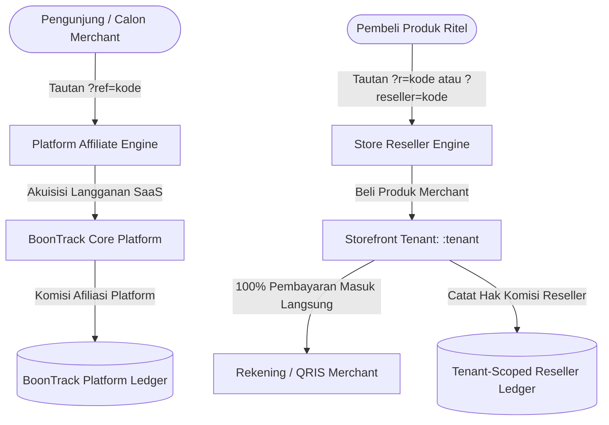
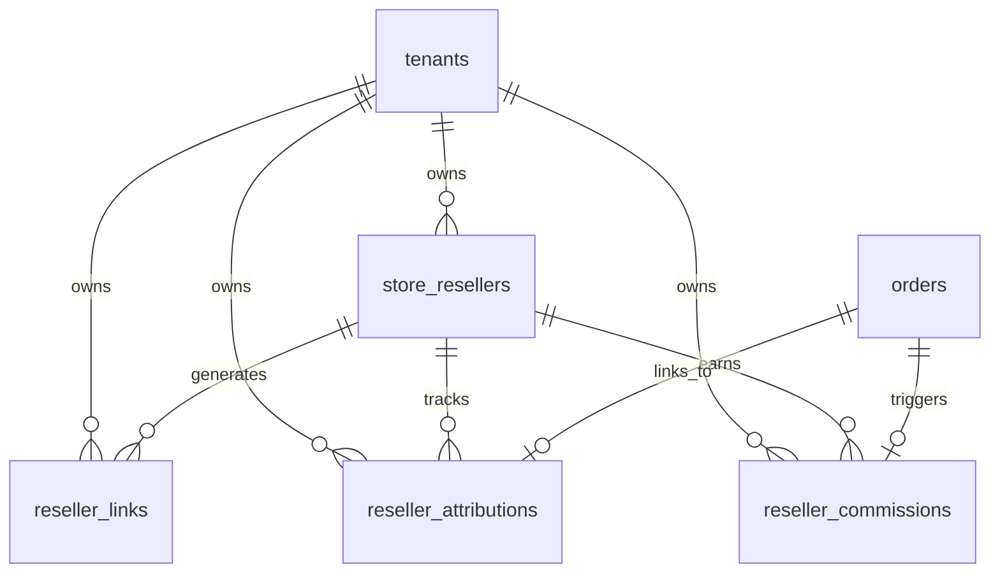

# STORE RESELLER ARCHITECTURE CONTRACT (TENANT-SCOPED)
**Document Version:** 1.0.0 (Official Freeze)  
**Status:** APPROVED & FROZEN (CTO & CFO Sign-Off)  
**Target Module:** Multi-Tenant Store Reseller & Distribution System  

---

## 1. Executive Summary & Core Mandate

Modul **Store Reseller** adalah subsistem terisolasi per tenant (*tenant-scoped*) yang memberdayakan setiap merchant di platform BoonTrack untuk merekrut, mengelola, melacak tautan referensi, dan menghitung komisi penjualan bagi tim reseller atau mitra penjual masing-masing toko.

Sistem ini dirancang dengan prinsip dasar:
1. **Strict Tenant Isolation**: Seluruh entitas reseller, tautan rujukan, log atribusi, dan rekaman komisi terikat secara eksklusif ke `tenant_id`. Tidak ada data reseller yang bocor atau dibagi antartoko.
2. **Non-Custodial Architecture**: BoonTrack **bukan** kustodian finansial. BoonTrack mencatat atribusi dan menghitung nilai komisi, namun **TIDAK** menampung saldo dompet (*escrow*), mengumpulkan dana komisi merchant, ataupun melakukan pemindahan dana otomatis (*automated payout disbursement*).
3. **Canonical Event Financial Authority**: Komisi reseller **HANYA** lahir dari event kanonikal yang telah terverifikasi secara finansial (`PAYMENT_CONFIRMED` untuk transaksi prabayar dan `COD_SETTLED` untuk transaksi kurir COD).
4. **Immutable Commission Snapshotting**: Nilai dasar harga, persentase/nominal komisi, dan formula komisi dibekukan (*frozen snapshot*) saat status komisi berstatus *earned*. Perubahan pengaturan komisi di masa depan tidak mempengaruhi transaksi masa lalu.
5. **Clean Attribution & Zero Adtech Distortion**: Sinyal atribusi reseller dikirimkan ke server ads (Meta CAPI & TikTok Events API) sebagai custom metadata pada event `Purchase` tunggal yang sah, **tanpa menduplikasi event Purchase**.

---

## 2. Boundary Definition: Platform Affiliate vs. Store Reseller

Sangat krusial untuk memisahkan domain antara **Platform Affiliate** dan **Store Reseller**:



| Parameter | Platform Affiliate (BoonTrack Mitra) | Store Reseller (Merchant Reseller) |
| :--- | :--- | :--- |
| **Tujuan** | Akuisisi tenant baru berlangganan BoonTrack SaaS | Penjualan produk fisik / digital / jasa milik tenant |
| **Parameter URL** | `?ref=` atau `?aff=` | `?r=` atau `?reseller=` |
| **Domain Scope** | `shop.boontrack.com`, `boontrack.com`, `affiliate.boontrack.com` | `[tenant].boontrack.com`, custom domain merchant |
| **Arus Kas Pembayaran** | Pembeli membayar langganan ke BoonTrack | Pembeli membayar langsung ke QRIS/Rekening Merchant |
| **Kustodi Pembayaran** | BoonTrack membayarkan bagi hasil langganan SaaS | Merchant membayarkan komisi langsung ke resellernya |
| **Audit & Database** | Tabel `affiliates`, `affiliate_referrals`, `affiliate_commissions` | Tabel `store_resellers`, `reseller_links`, `reseller_commissions` |

> [!IMPORTANT]
> **Dilarang Crossover:** Kode rujukan platform affiliate (`?ref=`) tidak boleh memicu komisi produk toko merchant. Sebaliknya, kode reseller toko (`?r=`) tidak boleh memberikan bagi hasil biaya langganan platform BoonTrack.

---

## 3. Prinsip Non-Custodial (CFO Mandate)

Sesuai arahan resmi CFO, BoonTrack menghindari regulasi Penyelenggara Jasa Pembayaran (PJP) Kategori Dompet Elektronik / Escrow:

1. **Zero Fund Holding (Tanpa Rekening Penampung)**:
   - BoonTrack tidak pernah menahan persentase uang muka pembeli atas nama reseller.
   - 100% uang pembayaran pembeli masuk ke rekening merchant (via QRIS Statis/Dinamis merchant atau transfer bank langsung).
2. **Kalkulasi & Rekonsiliasi Murni**:
   - Sistem bertindak sebagai *calculator & bookkeeping ledger* murni.
   - Dasbor merchant menampilkan tabel tagihan komisi (*Unpaid Commission Report*).
3. **Eksekusi Payout Independen**:
   - Pembayaran hak komisi reseller dilakukan secara independen oleh merchant (misalnya via transfer manual bank, batch disbursement payroll merchant, atau e-wallet).
   - Merchant menandai status komisi dari `APPROVED` menjadi `PAID` di dashboard beserta bukti transfer (*payout reference*).

---

## 4. Otoritas Finansial & Canonical Event Lifecycle

Komisi reseller **TIDAK PERNAH** dibuat pada status `PENDING`, `WAITING_PAYMENT`, atau saat form checkout pertama kali disubmit. Komisi hanya dibuat ketika sistem menerima event kanonikal:

```
[Pesanan Baru Dibuat] ──> Status Order: PENDING (Komisi: BELUM LAHIR)
                                │
               ┌────────────────┴────────────────┐
               ▼                                 ▼
   [Transaksi Prabayar (QRIS/Transfer)]     [Transaksi COD]
               │                                 │
      Pembayaran Lunas                 Barang Diterima & Kas Masuk
               ▼                                 ▼
   Event: PAYMENT_CONFIRMED              Event: COD_SETTLED
               │                                 │
               └────────────────┬────────────────┘
                                ▼
         [Generate Record: reseller_commissions]
         Status: PENDING -> Auto/Manual APPROVED
                                │
                        Merchant Membayar
                                ▼
         Status Komisi: PAID (Disertai Nomor Bukti)
```

### Penanganan Retur & Pembatalan (Reversal)
Jika pesanan mengalami *chargeback*, retur barang, atau pembatalan setelah pembayaran terkonfirmasi:
1. Status komisi diubah menjadi `REVERSED`.
2. Field `reversed_at` dicatat dengan timestamp UTC.
3. Alasan pembatalan disimpan di `metadata.reversal_reason`.
4. Jika komisi sudah terlanjur berstatus `PAID`, sistem mencatat saldo penyesuaian negatif (*negative balance carryover*) pada periode pembukuan reseller berikutnya.

---

## 5. Immutability (Snapshotting Komisi)

Ketika event kanonikal terjadi dan komisi reseller dicatat di tabel `reseller_commissions`, nilai berikut **WAJIB DI-SNAPSHOT** secara permanen:

```json
{
  "order_id": "ORD-1728345678-4921",
  "commission_base": 250000.00,
  "commission_rate": 0.10,
  "commission_type": "PERCENTAGE",
  "commission_amount": 25000.00,
  "currency": "IDR",
  "snapshot_product_data": {
    "product_id": "prod_coffee_arabica",
    "unit_price": 125000.00,
    "quantity": 2
  }
}
```

> [!NOTE]
> Jika merchant di kemudian hari mengubah persentase komisi reseller dari 10% menjadi 5%, atau menaikkan harga produk, nilai komisi untuk pesanan yang sudah tercatat **tidak boleh berubah**.

---

## 6. Single Meta CAPI / TikTok Pixel Integration

Untuk menjaga akurasi optimasi algoritma Meta Ads & TikTok Ads serta mencegah penggelembungan metrik ROAS (*Return on Ad Spend*):

1. **Single Purchase Event**:
   Setiap order yang lunas hanya mengirimkan **SATU** event `Purchase` ke Meta Conversions API dan TikTok Events API.
2. **Metadata Enkapsulasi**:
   Informasi atribusi reseller ditanamkan ke dalam properti `custom_data` pada payload event yang sama:
   ```json
   {
     "event_name": "Purchase",
     "event_id": "PURCHASE_ORD-1728345678-4921",
     "custom_data": {
       "currency": "IDR",
       "value": 250000,
       "reseller_id": "res_8f3d4a21-...",
       "reseller_code": "BUDI01",
       "attribution_id": "attr_91ab23..."
     }
   }
   ```
3. **Dilarang**:
   - Dilarang mengirim event tambahan seperti `ResellerPurchase` yang dapat dihitung sebagai purchase ganda oleh adset campaign.

---

## 7. Pricing Tier Add-on (CFO Monetization Plan)

Fitur Store Reseller disediakan sebagai modular add-on berbasis jumlah kapasitas reseller aktif:

| Paket Add-On | Kapasitas Reseller Aktif | Biaya Bulanan (IDR) | Ketentuan Khusus |
| :--- | :--- | :--- | :--- |
| **Starter** | Hingga 25 Reseller | Rp 79.000 / bulan | Cocok untuk bisnis berkembang yang mulai membuka kemitraan |
| **Scale** | Hingga 100 Reseller | Rp 149.000 / bulan | Dilengkapi export CSV komisi & analitik performa |
| **Unlimited** | Reseller Tanpa Batas | Rp 249.000 / bulan | **GRATIS** untuk merchant dengan paket langganan tahunan (Annual Pro/Enterprise) |

### Mekanisme Validasi Kuota (Quota Guard)
Sebelum merchant mengundang atau mengaktifkan reseller baru:
- Sistem mengecek `COUNT(*)` reseller dengan `status = 'ACTIVE'` di `store_resellers` milik `tenant_id`.
- Jika jumlah mencapai limit tier yang aktif, aktivasi reseller baru diblokir dengan instruksi upgrade tier.

---

## 8. Kepatuhan ToS & Regulasi Hukum (Legal Guardrail)

1. **Non-Pyramid / Anti-MLM Ilegal**:
   - Modul Store Reseller **HANYA** mendukung model komisi 1-tingkat (*Single-Level Direct Sales*).
   - BoonTrack melarang keras skema piramida berjenjang bertingkat tanpa izin resmi (multi-level pyramid scheme / skema ponzi).
2. **Kewajiban Tenant**:
   - Tenant bertanggung jawab penuh terhadap barang dagangan, perizinan edar (BPOM/PIRT jika makanan/kosmetik), kebenaran klaim produk, dan pemenuhan pembayaran hak komisi kepada resellernya.
   - BoonTrack bertindak murni sebagai penyedia teknologi SaaS dan platform infrastruktur sistem.

---

## 9. Struktur Tabel & Relasi



1. `store_resellers`: Data profil reseller (kode rujukan unik per toko, kontak, tipe komisi).
2. `reseller_links`: Link tujuan khusus (ke halaman utama toko atau langsung ke produk tertentu).
3. `reseller_attributions`: Log sesi klik rujukan pembeli dengan masa kedaluwarsa cookie/sesi (default: 30 hari).
4. `reseller_commissions`: Ledger catatan komisi finansial yang terkunci (*immutable*).
5. `orders.reseller_attribution_id`: Kolom penghubung order dengan sesi atribusi reseller.

---

## 10. Persetujuan & Penandatanganan

Dokumen ini menjadi rujukan baku implementasi frontend, backend, migrasi basis data, dan otomasi CAPI BoonTrack. Segala modifikasi terhadap logika finansial wajib melalui persetujuan ulang CTO & CFO.
