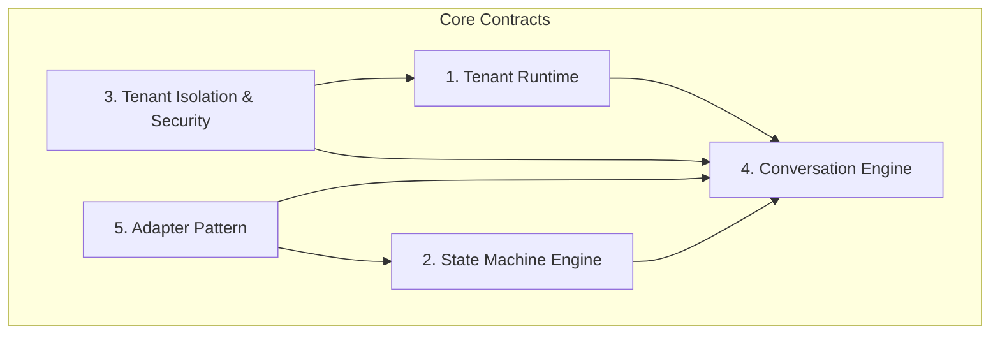
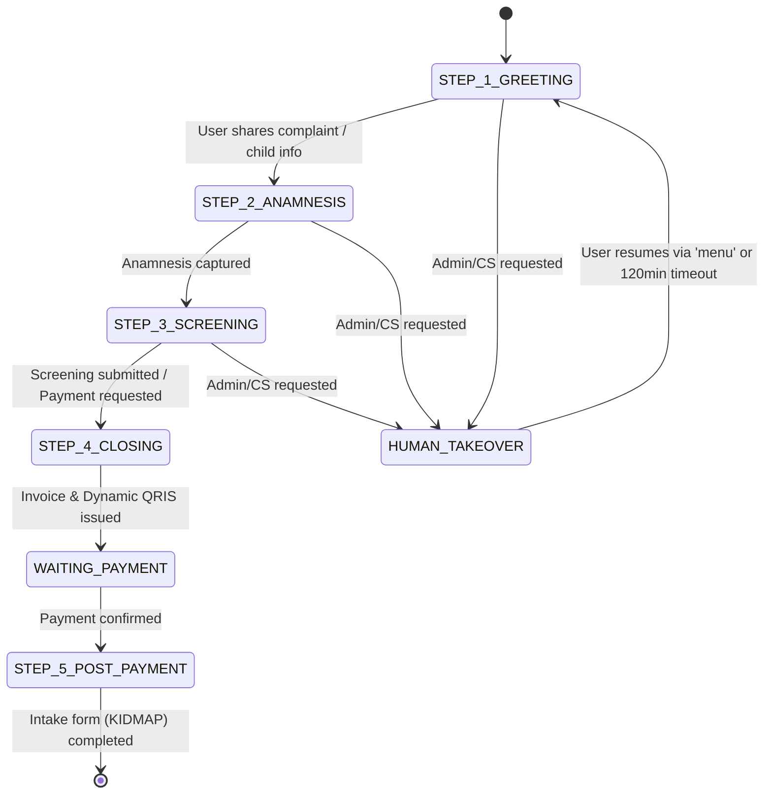
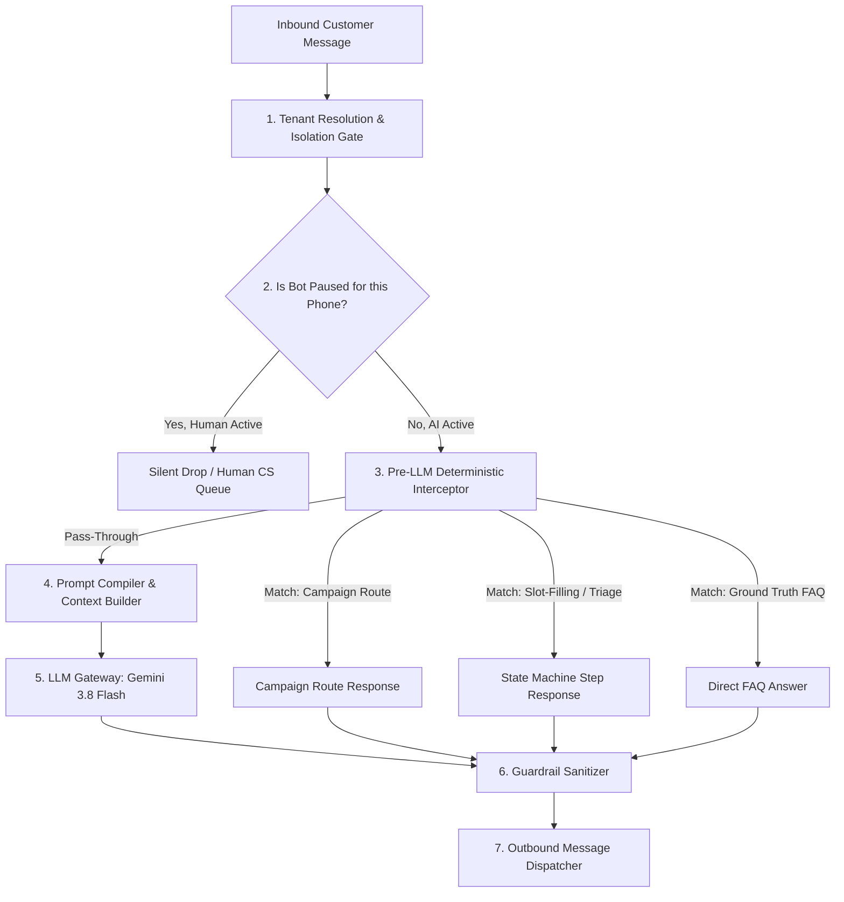
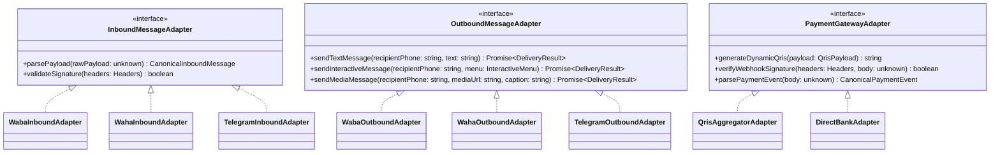

# BoonTrack Core Architecture Contracts
**Document Version:** 2.0.0 (Core Engine Freeze)  
**Status:** Canonical Reference (CTO Approved with Guardrails)  
**Target Domain:** Multi-Tenant Platform Core Runtime & Infrastructure  

---

## Executive Overview & Architectural North Star

BoonTrack operates as a high-performance, strictly isolated multi-tenant commerce and conversation platform. The Core Architecture is composed of five foundational contracts:



1. **Tenant Runtime**: Resolves runtime context, domain boundaries, capabilities, and dynamic templates with zero hardcoding.
2. **Deterministic State Machine**: Governs financial mutations, human/AI handovers, and multi-step conversation triage.
3. **Tenant Isolation**: Guarantees zero cross-tenant data leakage across 7 isolation gates and composite session keys.
4. **Conversation Engine**: Coordinates gateway routing, pre-LLM deterministic interception, LLM execution, and guardrail sanitization.
5. **Adapter Pattern**: Decouples external protocols (WABA, WAHA, Telegram, QRIS, Webhooks) from internal domain services.

---

## 1. Tenant Runtime Contract (`lib/types/tenant-runtime.ts`)

### 1.1 Tenant Runtime Context & Boundary Resolution
Every incoming request (HTTP, Webhook, WebSocket) is resolved into an immutable `TenantRuntimeContext`:

```typescript
export interface TenantRuntimeContext {
  host: string;
  tenantSlug: string;
  tenantId?: string;
  tenantKind: TenantKind;          // 'SAAS' | 'CUSTOM_APP' | 'INTERNAL'
  businessType: BusinessType;      // 'RETAIL' | 'FNB' | 'PUBLIC_SERVICE' | 'CLINIC' | ...
  templateCode: TemplateCode;      // 'SHOP_V1' | 'DROP_V1' | 'PUBLIC_SERVICE_V1' | ...
  capabilities: TenantCapabilities;
  hardeningPolicy: HardeningPolicy;// 'HARDENING_V0' | 'HARDENING_V1'
  tenant: TenantRecord;
  isAllowedHost: boolean;
  error?: 'HOST_MISMATCH' | 'TEMPLATE_NOT_COMPATIBLE' | 'UNKNOWN_TEMPLATE' | 'TENANT_NOT_FOUND' | 'CORRUPT_CONFIG';
}
```

### 1.2 Capability Matrix (`TenantCapabilities`)
Features are enabled via capability flags rather than static slug checks:
- **Commerce Capabilities**: `catalog`, `cart`, `checkout`, `shopping_bag`, `promo`, `price_badge`, `payment`, `order`, `sales_assistant`.
- **Public & Service Capabilities**: `service_catalog`, `citizen_request`, `complaint`, `announcement`, `public_information`, `ai_public_service_assistant`.
- **Studio & Intelligence Capabilities**: `viral_trends_radar`, `paid_ads_intelligence`.

### 1.3 Template Resolution Contract
- Template code resolution (`resolveTemplateConfig`) inspects `tenant.template_code` and binds permitted UI layouts and slot-filling components.
- Unknown or corrupted template configurations trigger a deterministic fail-safe error state (`UNKNOWN_TEMPLATE` or `CORRUPT_CONFIG`), never a mock storefront.

---

## 2. Deterministic State Machine Contract

BoonTrack mandates **deterministic state machines** for all critical domain workflows. Non-deterministic probabilistic models (LLMs) are forbidden from directly mutating state.



### 2.1 Financial & Order State Machine
1. `ORDER_CREATED` $\rightarrow$ Generates unique amount & dynamic QRIS with CRC16.
2. `PAYMENT_PENDING` $\rightarrow$ Awaits payment gateway webhook or manual transfer proof verification.
3. `PAYMENT_CONFIRMED` $\rightarrow$ Canonical financial authority event. Locks order totals, triggers downstream ledger entries, and initiates fulfillment.
4. `ORDER_FULFILLED` / `SETTLED` $\rightarrow$ Terminal state.

### 2.2 Handover State Machine (`AI_ACTIVE` $\leftrightarrow$ `HUMAN_ACTIVE`)
- **Pause Trigger**: When a customer requests human assistance or sends explicit triggers (`admin`, `cs`, `operator`, `bicara dengan orang`), the bot enters `HUMAN_ACTIVE` / `HUMAN_TAKEOVER`.
- **Isolation Scope**: The pause applies exclusively to the composite conversation key `${tenant_id}:${sender_phone}`.
- **Auto-Expiry**: Sessions pause for a bounded duration (default `120 minutes`).
- **Deterministic Resume**: An incoming command (`menu`, `bot`, `aktifkan bot`, `pilihan`) immediately transitions state back to `AI_ACTIVE`.

### 2.3 Conversation Funnel State Machine & Anti-Loop Guard
- **Greeting Invariant**: An initial greeting is emitted strictly **once per customer conversation cycle**.
- **Anti-Looping Verification**: When `hasPreviousGreeting` is true or session history already contains prior assistant turns, re-greeting is strictly suppressed, advancing immediately to intake extraction or triage routing.

---

## 3. Tenant Isolation & Security Contract

### 3.1 The 7 Isolation Gates
Every tenant's operational data and execution boundary is protected across seven gates:

| Gate | Mechanism | Enforcement Level |
| :--- | :--- | :--- |
| **1. Gateway Gate** | Multi-tenant URL / Webhook host verification | Edge Router / Middleware |
| **2. Database Gate (RLS)** | Supabase Row-Level Security scoped by `tenant_id` | Database Engine |
| **3. Composite Session Gate** | In-memory & DB composite key `${tenantId}:${senderPhone}` | Memory Cache & Session Store |
| **4. Catalog & Product Gate** | Queries strictly filtered by `tenant_id` foreign key | Application Service Layer |
| **5. Asset & Media Gate** | Storage buckets scoped to `/tenants/{slug}/*` | Object Storage Policies |
| **6. Configuration Gate** | Zod runtime schema validation (`.strict()`) | Configuration Loader |
| **7. Zero-Hardcode Gate** | Zero hardcoded slugs, mock stores, or static fallbacks | CI / Lint / Architecture Policy |

### 3.2 Composite Key Isolation
In-memory and persistent session states are keyed by:
```typescript
const compositeKey = `${canonicalTenantIdOrSlug}:${canonicalE164Phone}`;
```
A phone number paused in Tenant A **remains completely active and unpaused** in Tenant B.

### 3.3 Zero Hardcoding & Single Source of Truth
- **Supabase as Ground Truth**: All tenant information (operating hours, doctor lists, payment accounts, catalog products, custom domains) is read from `tenants` and `products`.
- **Absolute Ban on Static Slugs**: Code constructs such as `if (slug === 'demo')` or hardcoded clinic registries in route handlers are architectural violations.

---

## 4. Conversation Engine Contract

The Conversation Engine coordinates the processing of inbound omnichannel messages through deterministic and probabilistic pipelines:



### 4.1 Pre-LLM Deterministic Interception
Before invoking an LLM, the engine evaluates deterministic rules:
1. **Campaign & CTWA Trigger Matcher**: Evaluates keyword triggers and advertising campaign IDs.
2. **Clinical & Administrative Triage Matcher**: Validates patient slots (parent name, child age, complaint), rejects invalid child names (complaint adjectives), and locks appropriate services.
3. **FAQ Ground Truth Matcher**: Matches customer questions against verified `ai_knowledge` items.

### 4.2 LLM Gateway & Prompt Compilation
When deterministic rules pass through:
- Context is bounded to active catalog items and verified tenant metadata.
- System prompt is compiled dynamically via `TenantBotConfig`.
- Temperature is locked to low variance (`0.1 - 0.2`) for reproducible factual responses.

### 4.3 Guardrail Sanitizer
All outbound messages undergo strict normalization:
1. **Single Bubble Output**: Bounded to compact formats under 2048 tokens.
2. **Asterisk-Free URLs**: Strips Markdown formatting around links (`replace(/\*(\s*https?:\/\/[^\s*]+)\*/g, '$1')`) to guarantee mobile messaging client link clickability.
3. **Medical Emergency Protection**: Detects critical symptom terms and prepends official emergency clinical disclaimers.

---

## 5. Adapter Pattern Contract

The platform decouples business logic from external protocols through uniform interface adapters:



### 5.1 Omnichannel Messaging Adapters
- **WhatsApp Cloud API (WABA)**: Handles official Cloud API webhooks and interactive list/button payloads.
- **Evolution API (WAHA)**: Handles self-hosted instance webhooks and formatted text menus.
- **Telegram Bot API**: Handles `@boonshop_bot` webhook updates and inline keyboard markups.

### 5.2 Payment Gateway Adapters
- **Dynamic QRIS Aggregator**: Injects dynamic transaction amount into merchant static QRIS string and computes canonical EMVCo CRC16 checksum.
- **Direct Bank Settlement**: Formats verified bank account numbers and payment instructions.

### 5.3 Storage & Event Adapters
- **Adtech Server-Side Events**: Dispatches single canonical `Purchase` event to Meta Conversions API (CAPI) and TikTok Events API with tenant-scoped attribution metadata.
- **Webhook Subscriptions**: Dispatches tamper-proof HMAC-signed events to tenant external ERP/CRM endpoints.
