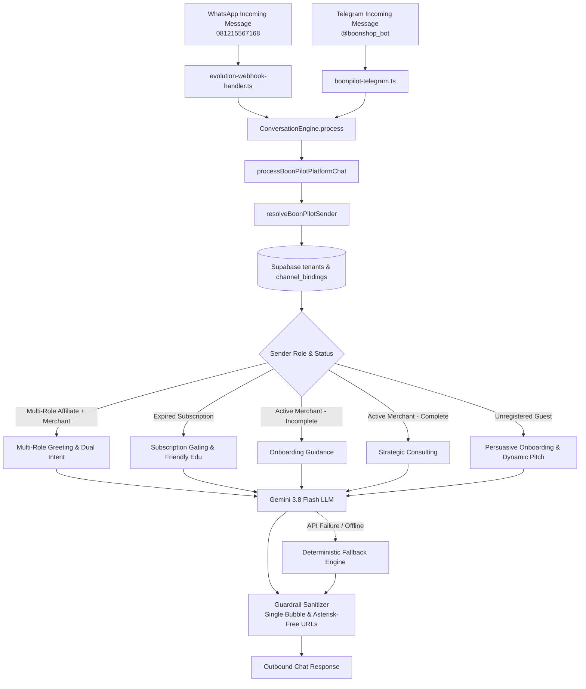
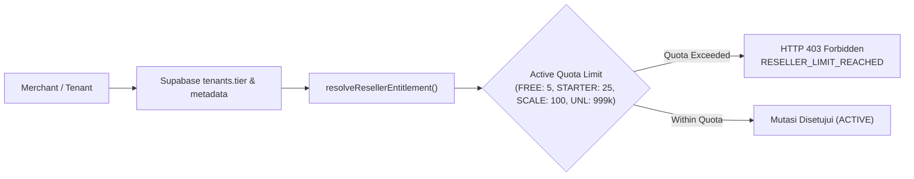

# BoonTrack Architecture Documentation

This document serves as the permanent reference for BoonTrack core architecture and specialized sub-engines.

---

## BoonPilot Bot Architecture & Persona Engine (WhatsApp & Telegram)

### 1. Executive Summary & Multi-Provider Gateway
BoonPilot is the unified conversational AI assistant and onboarding specialist across the BoonTrack commerce ecosystem. It operates concurrently through two official messaging gateways:
- **WhatsApp Gateway**: Official Platform Number `081215567168` (`+6281215567168`), routed via Evolution API / WhatsApp Cloud API webhooks (`lib/whatsapp/evolution-webhook-handler.ts`).
- **Telegram Gateway**: Official Platform Bot `@boonshop_bot`, routed via Telegram Bot webhook (`lib/telegram/boonpilot-telegram.ts`).

Both gateways route into the unified entrypoint `processBoonPilotPlatformChat()` (`lib/boonpilot/platform-engine.ts`), which coordinates dynamic sender identity resolution, multi-role recognition, persona prompt compilation, LLM execution (Gemini 3.8 Flash), and deterministic fallbacks.



---

### 2. Identity Resolution & Lifecycle Engine (`lib/boonpilot/sender-resolver.ts`)

BoonPilot enforces **Zero Hardcoding** and relies on Supabase as the **Single Source of Truth**:
1. **Dynamic Phone & Telegram Matching**:
   - Resolves sender phone across `phone`, `whatsapp_number`, and `wa_verified_phone` (normalized to international `62...` format).
   - Resolves Telegram users via `telegram_chat_id` column and `metadata->>telegram_chat_id`.
2. **Setup Completeness Evaluation (`isTenantSetupComplete`)**:
   - Evaluates whether the merchant's store is ready for commerce:
     - Explicit flags: `tenant.isSetupComplete`, `metadata.setup_completed`, `metadata.is_ready`.
     - Runtime state: Presence of active catalog products AND configured payment method (QRIS or bank account).
3. **Subscription Lifecycle Evaluation (`isTenantSubscriptionExpired`)**:
   - Checks `tenant.subscription_status === 'expired'` or `tenant.status === 'expired'`.
   - Checks expiration timestamp: `tenant.plan_expires_at && new Date(tenant.plan_expires_at) < new Date()`.

---

### 3. Multi-Role Recognition (Affiliate Leader + Merchant)

Affiliate Leaders often manage their own merchant storefront while simultaneously leading downline communities:
- **Detection Criteria**:
  - The sender matches a registered tenant in `tenants`.
  - The sender holds an affiliate leader relationship in `channel_bindings` or designated slug (e.g. `buzzerukm` / Kang Sakti).
- **Private DM Greeting (Japri)**:
  ```text
  "Halo Kang/Kak {nama_owner}! Mau cek performa referral komunitas {affiliate_id/nama_komunitas}, diskusi strategi toko {nama_toko}, atau ada hal lain yang mau diobrolkan?"
  ```
- **Dual Intent Routing**:
  - **Community / Referral Inquiry**: BoonPilot summarizes referral performance, pool registration link, and demo store attribution.
  - **Personal Store Inquiry**: BoonPilot redirects to `{nama_toko}` analytics, conversion metrics, and dashboard management (`https://dashboard.boontrack.com`).
  - **General Inquiries**: Seamlessly answered with high-value e-commerce knowledge.

---

### 4. Tenant Expired Lifecycle & Feature Gating

When a merchant's plan expires:
- **Operational Gating**:
  - Store management operations (orders, catalog, courier setup, QRIS settlement, dashboard navigation) are gated.
  - Sapaan & Gating Message:
    ```text
    "Halo Kak {nama_owner}! Masa aktif operasional toko {nama_toko} saat ini sudah berakhir nih. Agar otomatisasi WhatsApp, penerimaan pesanan, dan asisten toko bisa langsung jalan kembali, silakan login ke dashboard toko Kakak di https://dashboard.boontrack.com lalu klik tombol Upgrade / Perpanjangan ya!"
    ```
- **Educational Exemption Guardrail**:
  - General e-commerce inquiries, product feature explanations (Single-Page Checkout, Dynamic QRIS 0% MDR, Meta CAPI), and business questions are **still answered informatively and warmly**.
  - The bot **never refuses rigidly** to answer non-dashboard educational questions.

---

### 5. Merchant Reguler & Onboarding Personas

- **Scenario A: Setup Incomplete (Belum Selesai)**:
  ```text
  "Halo Kak {nama_owner}, toko {nama_toko} kamu masih belum selesai nih. Yuk kita bantu lengkapin data-datanya biar siap jualan!"
  ```
- **Scenario B: Store Ready (Siap Tempur)**:
  ```text
  "Halo Kak {nama_owner}, toko {nama_toko} sudah siap tempur nih! Hari ini mau kita diskusikan strategi penjualan, analisa dan evaluasi performa bisnis, atau ada hal lain yang mau Kakak ceritakan?"
  ```
- **Invariant**: Registered merchants are **strictly never pitched** to create a new store or shown registration links.

---

### 6. Unregistered Guest & Community Attribution

- **Store / Dashboard Analysis Request**:
  When an unregistered user asks BoonPilot to audit or analyze their store/dashboard:
  ```text
  "Wah saya bisa bantu analisa kak, tapi kalau Kakak sudah jadi seller di BoonTrack Shop pasti saya bantu bedah sampai tuntas! Yuk aktifkan toko Kakak dulu di sini: {registration_url}"
  ```
- **Dynamic Registration URL Attribution**:
  - **Kang Sakti (Buzzer UKM)**: `https://buzzerukm.boontrack.com`
  - **Other Affiliates**: `https://shop.boontrack.com/?ref={code}`
  - **Direct / Generic Fallback**: `https://boontrack.com`

---

### 7. Canonical URL Standardization & Strict Guardrails

| Destination | Canonical URL | Usage Context |
| :--- | :--- | :--- |
| **Merchant Dashboard** | `https://dashboard.boontrack.com` | Store management, order processing, settings, upgrade |
| **Demo Storefront** | `https://shop.boontrack.com/boon` | Single-page checkout & QRIS demonstration |
| **Kang Sakti Landing** | `https://buzzerukm.boontrack.com` | Community referral & registration for Buzzer UKM |
| **Affiliate Referral** | `https://shop.boontrack.com/?ref={code}` | Downline community registration |
| **Platform Homepage** | `https://boontrack.com` | Generic platform fallback |

#### Communication Guardrails
1. **Single Chat Bubble**:
   - `maxOutputTokens` is tuned (2048 tokens).
   - Responses are structured compactly so they are always delivered in a single chat bubble without truncation.
2. **Asterisk-Free URLs**:
   - Markdown asterisks (`*`) wrapping URLs (e.g. `*https://...*`) cause rendering anomalies and broken links across mobile messaging clients.
   - An automated sanitizer strips asterisks from URLs in both AI responses and fallback messages:
     ```typescript
     cleanReply = cleanReply.replace(/\*(\s*https?:\/\/[^\s*]+)\*/g, '$1');
     ```
---

## Store Reseller V1 Commercial & Entitlement Contract

### 1. Nomenklatur Resmi & Commercial Tiers
Pemisahan tegas antara paket dasar gratis, add-on berbayar, dan paket enterprise:

| Tier / Add-on | Kuota Reseller Aktif (`max_active_resellers`) | Biaya Langganan | Target & Peruntukan |
| :--- | :---: | :--- | :--- |
| **FREE TIER** | **5** | Rp 0 (Gratis) | Default merchant terverifikasi untuk uji coba pasukan penjualan kecil |
| **STARTER ADD-ON** | **25** | Rp 79.000 / bulan | Bisnis berkembang yang mulai merekrut tim reseller terstruktur |
| **SCALE ADD-ON** | **100** | Rp 149.000 / bulan | Brand dengan pasukan distributor/reseller aktif + laporan ekspor |
| **UNLIMITED** | **999.999** | Rp 249.000 / bulan | Termasuk gratis pada paket Enterprise / Annual Pro Scale |

### 2. Entitlement Model & Deterministic Evaluation
Alur evaluasi entitlement berjalan deterministik di server-side gateway (`app/api/v1/tenants/[slug]/reseller/members/route.ts`):



#### Deterministic Rejection Response Payload (HTTP 403)
Ketika kuota reseller aktif telah tercapai, mutasi penambahan atau aktivasi reseller ditolak deterministik dengan payload:
```json
{
  "success": false,
  "error": "RESELLER_LIMIT_REACHED",
  "message": "Batas kuota mitra reseller aktif telah tercapai. Upgrade ke Starter Add-on untuk menambah hingga 25 reseller.",
  "current_quota": 5,
  "upgrade_url": "/dashboard/billing?feature=reseller_starter"
}
```

### 3. Guardrails Downgrade-Safe & Status `FROZEN`
Untuk menjaga integritas ledger dan keadilan finansial mitra:
1. **Zero Hard Delete Policy**:
   - Dilarang keras melakukan `DELETE` terhadap record di `store_resellers` maupun buku besar komisi `reseller_commissions` saat tenant downgrade paket atau membatalkan add-on.
2. **Status Transition (`FROZEN`)**:
   - Jika tenant mengalami downgrade (misal: Starter 25 mitra turun ke Free 5 mitra), sistem menandai reseller ke-6 dan seterusnya dengan status `FROZEN` (read-only).
   - Reseller tertua (berdasarkan `created_at ASC` / FIFO) tetap berstatus `ACTIVE` sejumlah limit kuota baru.
3. **Proteksi Finansial & Non-Blocking Checkout**:
   - Pada link atribusi toko (`?r=KODE`), jika reseller target berstatus `FROZEN`, checkout pelanggan **tetap diproses lancar sebagai pesanan reguler toko**.
   - Sistem **tidak mencatatkan komisi baru** untuk reseller berstatus `FROZEN` guna melindungi merchant dari kewajiban komisi di luar paket aktif.
4. **Self-Healing Auto-Thaw saat Upgrade**:
   - Saat merchant meng-upgrade paket kembali, sistem secara otomatis merekonsiliasi dan memulihkan reseller tertua berstatus `FROZEN` kembali ke `ACTIVE` hingga batas kuota tier baru.

### 4. Anti-Farming Policy
Untuk mencegah penyalahgunaan kuota Free Tier (5 reseller) melalui pembuatan akun toko dummy massal:
- **Binding Identitas Unik**: Hak kuota Free Tier diikat secara ketat ke identitas terverifikasi pemilik bisnis (nomor WhatsApp terverifikasi, nomor rekening bank settlement, atau riwayat transaksi toko).
- **Deteksi Anomali Multi-Tenant**: Tenant yang terdeteksi berbagi nomor WhatsApp owner atau rekening penampung yang sama tidak dapat mengklaim kuota Free Tier berulang kali pada storefront tiruan.

