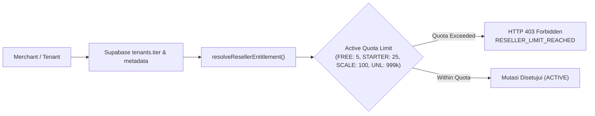

# Blueprint: Store Reseller Commercial & Entitlement Model
**Blueprint Code:** `STORE_RESELLER`  
**Target Module:** Multi-Tenant Store Reseller & Distribution System  
**Status:** Approved & Frozen

---

## 1. Nomenklatur Resmi & Commercial Tiers
Pemisahan tegas antara paket dasar gratis, add-on berbayar, dan paket enterprise:

| Tier / Add-on | Kuota Reseller Aktif (`max_active_resellers`) | Biaya Langganan | Target & Peruntukan |
| :--- | :---: | :--- | :--- |
| **FREE TIER** | **5** | Rp 0 (Gratis) | Default merchant terverifikasi untuk uji coba pasukan penjualan kecil |
| **STARTER ADD-ON** | **25** | Rp 79.000 / bulan | Bisnis berkembang yang mulai merekrut tim reseller terstruktur |
| **SCALE ADD-ON** | **100** | Rp 149.000 / bulan | Brand dengan pasukan distributor/reseller aktif + laporan ekspor |
| **UNLIMITED** | **999.999** | Rp 249.000 / bulan | Termasuk gratis pada paket Enterprise / Annual Pro Scale |

---

## 2. Entitlement Model & Deterministic Evaluation
Arsitektur entitlement mengikuti relasi deterministik satu arah:
`Plan / Add-on -> Entitlement -> Capability -> Reseller Quota`

1. **Plan / Add-on**:
   - Didefinisikan di level database Supabase (`tenants.tier` dan `tenants.metadata.reseller_settings.tier` atau `tenants.metadata.addons`).
   - Single source of truth murni dari database tanpa hardcoding nama slug tenant.
2. **Entitlement Engine (`resolveResellerEntitlement`)**:
   - Dijalankan di server-side gateway (`app/api/v1/tenants/[slug]/reseller/members/route.ts` dan `lib/store-reseller.ts`).
   - Memetakan paket aktif merchant ke objek entitlement resmi yang memuat batas kuota, pesan edukatif, dan URL upgrade terarah.
3. **Capability**:
   - Kemampuan untuk merekrut, mengaktifkan, dan men-generate tautan rujukan toko bagi mitra reseller (`CAN_RECRUIT_STORE_RESELLERS`).
4. **Reseller Quota & Server-Side Deterministic Rejection**:
   - Perhitungan kuota **hanya menghitung mitra berstatus ACTIVE** (`status = 'ACTIVE'`, `is_active = true`, dan bukan `FROZEN`).
   - Mitra dengan status `FROZEN`, `INACTIVE`, atau `SUSPENDED` **tidak memotong kuota aktif**.
   - Jika penambahan atau aktivasi reseller baru melebihi kuota aktif (misalnya mitra ke-6 pada Free Tier), gateway menolak mutasi secara deterministik dengan respons HTTP 403 / 422:



### Deterministic Rejection Response Payload (HTTP 403)
Ketika kuota reseller aktif telah tercapai, mutasi penambahan atau aktivasi reseller ditolak deterministik dengan payload:
```json
{
  "success": false,
  "error": "RESELLER_LIMIT_REACHED",
  "message": "Batas kuota mitra reseller aktif telah tercapai. Upgrade ke Starter Add-on untuk menambah hingga 25 reseller.",
  "current_quota": 5,
  "upgrade_url": "/dashboard/billing?feature=reseller_starter"
}
```

---

## 3. Guardrails Downgrade-Safe & Status `FROZEN`
Untuk menjaga integritas ledger dan keadilan finansial mitra:
1. **Zero Hard Delete Policy (Proteksi Retensi Data & Integritas Financial Ledger)**:
   - Dilarang keras melakukan operasi `DELETE` fisik terhadap record di `store_resellers` maupun buku besar komisi `reseller_commissions` saat tenant menurunkan paket (*downgrade*) atau membatalkan add-on langganan.
   - Endpoint `DELETE` HTTP diubah menjadi operasi *soft-deactivation* (`status: 'INACTIVE'`) guna mempertahankan audit trail keuangan.
2. **Status Transition (`FROZEN`)**:
   - Jika tenant mengalami downgrade (misal: Starter 25 mitra turun ke Free 5 mitra), sistem menandai reseller ke-6 dan seterusnya dengan status `FROZEN` (read-only).
   - Reseller tertua (berdasarkan `created_at ASC` / FIFO) tetap berstatus `ACTIVE` sejumlah limit kuota baru.
   - Mitra berstatus `FROZEN` bersifat **read-only**: parameter komisi dan profilnya tidak dapat dimutasi kecuali paket tenant ditingkatkan kembali.
3. **Proteksi Finansial & Non-Blocking Checkout**:
   - Pada link atribusi toko (`?r=KODE`), jika reseller target berstatus `FROZEN`:
     * Checkout pelanggan **tetap diproses 100% normal tanpa kendala sebagai pesanan reguler toko**.
     * Sistem **tidak mencatatkan komisi baru** pada buku besar `reseller_commissions` untuk reseller yang sedang beku guna melindungi merchant dari kewajiban komisi di luar paket aktif.
4. **Self-Healing Auto-Thaw saat Upgrade**:
   - Saat merchant meng-upgrade paket kembali, sistem secara otomatis merekonsiliasi dan memulihkan reseller tertua berstatus `FROZEN` kembali ke `ACTIVE` hingga batas kuota tier baru.

---

## 4. Anti-Farming Policy
Untuk mencegah penyalahgunaan kuota Free Tier (5 reseller) melalui pembuatan akun toko dummy massal (*multi-tenant dummy farming*):
1. **Verified Merchant Identity Binding**:
   - Hak kuota Free Tier diikat secara ketat ke identitas terverifikasi pemilik bisnis (*verified merchant identity*: nomor WhatsApp terverifikasi, nomor rekening bank settlement, atau riwayat transaksi toko).
2. **Deteksi Anomali Multi-Tenant Farming**:
   - Tenant yang terdeteksi berbagi nomor WhatsApp owner atau rekening penampung yang sama tidak dapat mengklaim kuota Free Tier berulang kali pada storefront tiruan.
   - Pelanggaran terdeteksi akan menonaktifkan fitur kemitraan pada seluruh etalase terkait hingga proses verifikasi bisnis diselesaikan.
