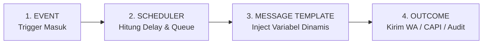

# Spesifikasi Arsitektur: Customer Lifecycle MVP (Modular Primitives)

**Versi**: 1.0.0 (MVP)  
**Tanggal**: 05 Oktober 2026  
**Status**: Approved (Mandat CTO)  
**Dokumen Rujukan**: `ARCHITECTURE.md`, `docs/knowledge/02_tenant_dr_harys.md`

---

## 1. Prinsip & Invariant Arsitektur

1. **Zero Checkout Latency (P0 Invariant)**:
   - Lifecycle Engine dirancang bersifat sepenuhnya **asinkron & non-blocking** (`fire-and-forget` via `process.nextTick` / background worker).
   - Pemrosesan lifecycle dilarang keras memperlambat alur checkout, webhook pembayaran QRIS/Bank, atau pembuatan order pelanggan. Waktu respon API checkout harus tetap `< 150ms`.

2. **Multi-Tenant Isolation**:
   - Setiap tabel relasional (`lifecycle_templates`, `lifecycle_events`) memiliki kolom `tenant_id` dan diindeks secara ketat.
   - Template pesan dan penjadwalan terisolasi 100% per tenant; tenant `tumbuh-kembang-anak` tidak dapat melihat atau mengeksekusi template milik tenant lain.

3. **Modular Primitives (4 Kontrak Inti)**:
   Sistem tidak dibangun sebagai monolit yang kaku, melainkan dirangkai dari 4 komponen primitif mandiri:
   $$\text{Event} \longrightarrow \text{Scheduler} \longrightarrow \text{Message Template} \longrightarrow \text{Outcome}$$

---

## 2. Kontrak 4 Primitif Lifecycle



### Primitif 1: Event (Ingestion)
- **Definisi**: Peristiwa bisnis yang terjadi pada tenant yang memicu siklus komunikasi.
- **Tipe Event Standar**:
  - `PAYMENT_CONFIRMED`: Pelanggan menyelesaikan pembayaran pesanan/layanan.
  - `CONSULTATION_BOOKED`: Jadwal sesi konsultasi (Google Meet / Klinik) telah dikonfirmasi.
  - `POST_CONSULTATION`: Penanda waktu pasca konsultasi (evaluasi hasil & follow-up).
  - `ORDER_CREATED`: Pesanan baru dibuat (menunggu pembayaran).
- **Kontrak Payload**:
  ```typescript
  interface LifecycleEventPayload {
    tenant_id: string;
    customer_phone: string;
    customer_name: string;
    order_id?: string;
    product_title?: string;
    product_id?: string;
    consultation_time?: string;
    doctor_name?: string;
    custom_fields?: Record<string, any>;
  }
  ```

### Primitif 2: Scheduler (Timeline & Due Date Calculator)
- **Definisi**: Menghitung waktu eksekusi target (`scheduled_at`) berdasarkan `delay_minutes` dari template yang aktif.
- **Perhitungan**:
  $$\text{scheduled\_at} = \text{event\_timestamp} + (\text{delay\_minutes} \times 60 \text{ detik})$$
  - `delay_minutes = 0`: Eksekusi instan (misal: pengiriman form screening tepat setelah bayar).
  - `delay_minutes = 1440` (H-1): Pengingat 24 jam sebelum jadwal konsultasi.
  - `delay_minutes = 10080` (+7 hari): Evaluasi rencana nutrisi setelah 7 hari pelaksanaan.
- **State Lifecycle**:
  - `PENDING` $\rightarrow$ `SCHEDULED` $\rightarrow$ `PROCESSED` (atau `FAILED`).

### Primitif 3: Message Template (Dynamic Variable Resolver)
- **Definisi**: Template teks yang disimpan per tenant dan mendukung substitusi variabel dinamis tanpa hardcoding.
- **Format Variabel**: `{{nama_variabel}}`
  - `{{customer_name}}`: Nama orang tua / pelanggan.
  - `{{product_title}}`: Nama layanan / produk yang dibeli.
  - `{{doctor_name}}`: Nama dokter pemeriksa.
  - `{{consultation_time}}`: Tanggal dan jam konsultasi terkonfirmasi.
  - `{{kidmap_url}}`: Tautan formulir asesmen medis KIDMAP.
  - `{{session_link}}`: Tautan Google Meet / panduan lokasi klinik.
  - `{{upsell_url}}`: Tautan produk lanjutan / penawaran e-course.

### Primitif 4: Outcome (Dispatch, Audit, & Conversion)
- **Definisi**: Tindakan nyata yang dihasilkan oleh event yang telah matang jadwalnya.
- **Hasil Outcome**:
  1. **WhatsApp Dispatch**: Mengirim pesan terformat ke nomor WhatsApp pelanggan melalui queue pesan resmi atau Webchat inbox.
  2. **Audit Trail**: Mencatat status pengiriman, timestamp `processed_at`, dan pesan error (jika gagal).
  3. **Conversion Signal (Meta CAPI / Analytics)**: Memicu tracking event lanjutan saat pelanggan mengklik link follow-up atau melakukan repeat order.

---

## 3. Skema Basis Data (Supabase PostgreSQL)

### Tabel `public.lifecycle_templates`
Menyimpan aturan otomasi pesan dan jeda waktu per tenant:

```sql
CREATE TABLE IF NOT EXISTS public.lifecycle_templates (
    id UUID PRIMARY KEY DEFAULT gen_random_uuid(),
    tenant_id UUID NOT NULL REFERENCES public.tenants(id) ON DELETE CASCADE,
    vertical TEXT NOT NULL DEFAULT 'CLINIC',
    event_trigger TEXT NOT NULL,
    template_body TEXT NOT NULL,
    delay_minutes INT NOT NULL DEFAULT 0,
    is_active BOOLEAN NOT NULL DEFAULT true,
    metadata JSONB DEFAULT '{}'::jsonb,
    created_at TIMESTAMPTZ NOT NULL DEFAULT now(),
    updated_at TIMESTAMPTZ NOT NULL DEFAULT now(),
    CONSTRAINT uq_tenant_event_delay UNIQUE (tenant_id, event_trigger, delay_minutes)
);

CREATE INDEX IF NOT EXISTS idx_lifecycle_templates_lookup 
ON public.lifecycle_templates(tenant_id, event_trigger, is_active);
```

### Tabel `public.lifecycle_events`
Menyimpan antrean riwayat event individual yang terjadwal untuk setiap pelanggan:

```sql
CREATE TABLE IF NOT EXISTS public.lifecycle_events (
    id UUID PRIMARY KEY DEFAULT gen_random_uuid(),
    tenant_id UUID NOT NULL REFERENCES public.tenants(id) ON DELETE CASCADE,
    customer_phone TEXT NOT NULL,
    event_type TEXT NOT NULL,
    payload JSONB NOT NULL DEFAULT '{}'::jsonb,
    status TEXT NOT NULL DEFAULT 'PENDING',
    scheduled_at TIMESTAMPTZ NOT NULL DEFAULT now(),
    processed_at TIMESTAMPTZ,
    error_message TEXT,
    metadata JSONB DEFAULT '{}'::jsonb,
    created_at TIMESTAMPTZ NOT NULL DEFAULT now(),
    updated_at TIMESTAMPTZ NOT NULL DEFAULT now()
);

CREATE INDEX IF NOT EXISTS idx_lifecycle_events_due 
ON public.lifecycle_events(status, scheduled_at) 
WHERE status IN ('PENDING', 'SCHEDULED');

CREATE INDEX IF NOT EXISTS idx_lifecycle_events_tenant 
ON public.lifecycle_events(tenant_id, customer_phone, event_type);
```

---

## 4. Preset Alur Standar: dr. Harys (`tumbuh-kembang-anak`)

Untuk tenant klinik dr. Harys Maulana & dr. Azizah Ridwan, sistem mengonfigurasi 3 preset alur otomatis:

### Alur 1: Instant Screening Intake (KIDMAP Form)
- **Event Trigger**: `PAYMENT_CONFIRMED`
- **Jeda (Delay)**: `0 menit` (Langsung terkirim saat transaksi lunas)
- **Tujuan**: Mengumpulkan data riwayat nutrisi, kurva pertumbuhan, dan keluhan makan anak sebelum dokter memeriksa.
- **Template Pesan**:
  ```text
  Halo Ayah/Bunda {{customer_name}}, terima kasih telah melakukan pembayaran untuk layanan {{product_title}} di Klinik Tumbuh Kembang Anak (dr. Harys Maulana & dr. Azizah Ridwan).

  Sebelum sesi dimulai, mohon luangkan waktu 3 menit untuk melengkapi Form Screening Awal KIDMAP si kecil melalui tautan berikut:
  👉 {{kidmap_url}}

  Data ini sangat penting agar dokter dapat menganalisis grafik nutrisi, riwayat makan, dan milestone tumbuh kembang si kecil secara mendalam. Tim kami akan segera mengonfirmasi jadwal konsultasi Anda.
  ```

### Alur 2: Pengingat Jadwal Sesi (H-1 Reminder)
- **Event Trigger**: `CONSULTATION_BOOKED`
- **Jeda (Delay)**: `1440 menit` (H-1 sebelum tanggal konsultasi)
- **Tujuan**: Mencegah *no-show*, memastikan orang tua menyiapkan buku KIA/catatan makan anak.
- **Template Pesan**:
  ```text
  Pengingat Jadwal Konsultasi (H-1) 🩺

  Halo Ayah/Bunda {{customer_name}}, ini adalah pengingat bahwa sesi konsultasi {{product_title}} bersama {{doctor_name}} dijadwalkan pada:
  📅 Waktu: {{consultation_time}}
  📍 Media: {{consultation_channel}}

  Tips Persiapan:
  1. Pastikan koneksi internet stabil (jika video meet)
  2. Siapkan catatan kebiasaan makan & buku KIA/tumbuh kembang anak
  3. Tautan masuk sesi: {{session_link}}

  Sampai jumpa di sesi konsultasi besok! 🙏
  ```

### Alur 3: Evaluasi & Upsell Lanjutan (+7 Hari)
- **Event Trigger**: `POST_CONSULTATION`
- **Jeda (Delay)**: `10080 menit` (7 hari setelah konsultasi selesai)
- **Tujuan**: Menjaga hubungan dokter-pasien, memantau kemajuan feeding rules, dan menawarkan materi pendukung (E-Course Play N Grow).
- **Template Pesan**:
  ```text
  Evaluasi 7 Hari Pasca Konsultasi 🌱

  Halo Ayah/Bunda {{customer_name}}, bagaimana kabar si kecil setelah 7 hari menerapkan rencana nutrisi & stimulasi dari sesi konsultasi bersama {{doctor_name}}?

  Apakah porsi makan si kecil sudah mulai membaik dan feeding rules berjalan lancar? Jika Ayah/Bunda membutuhkan panduan stimulasi bermain harian di rumah, kami menyediakan:
  🌟 E-Course PLAY N GROW (Stimulasi Anak 0–5 Tahun):
  👉 {{upsell_url}}

  Gunakan kupon khusus alumni *ALUMNIGROW* untuk potongan langsung Rp 50.000. Semoga si kecil tumbuh sehat dan cerdas! ❤️
  ```

---

## 5. Integrasi Non-Blocking Engine

Lifecycle Engine dieksekusi melalui modul internal [`lib/lifecycle/event-bus.ts`](file:///c:/boontrack-inbox/lib/lifecycle/event-bus.ts).
Saat endpoint pembayaran (`/api/v1/orders/[id]/quick-paid`, webhook QRIS, atau Quick POS chat) mengonfirmasi transaksi:
```typescript
import { lifecycleEventBus } from '@/lib/lifecycle/event-bus';

// Fire-and-forget: Dipanggil di background tanpa menunggu await
lifecycleEventBus.publish({
  tenant_id: tenant.id,
  event_type: 'PAYMENT_CONFIRMED',
  customer_phone: order.customer_phone,
  payload: {
    customer_name: order.customer_name,
    product_title: order.product_title,
    order_id: order.id,
    kidmap_url: `https://shop.boontrack.com/${tenant.slug}/kidmap?order=${order.order_number}`
  }
});
```
Dengan pola ini, proses HTTP checkout langsung merespon pengguna tanpa overhead latensi basis data tambahan.
